Convert a PRD into an attractor-compatible DOT digraph.

Persona via CLAUDE.md. **SPEAK BEFORE ACTING**.

## Philosophy

Attractor = **convergence basin**, not task list. Failures route back toward the basin. Self-correction at graph level. Linear chains (`A→B→C→done`) forbidden unless zero failure modes.

## Step 1: Acquire PRD, Flags & Resolve Working Dir

`$ARGUMENTS`: extract flags first, remainder is the PRD source.

**Flags** (all optional):
- `--provider <name>` — LLM provider: `anthropic` (default), `openai`, `qwen`, `gemini`, `deepseek`, `ollama`, `vllm`. Sets `llm_provider` on all nodes.
- `--models default=<id>,review=<id>` — model IDs for the two semantic tiers. Comma-separated key=value pairs. Keys: `default` (impl/simplify/tools), `review` (review/scope/conformance/fan-in). Example: `--models default=qwen-plus,review=qwen-max`.
- `--model <id>` — shorthand: use one model for everything (both tiers). Equivalent to `--models default=<id>,review=<id>`.

**Defaults** (when no flags given):

| Provider | Default tier | Review tier |
|----------|-------------|-------------|
| `anthropic` | `claude-sonnet-4-6` | `claude-opus-4-6` |
| `openai` | `gpt-4.1` | `o3` |
| `qwen` | `qwen-plus` | `qwen-max` |
| `gemini` | `gemini-2.5-flash` | `gemini-2.5-pro` |
| `deepseek` | `deepseek-chat` | `deepseek-reasoner` |
| `ollama` | `qwen3:32b` | `qwen3:32b` |
| `vllm` | *(ask user — no standard model IDs)* | *(ask user)* |

If `--provider` is given without `--models`, use the provider's defaults from the table above. If `--models` is given without `--provider`, infer provider from the model ID prefix or ask the user.

**PRD source**: after extracting flags, the remainder of `$ARGUMENTS` is: path (has `/` or `.md`) → read file. Text → use directly. Empty → ask user.

**Working directory**: The attractor runs in Docker where the user's project root is mounted at `/repos/`. All paths in the DOT file MUST be relative to `/repos/`, not absolute local paths.

1. Determine the repo path relative to the user's project root. Use git to find it: `git rev-parse --show-toplevel` gives the repo root. The relative path from the mount point to the working directory becomes the `working_dir` graph attribute (e.g., `/repos/my-org/my-repo`).
2. If the repo root can't be determined (not a git repo, or ambiguous mount point), **ask the user**: "What path will this repo be mounted at inside `/repos/`?" (e.g., `/repos/pickle-rick/pickle-rick-claude`).
3. If the PRD references subdirectories (e.g., `extension/`), append them: `/repos/my-repo/extension`.
4. Use this resolved path in `working_dir` graph attr and all `tool_command` `cd` prefixes. **Never use absolute local paths** (`/Users/...`, `/home/...`).

## Step 2: Parse & Validate

Extract: slug (lowercase+underscores), goal, tasks (ID/type/prompt/critical/deps), gates (diamond=conditional), parallelism (component↔tripleoctagon), acceptance criteria → `acceptance_criteria` attr + `goal_gate=true`, failure modes → conditional edges.

**Validate**: Must have title + ≥1 requirement section. Missing acceptance criteria → WARN (no self-correction guarantees). Missing title/sections → STOP and ask.

**Microverse detection**: Scan PRD for metric convergence indicators — these phases need Pattern 20 (Microverse Convergence Loop) instead of standard impl→verify:
- Quantitative targets: "reduce below X", "improve to Y%", "optimize under N ms", "minimize", "maximize"
- Measurable outcomes: bundle size, latency, test coverage %, memory usage, response time, error rate
- Iterative refinement: "incrementally", "iteratively optimize", "converge toward"
If detected, flag those phases for microverse pattern and determine the measurement command.

**Review team planning**: For each implementation phase, determine review team composition and ratchet depth:
1. Start with `correctness` + `patterns` (always included)
2. Add `architecture` if phase creates new modules or changes >5 files
3. Add `security` if phase touches auth, data, crypto, or user input
4. Add `performance` if phase touches hot paths, queries, or caching
5. Add `api_compatibility` if phase changes public interfaces or contracts
6. Present suggested team: "Review team for Phase N: [roles]. Customize? (default: use suggested)"
7. Ask: "How many consecutive clean review passes? (default: 2)"
8. For phases touching security/auth/data: ask "Add adversarial red team? (burns ~10K extra tokens per phase)" (Pattern 17)
9. For high-complexity phases (>3 files, cross-cutting): ask "Use competing implementations? (doubles impl token cost)" (Pattern 18)

## Step 3: Build Graph

**Structure**: 1 `Mdiamond` start, 1 `Msquare` exit. All reachable. No orphans. `->` only.

**Shapes**: Mdiamond=start, Msquare=exit, box=codergen, diamond=conditional, component=fan-out, tripleoctagon=fan-in, parallelogram=tool, house=manager_loop. (hexagon=human exists in attractor but is NOT IMPLEMENTED for claude-code backend — do not emit)

**Permission modes** (claude-code backend, codergen nodes): `plan` (default), `bypassPermissions`, `acceptEdits`, `auto`, `default`, `dontAsk`. Do NOT use `full` — it is not a valid CLI value.

### Mandatory Patterns

**0. Dependency Setup Node** — first node after `start`, before any implementation or verification. The attractor runs in Docker where `node_modules` are not present. Emit a `shape=parallelogram` tool node that installs dependencies in the `working_dir`. This avoids LLM overhead — it's a raw command, not codergen:
```
setup_deps [shape=parallelogram, tool_command="cd ${WORKING_DIR} && npm install 2>&1", timeout="120s"]
start -> setup_deps -> first_impl
```
Detect package manager from the PRD or repo context: `npm install`, `pnpm install`, `yarn install`, `pip install -r requirements.txt`, etc. If multiple subdirectories need deps, chain them: `cd dir1 && npm install && cd ../dir2 && npm install`.

**0b. max_parallel=1 for claude-code backend** — all `shape=component` (fan-out) nodes MUST use `max_parallel=1`. Parallel `claude -p` processes OOM the Docker container (7GB memory limit). Sequential execution is safer — one claude process at a time. This applies to ALL fan-out nodes in the graph:
```
split [shape=component, max_parallel=1, join_policy="wait_all", error_policy="continue"]
```

**1. Test-Fix Loops** — every impl has verification routing back on failure:
```
impl -> test -> check [shape=diamond]
check -> next [condition="outcome=success", weight=2]
check -> impl [condition="outcome=fail"]
```

**2. Goal Gates** — P0/critical nodes get `goal_gate=true`. PRD acceptance criteria → graph-level `acceptance_criteria` (evaluated after every goal_gate node; fails → retry from node-level `retry_target`). Prefer per-node `retry_target` over graph-level — graph-level retry causes full pipeline re-runs and is dangerous with fan-outs:
```
graph [acceptance_criteria="context.tests_pass=true && context.build_status=passing"]
impl [goal_gate=true, retry_target="impl"]
test [goal_gate=true, retry_target="impl"]
```
Context vars: `context.tests_pass`, `context.build_status`, `context.lint_status`, `context.typecheck_status`, `context.review_status`, `context.conformance_status`.

**CRITICAL: `context_on_success` bridge** — acceptance_criteria check context keys, but context keys are only set by tool nodes with `context_on_success="key=value,key2=value2"` (sets RunContext values when tool exits 0). Without this, acceptance criteria always fail and the pipeline retries indefinitely. Every key in `acceptance_criteria` must be set by exactly one `context_on_success` on a tool node upstream of the exit. Place `context_on_success` on the **last verification tool node** in the pipeline — the one that runs all final checks before exit:
```
// acceptance_criteria = "context.tests_pass=true && context.lint_status=passing"
// → the final verify node MUST set these keys on success:
verify_final [shape=parallelogram,
    tool_command="cd ${WORKING_DIR} && npm run lint 2>&1 && npx tsc --noEmit 2>&1 && npm test 2>&1",
    goal_gate=true, retry_target="impl", max_visits=3,
    context_on_success="tests_pass=true,lint_status=passing"]
```
Do NOT put `context_on_success` on intermediate per-phase verify nodes — those use goal gates for convergence. Only the final verification before exit sets the acceptance criteria context.

**3. Conditional Routing** — diamond nodes, 2+ edges covering all cases:
```
check [shape=diamond]
check -> a [condition="context.status=ready"]
check -> b [condition="context.status!=ready"]
```

**4. Parallel Fan-Out/Fan-In**:
```
split [shape=component, max_parallel=1, join_policy="wait_all", error_policy="continue"]
merge [shape=tripleoctagon, prompt="Select best"]  // or eval_criteria="completeness,faithfulness", eval_threshold=0.7
```
Fan-in selection: (1) structured scoring via `eval_criteria`, (2) LLM eval via `prompt`, (3) heuristic fallback (auto).

**5. Human Gates** — NOT IMPLEMENTED. The attractor engine supports hexagon nodes with an Interviewer interface (CLI, HTTP API, callback), but no polling/notification infrastructure exists for the claude-code Docker backend. Pipelines block indefinitely at hexagon nodes. Use automated review-simplify cycles (Pattern 7) and goal gates (Pattern 2) instead. Do NOT emit hexagon nodes in generated DOT files.
```
// FUTURE: when a question-polling service exists, hexagon gates can be re-enabled:
// review [shape=hexagon, label="Review"]
// review -> next [label="[A] Approve", weight=2]
// review -> fix [label="[R] Revise"]
```

**6. Max Visits** — `max_visits` on looping nodes prevents infinite convergence.

**7. Per-Phase Review-Simplify Cycle** — **Superseded by Pattern 19 (Review Convergence Ratchet) when present — Pattern 19 is the default.** Pattern 7 applies only as a standalone fallback for explicitly simplified pipelines. When used standalone, every implementation phase MUST include review→simplify→re-verify after initial verification passes:
```
verify -> check
check -> review [condition="outcome=success", weight=2]
check -> impl [condition="outcome=fail"]
review [class="review", prompt="Review Phase N: correctness, edge cases, error handling, naming, duplication, project patterns. List issues with file:line."]
simplify [prompt="Simplify Phase N: redundant logic, complex conditionals, duplication, unclear naming, unnecessary abstractions. Preserve functionality and tests."]
reverify [shape=parallelogram, tool_command="...", goal_gate=true, retry_target="simplify", max_visits=3]
check_clean [shape=diamond]
review -> simplify -> reverify -> check_clean
check_clean -> next_phase [condition="outcome=success", weight=2]
check_clean -> simplify [condition="outcome=fail"]
```
Review=Opus (`.review` class), simplify=Sonnet. Never skip re-verify after simplification.

**8. Security Scanning Gate** — separate from test verification. Run SAST/dependency audit as its own parallelogram node. Do NOT bundle into the test gate — security failures need distinct routing:
```
verify_tests [shape=parallelogram, tool_command="npm test 2>&1"]
verify_security [shape=parallelogram, tool_command="npm audit --audit-level=high 2>&1 && npx semgrep --config=auto src/ 2>&1"]
check_security [shape=diamond]
check_security -> next [condition="outcome=success", weight=2]
check_security -> impl [condition="outcome=fail"]
```
If the project has no security tooling, use `npm audit` at minimum. Add SAST (`semgrep`, `eslint-plugin-security`, `CodeQL`) when available. Security gates are goal_gate=true — a passing build with a critical CVE is not converged.

**9. Coverage Qualification Gate** — score-based quality gate on new/changed code, not a binary pass/fail. Runs after tests pass:
```
check_coverage [shape=diamond, prompt="Check coverage on new/changed code. If project has coverage tooling, verify >= 80% on new lines. If no tooling, LLM reviews whether tests exist for all new public functions/methods/exports."]
check_coverage -> next [condition="context.coverage_adequate=true", weight=2]
check_coverage -> impl [condition="context.coverage_adequate!=true"]
```
Use project's coverage tool if available (`c8`, `istanbul`, `coverage.py`). For LLM-only evaluation, the review node checks: every new public function has at least one test, every branch in new conditionals is exercised, edge cases from the prompt are tested.

**10. Scope Creep Detection** — post-implementation check that the agent stayed within the prompt's boundaries. Runs before review:
```
scope_check [class="review", prompt="Scope audit: compare git diff against the implementation prompt. Flag: 1) Files modified not mentioned in prompt. 2) Features added beyond requirements. 3) Refactoring of code not related to the task. 4) New dependencies not justified by requirements. Output: PASS if all changes trace to prompt requirements, FAIL with list of out-of-scope changes."]
scope_check_gate [shape=diamond]
scope_check -> scope_check_gate
scope_check_gate -> review [condition="outcome=success", weight=2]
scope_check_gate -> impl [condition="outcome=fail"]
```
Scope creep detection uses Opus (`.review` class). On failure, routes back to impl with instruction to revert out-of-scope changes. Particularly important for fan-out parallel implementations where agents may gold-plate.

**11. Drift Detection in Review-Simplify Cycles** — if simplification reintroduces issues fixed in prior rounds, roll back instead of re-simplifying. Prevents oscillation:
```
reverify -> check_clean
check_clean -> next [condition="outcome=success", weight=2]
check_clean -> drift_check [condition="outcome=fail"]
drift_check [class="review", prompt="Compare current failures against previous round's failures. If NEW failures appeared that didn't exist before simplification, this is drift — roll back simplification and proceed without it. If failures are SAME as pre-simplify, re-simplify with narrower scope."]
drift_check_gate [shape=diamond]
drift_check_gate -> next [condition="context.action=rollback", weight=2]
drift_check_gate -> simplify [condition="context.action=resimplify"]
```
Drift detection prevents infinite oscillation where simplify breaks things, fix repairs them, simplify breaks them again. After `max_visits` on drift detection, skip simplification entirely and proceed.

**12. Multi-Pass Complexity Escalation** — for high-complexity phases (many files, cross-cutting concerns, architectural changes), use multiple independent implementation attempts with best-selection instead of single-shot:
```
// When PRD marks a task as high-complexity or it touches >5 files:
split_approaches [shape=component, max_parallel=1, join_policy="wait_all", error_policy="continue"]
approach_a [prompt="Implement using strategy A: ..."]
approach_b [prompt="Implement using strategy B: ..."]
select_best [shape=tripleoctagon, class="critical", prompt="Compare both implementations. Evaluate: correctness, test coverage, minimal diff size, adherence to project patterns. Select the best. If neither is adequate, document why for retry."]
```
Complexity indicators that trigger multi-pass: >5 files modified, cross-module dependency changes, new abstraction layers, migration of many call sites. Each approach gets its own verify gate before fan-in selection. The fan-in uses Opus (`.critical` class) for nuanced comparison.

**13. Lint Gate** — run the target repo's linter as its own tool node, separate from tests. Lint errors and test failures have different fix strategies — a type error needs code changes, a lint violation might just need formatting. Do NOT bundle with test or typecheck:
```
verify_lint [shape=parallelogram, tool_command="cd ${WORKING_DIR} && npm run lint 2>&1", max_visits=3]
check_lint [shape=diamond]
check_lint -> verify_types [condition="outcome=success", weight=2]
check_lint -> impl [condition="outcome=fail"]
```
Detect the lint command from the repo: `npm run lint`, `bun run lint`, `pnpm lint`, `ruff check .`, `golangci-lint run`, etc. If the repo has no lint script, skip this node (don't invent one). Lint gate runs AFTER implementation, BEFORE tests — catches cheap errors before expensive test runs.

**14. Type-Check Gate** — run the type checker as its own tool node, separate from both lint and tests. A type error is a different class of failure than a test failure or lint violation — it means the code won't compile, and routing back to the impl node with "type error in foo.ts:42" is more actionable than a generic "npm test failed":
```
verify_types [shape=parallelogram, tool_command="cd ${WORKING_DIR} && npx tsc --noEmit 2>&1", max_visits=3]
check_types [shape=diamond]
check_types -> verify_tests [condition="outcome=success", weight=2]
check_types -> impl [condition="outcome=fail"]
```
Detect the type-check command from the repo: `tsc --noEmit` (TS), `mypy .` (Python), `go vet ./...` (Go). Skip for dynamically-typed projects with no type checker configured. Type-check runs AFTER lint, BEFORE tests — the verification chain is: impl → lint → typecheck → test.

**15. Conformance Check** — an LLM gate that reads the original ticket spec AND the git diff, then verifies the implementation actually addresses what was asked. Goes beyond "does it compile" to "did it do the right thing." Distinct from scope check (pattern 10) which catches *extra* work — conformance catches *missing* work:
```
conformance [class="review", goal_gate=true, retry_target="impl", prompt="Conformance audit: read the original implementation prompt and the current git diff. Verify: 1) Every requirement in the prompt has a corresponding code change. 2) Acceptance criteria from the prompt are testable and tested. 3) No requirements were silently dropped or left as TODOs. 4) Edge cases mentioned in the prompt are handled. Output: PASS if all requirements are addressed, FAIL with list of unmet requirements."]
conformance_gate [shape=diamond]
conformance -> conformance_gate
conformance_gate -> done [condition="outcome=success", weight=2]
conformance_gate -> impl [condition="outcome=fail"]
```
Conformance uses Opus (`.review` class) and is a `goal_gate` — failing conformance triggers retry from impl. Runs AFTER review-simplify cycle, BEFORE the final exit. On failure, routes back to impl with the list of unmet requirements. The prompt for the conformance node MUST include or reference the original task requirements so the LLM can compare.

**16. Spec-First TDD** — generate tests FROM the spec BEFORE implementation. The impl node's job is to make pre-written tests pass, not invent its own. This is the single highest-leverage pattern — it inverts "implement then test" into "define convergence target then converge." Mandatory for every `goal_gate=true` impl node:
```
spec_tests [class="review", prompt="Read the implementation prompt for the next node. Write failing tests that verify EVERY requirement and edge case listed in that prompt. Do NOT implement production code — only write tests. Run them to confirm they all fail (red phase). Tests define the behavioral contract.", goal_gate=true, retry_target="spec_tests"]
impl [prompt="Make all failing tests pass. Do NOT modify test files — only write production code. ${REQUIREMENTS}", goal_gate=true, retry_target="impl"]
verify_tests [shape=parallelogram, tool_command="cd ${WORKING_DIR} && npm test 2>&1", max_visits=3]
check_tests [shape=diamond]
spec_tests -> impl -> verify_tests -> check_tests
check_tests -> next [condition="outcome=success", weight=2]
check_tests -> impl [condition="outcome=fail"]
```
`spec_tests` uses Opus (`.review` class) because test design requires deep understanding of requirements — it's architecture work, not code generation. The impl node is explicitly forbidden from modifying tests — it can only write production code. This enforces behavioral contracts: tests define what convergence means, impl converges toward it. The spec_tests prompt MUST reference the impl node's prompt so the LLM knows what to test.

**17. Adversarial Red Team** — a dedicated agent that tries to BREAK the implementation after all other gates pass. Distinct from review (pattern 7) which looks for issues — red team actively attempts exploits, race conditions, and unhandled edge cases. **Optional** — ask the user if they want adversarial red teaming. Default to YES for phases touching security, auth, data integrity, or financial logic:
```
red_team [class="review", prompt="Adversarial audit: attempt to break this implementation. Try: 1) Invalid/malicious inputs not covered by existing tests. 2) Concurrent access races. 3) Resource exhaustion (large payloads, deep nesting). 4) State corruption via unexpected call order. 5) Dependency failure modes (network down, disk full, OOM). Write reproducing test cases for any issues found — these become additional constraints on impl retry. Output PASS if no exploitable issues, FAIL with descriptions and repro tests.", goal_gate=true, retry_target="impl"]
red_team_gate [shape=diamond]
red_team -> red_team_gate
red_team_gate -> done [condition="outcome=success", weight=2]
red_team_gate -> impl [condition="outcome=fail"]
```
Red team runs AFTER conformance, BEFORE done — it's the final adversarial gate. Uses Opus (`.review` class). On failure, the repro test cases it wrote become additional constraints the impl must satisfy on retry. Only emit for phases marked critical or touching security/auth/data surfaces. When asking the user, frame it as: "This phase touches [auth/data/security]. Add adversarial red team? (burns ~10K extra tokens per phase)."

**18. Competing Implementations** — two parallel approaches with different optimization targets, fan-in selects best. Upgrades pattern 12 from optional to **default for any `goal_gate=true` phase touching >3 files**. **Optional** for smaller phases — ask the user if they want competing approaches. Frame as: "Phase N touches [N files / cross-cutting concern]. Use competing implementations? (doubles impl token cost)":
```
split_impl [shape=component, max_parallel=1, join_policy="wait_all", error_policy="continue"]
approach_minimal [prompt="Implement using MINIMAL changes — smallest possible diff that satisfies all spec tests. Prefer modifying existing code over creating new files. ${REQUIREMENTS}"]
approach_clean [prompt="Implement with CLEAN architecture — best long-term design even if diff is larger. Prefer clear abstractions and separation of concerns. ${REQUIREMENTS}"]
select_best [shape=tripleoctagon, class="critical", eval_criteria="completeness,faithfulness", eval_threshold=0.7, prompt="Compare both implementations against the spec tests. Evaluate: 1) All spec tests pass? 2) Diff size (smaller is better at equal correctness). 3) Adherence to project patterns. 4) Long-term maintainability. Select the best. If neither passes all tests, select the closer one and document gaps for retry."]
split_impl -> approach_minimal
split_impl -> approach_clean
approach_minimal -> select_best
approach_clean -> select_best
```
The two approaches have DIFFERENT optimization targets: minimal diff (conservative, low risk) vs clean design (higher quality, larger diff). Fan-in uses Opus (`.critical` class). This eliminates single-point-of-failure on implementation strategy — if one approach hits a dead end, the other may succeed.

**Integration with spec-first TDD (Pattern 16)**: spec_tests runs ONCE before the fan-out — both approaches share the same spec tests as their convergence target. Each approach's prompt includes "Do NOT modify test files." The fan-in evaluates which approach better satisfies the shared spec tests:
```
spec_tests -> split_impl -> [approach_minimal, approach_clean] -> select_best -> verify_lint -> ...
```

**19. Review Convergence Ratchet** — iterative agent team reviews where N consecutive clean passes are required before exit. Any fix resets the counter. This models the human workflow: review → fix → re-review until stable. **Default for all pipelines** — the review-simplify cycle (Pattern 7) becomes the inner loop within each ratchet pass. Ask the user: "How many consecutive clean review passes? (default: 2)":

**Team composition** — each review pass uses a fan-out agent team (`component→tripleoctagon`), not a single reviewer. The command suggests reviewer roles based on phase context, then asks the user to confirm:

| Phase touches | Default team |
|---------------|-------------|
| Any code change | `correctness`, `patterns` (always) |
| Architecture / new modules / >5 files | + `architecture` |
| Security / auth / data / crypto | + `security` |
| Performance / hot paths / queries | + `performance` |
| API / contracts / public interfaces | + `api_compatibility` |

Prompt the user: "Review team for Phase N: [suggested roles]. Customize? (default: use suggested)" and "How many consecutive clean passes? (default: 2)". Cap at 2–4 reviewers per team (more rarely finds new issues).

**Single pass structure** — each review pass is a component→tripleoctagon fan-out with specialized reviewers, merged by an Opus fan-in that classifies findings as BLOCKER or ADVISORY:
```
// Review pass N — agent team fan-out
split_review_N [shape=component, max_parallel=1, join_policy="wait_all", error_policy="continue"]
reviewer_correctness_N [class="review", prompt="Correctness ONLY: logic errors, off-by-one, null/undefined, async correctness, error propagation. Ignore style, naming, architecture. List issues with file:line."]
reviewer_patterns_N [class="review", prompt="Project patterns ONLY: naming conventions, file structure, existing abstractions, test patterns. Compare against surrounding code. Ignore logic correctness. List deviations with file:line."]
merge_review_N [shape=tripleoctagon, class="review", prompt="Consolidate all reviewer findings. Deduplicate (same issue found by multiple reviewers). Classify each as BLOCKER (must fix) or ADVISORY (nice to have). Output: CLEAN if zero blockers, DIRTY with blocker list."]
check_review_N [shape=diamond]
fix_N [prompt="Fix all BLOCKER issues from the review team. Also simplify: redundant logic, complex conditionals, duplication, unclear naming. Preserve functionality and tests. Do NOT modify test files.", max_visits=5]
reverify_N [shape=parallelogram, tool_command="cd ${WORKING_DIR} && npm test 2>&1"]
```

**Consecutive enforcement via reset-on-fail** — the graph topology itself enforces "N consecutive clean." No counters or state variables needed. When pass K fails, the failure edge routes back to **pass 1**, not pass K. The fix invalidated all prior clean results, so the ratchet resets:
```
// 2-pass ratchet (default)

// Pass 1 — fan-out review team
split_review_1 [shape=component, max_parallel=1, join_policy="wait_all", error_policy="continue"]
reviewer_correctness_1 [class="review", prompt="Correctness ONLY: logic errors, off-by-one, null/undefined, async correctness, error propagation. Ignore style. List issues with file:line."]
reviewer_patterns_1 [class="review", prompt="Project patterns ONLY: naming, file structure, existing abstractions, test patterns. Ignore logic. List deviations with file:line."]
merge_review_1 [shape=tripleoctagon, class="review", prompt="Consolidate findings. Deduplicate. Classify as BLOCKER or ADVISORY. Output CLEAN or DIRTY."]
check_review_1 [shape=diamond]
fix_1 [prompt="Fix all BLOCKER issues from the review team. Also simplify: redundant logic, complex conditionals, duplication, unclear naming. Preserve functionality and tests. Do NOT modify test files.", max_visits=5]
reverify_1 [shape=parallelogram, tool_command="cd ${WORKING_DIR} && npm test 2>&1"]

// Pass 2 — confirmation pass (fresh eyes, re-examine ALL code)
split_review_2 [shape=component, max_parallel=1, join_policy="wait_all", error_policy="continue"]
reviewer_correctness_2 [class="review", prompt="Fresh correctness review of ALL code — not just recent changes. Assume nothing from prior reviews. Logic errors, off-by-one, null/undefined, async. List issues with file:line."]
reviewer_patterns_2 [class="review", prompt="Fresh patterns review of ALL code — not just recent changes. Naming, structure, abstractions, tests. List deviations with file:line."]
merge_review_2 [shape=tripleoctagon, class="review", prompt="Consolidate findings. Deduplicate. Classify as BLOCKER or ADVISORY. Output CLEAN or DIRTY."]
check_review_2 [shape=diamond]
fix_2 [prompt="Fix all BLOCKER issues from the confirmation review. Also simplify: redundant logic, complex conditionals, duplication, unclear naming. Preserve functionality and tests. Do NOT modify test files.", max_visits=5]
reverify_2 [shape=parallelogram, tool_command="cd ${WORKING_DIR} && npm test 2>&1"]

// Wiring — pass 1 loop
split_review_1 -> reviewer_correctness_1 -> merge_review_1
split_review_1 -> reviewer_patterns_1 -> merge_review_1
merge_review_1 -> check_review_1
check_review_1 -> split_review_2 [condition="outcome=success", weight=2]   // clean → advance
check_review_1 -> fix_1 [condition="outcome=fail"]                         // dirty → fix
fix_1 -> reverify_1 -> split_review_1                                      // re-review pass 1

// Wiring — pass 2, failure RESETS to pass 1
split_review_2 -> reviewer_correctness_2 -> merge_review_2
split_review_2 -> reviewer_patterns_2 -> merge_review_2
merge_review_2 -> check_review_2
check_review_2 -> next_phase [condition="outcome=success", weight=2]       // 2 consecutive clean → exit
check_review_2 -> fix_2 [condition="outcome=fail"]                         // dirty → fix
fix_2 -> reverify_2 -> split_review_1                                      // RESET to pass 1, not pass 2
```

**For 3 consecutive clean** — add a pass 3 where failure also resets to pass 1:
```
check_review_3 -> done [condition="outcome=success", weight=2]       // 3 consecutive clean
check_review_3 -> fix_3 [condition="outcome=fail"]
fix_3 -> reverify_3 -> split_review_1                               // RESET to pass 1
```

**Reviewer prompt rules**:
- Each reviewer has a **narrow focus** — one concern per reviewer, no overlap (wastes tokens)
- Pass 2+ reviewers get **"fresh eyes" prompts** — explicitly told "re-examine ALL code, not just recent changes, assume nothing from prior passes"
- The fan-in merge prompt is **identical across passes** — same BLOCKER/ADVISORY classification
- Additional roles (security, architecture, etc.) use the same prompt across passes but with fresh-eyes framing on pass 2+

**Integration with Pattern 7 (Review-Simplify)**: The ratchet REPLACES the single review-simplify cycle from Pattern 7. Each ratchet pass includes the simplify step within the fix node — when fix_N addresses blockers, it simplifies as part of the fix. The ratchet subsumes Pattern 7 for pipelines that use it. For simple pipelines without the ratchet, Pattern 7 still applies standalone.

**Integration with Pattern 15 (Conformance)**: Conformance runs AFTER the ratchet exits — it's a final "did we build the right thing" check, not part of the review loop. The ratchet ensures code quality; conformance ensures requirements coverage:
```
... → check_review_2 [pass] → conformance → conformance_gate → [red_team] → done
```

**20. Microverse Convergence Loop** — for phases with quantitative targets (metric optimization), replace the standard impl→verify chain with an incremental measure→change→remeasure→compare loop. Each iteration makes ONE small change, measures the result, and rolls back if it regressed. This models iterative optimization, not feature implementation. **Mandatory** when the PRD specifies measurable numeric targets for a phase:

```
// Commit baseline before optimization (safety checkpoint for rollback)
// git -c flags set identity for Docker containers without global git config
commit_baseline_<phase> [shape=parallelogram, tool_command="cd ${WORKING_DIR} && git add -u && git -c user.name=attractor -c user.email=attractor@local commit -m 'microverse: baseline checkpoint' --allow-empty 2>&1"]

// Measure baseline
baseline_<phase> [shape=parallelogram, tool_command="cd ${WORKING_DIR} && <measurement_cmd> 2>&1"]

// Targeted change (ONE change per iteration — smallest possible diff)
optimize_<phase> [prompt="Current metric: read the tool output from the previous measurement node. Target: <TARGET_VALUE>. Make ONE targeted change to move the metric toward the target. Smallest possible diff. Do not refactor unrelated code.", max_visits=8]

// Re-measure after change
measure_<phase> [shape=parallelogram, tool_command="cd ${WORKING_DIR} && <measurement_cmd> 2>&1"]

// Compare: improved, regressed, or target met? (Opus evaluates)
// CRITICAL: output must use STATUS: markers — the engine parses these to set outcome
compare_<phase> [class="review", prompt="Read the measurement output. Compare against the target (<TARGET_VALUE>). Determine: 1) Has the target been met? If yes, output STATUS: SUCCESS on its own line. 2) Did the metric improve vs the previous measurement? If improved but not at target, output STATUS: PARTIAL_SUCCESS on its own line. 3) Did the metric regress or stall? If so, output STATUS: FAIL on its own line.", max_visits=10]
check_<phase> [shape=diamond]

// Rollback regression (only reverts uncommitted changes since last commit)
rollback_<phase> [shape=parallelogram, tool_command="cd ${WORKING_DIR} && git checkout . 2>&1"]

// Routing — 3 outgoing edges covering all outcome cases
check_<phase> -> next_phase [condition="outcome=success", weight=2]
check_<phase> -> optimize_<phase> [condition="outcome=partial_success"]
check_<phase> -> rollback_<phase> [condition="outcome=fail"]
rollback_<phase> -> optimize_<phase>

// Full wiring
commit_baseline_<phase> -> baseline_<phase> -> optimize_<phase> -> measure_<phase> -> compare_<phase> -> check_<phase>
```

**Key differences from standard impl→verify:**
- Each iteration makes **ONE small change**, not a full implementation — smallest possible diff
- **Rollback is explicit** (`git checkout .`) on regression — only reverts changes since the baseline commit checkpoint
- **Commit before optimize** — a baseline commit with `git add -u` (tracked files only) ensures `git checkout .` only rolls back the current iteration, not prior phases' work. The `git -c user.name=...` flags ensure commits work in Docker containers without global git config
- The measurement command must be **deterministic** (e.g., `npm run benchmark 2>&1`, `npx c8 report --reporter=text-summary 2>&1`)
- The compare node uses Opus (`.review` class) and **MUST output `STATUS:` markers** — the engine's `parseStatusMarker` only recognizes `STATUS: SUCCESS`, `STATUS: PARTIAL_SUCCESS`, `STATUS: FAIL` (line-anchored, case-insensitive). Bare "PASS"/"FAIL" words are ignored by the parser
- `max_visits` on optimize bounds the loop — **`max_visits` exhaustion is a pipeline error** that terminates the pipeline, so set it high enough for the expected convergence range (default: 8). If the target may require many iterations, increase `max_visits` accordingly. Set `compare` max_visits ≥ optimize max_visits to avoid premature exhaustion
- The optimize prompt references the target value directly (interpolated from the PRD) rather than context variables — this avoids dependency on context-writing mechanisms

**Coexistence with standard patterns:** Microverse and standard impl→verify can coexist in the same graph — some phases may be feature work (standard patterns 1-19) while others are metric optimization (Pattern 20). Connect them sequentially. The microverse phase feeds into the standard review ratchet (Pattern 19) and conformance (Pattern 15) like any other phase:
```
// Feature phase → optimization phase → review ratchet
... -> check_tests [pass] -> commit_baseline_perf -> baseline_perf -> optimize_perf -> measure_perf -> compare_perf -> check_perf
check_perf [pass] -> split_review_1 -> ... (Pattern 19 ratchet) ... -> conformance -> done
```

**When to use:** PRD says "reduce bundle size below 200KB", "improve p95 latency to under 100ms", "increase test coverage to 90%", "minimize memory usage". When NOT to use: "add authentication", "implement API endpoint", "refactor module" — these are feature work, not metric optimization.

**21. Cross-Phase Cleanup Node** — before `verify_final`, ALWAYS emit a `fix_all` codergen node that fixes ALL remaining issues across all phases. Per-phase verification catches issues within each phase's scope, but phases can introduce cross-cutting issues — a Phase 1 change adds an unused variable that Phase 1's linter doesn't flag at warning level, but `verify_final` runs with `--max-warnings=-1` and fails. No per-phase retry can fix this. **Mandatory** for all multi-phase pipelines:
```
// fix_all cleans up cross-phase issues before final verification
fix_all [prompt="Fix ALL remaining issues across the entire codebase. Run each check and fix failures: 1) cd ${WORKING_DIR} && npx eslint src/ --fix 2>&1 — fix auto-fixable lint errors, manually fix remaining. 2) npx tsc --noEmit 2>&1 — fix type errors. 3) npm test 2>&1 — fix test failures. 4) npm audit fix 2>&1 — fix audit vulnerabilities. Iterate until all four pass with zero errors. Do NOT skip or suppress errors.", permission_mode="bypassPermissions", max_visits=5]

// Wiring — fix_all sits between last phase and verify_final
... -> fix_all -> verify_final -> check_final
check_final -> done [condition="outcome=success", weight=2]
check_final -> fix_all [condition="outcome=fail"]
```

**Key rules:**
- `verify_final` and graph-level `retry_target` MUST point to `fix_all`, NOT to any impl node — `fix_all` can fix issues from ANY phase, while `impl_release` can only fix issues in its own scope
- `fix_all` uses `permission_mode="bypassPermissions"` — it needs to edit files across all phases' scopes
- `fix_all` has `max_visits=5` — if it can't fix after 5 attempts, the issues are structural (stop, don't retry forever)
- The cleanup prompt must be **specific to the repo's tooling** — detect the linter, type checker, test runner, and audit tool from the repo context (eslint/ruff/golangci-lint, tsc/mypy/go vet, npm test/pytest/go test, npm audit/pip-audit)
- `fix_all` does NOT replace per-phase verification — per-phase verify nodes still catch issues early. `fix_all` is the safety net for cross-cutting issues that accumulate across phases

### Retry Target Scoping

**Graph-level `retry_target` MUST point to `fix_all`** (the cross-phase cleanup node) — this is the node that can fix issues from ANY phase. When acceptance criteria fail after all nodes complete, the engine retries from `retry_target`. If it points to `setup_deps` or an early impl node, the entire 70-node pipeline re-runs pointlessly. If it points to a per-phase impl node (e.g., `impl_release`), it can only fix issues within that phase's scope — cross-phase issues cause infinite retry.

- **Set graph-level `retry_target` to `fix_all`** — the cross-phase cleanup node immediately upstream of `verify_final`
- **NEVER point graph-level `retry_target` to `setup_deps`, `start`, or early nodes** — full pipeline re-execution
- **NEVER point `verify_final` retry_target to a per-phase impl node** — it can't fix issues from other phases
- **Use per-node `retry_target`** on every `goal_gate=true` node — these are precise and scope-aware
- **Fan-out branch retry targets MUST stay within the branch** — nodes inside a `component→tripleoctagon` pair should only retry to other nodes within the same parallel branch. The engine strips out-of-scope retry targets, but don't rely on the engine as a safety net:
```
// CORRECT: retry stays within the branch
approach_a [goal_gate=true, retry_target="approach_a"]

// WRONG: retry escapes the branch scope
approach_a [goal_gate=true, retry_target="setup_deps"]  // causes full pipeline re-run
approach_a [goal_gate=true, retry_target="approach_b"]   // cross-branch deadlock risk
```

### Verification Chain Order

The full chain with spec-first TDD, review ratchet, and optional gates:

```
spec_tests → impl → lint → typecheck → test → security → coverage → scope_check → review_ratchet(pass_1 → pass_2) → conformance → [red_team] → fix_all → verify_final(context_on_success) → done
```

- `spec_tests` comes BEFORE impl — tests define the convergence target
- `review_ratchet` replaces the single review→simplify→reverify cycle (Pattern 7) — each pass is a fan-out agent team
- Ratchet pass failure resets to pass 1 (consecutive enforcement)
- `[red_team]` is optional — include for security/auth/data phases
- Competing implementations (pattern 18) replace the single `impl` node when applicable
- Skip gates that don't apply (no linter, no type checker, no security tooling), but never reorder or bundle them
- Early gates (lint, typecheck) are cheap tool nodes that catch trivial errors before expensive LLM review

### Anti-Patterns (NEVER)

- Linear chains without feedback loops
- Orphan tests (no failure routing)
- `goal_gate=true` without `retry_target`
- `acceptance_criteria` without `retry_target`
- Graph-level `retry_target` pointing to setup/start nodes (causes full pipeline re-run on any failure)
- Fan-out branch `retry_target` referencing nodes outside the branch (cross-scope retry)
- Hexagon nodes (human gates not implemented — pipeline will deadlock)
- Diamond without default branch (stalls)
- Parallel siblings depending on each other (deadlock)
- Test failure routing to wrong implementation node
- Security scanning bundled into test gate (distinct failure routing needed)
- Lint/typecheck/test bundled into one gate (distinct failure classes need distinct routing)
- Conformance check skipped (passing tests ≠ correct implementation)
- Implementation before spec tests on critical paths (tests define convergence target, not impl)
- Review as only quality gate (deterministic verification > LLM opinion)
- Single implementation attempt on high-complexity phases (competing approaches reduce variance)
- Simplify cycle without drift detection (oscillation risk) — applies to standalone Pattern 7 only; Pattern 19 ratchet handles this via reset-on-fail
- High-complexity phase without multi-pass or elevated review (single-shot gamble)
- Scope check skipped on fan-out branches (gold-plating risk)
- Single review pass as final quality gate (consecutive-clean ratchet catches issues single pass misses)
- Ratchet pass failure routing back to same pass instead of pass 1 (defeats consecutive enforcement)
- More than 4 reviewers per team (diminishing returns, wasted tokens)
- Reviewer with broad prompt covering multiple concerns (narrow focus per reviewer, no overlap)
- Standard impl→verify for metric optimization (no rollback mechanism, no incremental convergence — use microverse Pattern 20)
- acceptance_criteria checking context keys that no tool node sets via `context_on_success` (causes infinite retry — pipeline completes all nodes then restarts from retry_target because criteria never evaluate to true)
- verify_final retry_target pointing to a per-phase impl node (can't fix cross-phase issues — use fix_all node)
- Missing fix_all node before verify_final in multi-phase pipelines (cross-cutting lint/type/test failures from earlier phases cause verify_final to fail with no recovery path)

## Model Routing

Two semantic tiers — `${DEFAULT_MODEL}` and `${REVIEW_MODEL}` — resolved from Step 1 flags. `model_stylesheet` CSS-like selector: `*`=default, `.class`, `#id`. Resolution: node attr > stylesheet > graph-level > system default.

| Tier | Task | Class |
|------|------|-------|
| Default | Implementation, simplification, lint, typecheck, tests, security scanning | `*` (unclassed) |
| Review | Spec test design, architecture, review, fan-in eval, scope audit, drift detection, conformance, red team | `.critical` / `.review` |

**Stylesheet template** — substitute resolved model IDs and provider. Include `llm_provider` only when provider is NOT `anthropic` (anthropic is the attractor default):

```dot
// anthropic (default provider, no llm_provider needed):
model_stylesheet = "* { llm_model: ${DEFAULT_MODEL}; } .critical { llm_model: ${REVIEW_MODEL}; reasoning_effort: high; } .review { llm_model: ${REVIEW_MODEL}; }"

// non-anthropic provider (must set llm_provider):
model_stylesheet = "* { llm_model: ${DEFAULT_MODEL}; llm_provider: ${PROVIDER}; } .critical { llm_model: ${REVIEW_MODEL}; reasoning_effort: high; } .review { llm_model: ${REVIEW_MODEL}; }"
```

**Examples**:
```dot
// --provider qwen --models default=qwen-plus,review=qwen-max
model_stylesheet = "* { llm_model: qwen-plus; llm_provider: qwen; } .critical { llm_model: qwen-max; reasoning_effort: high; } .review { llm_model: qwen-max; }"

// --provider openai --model o3 (single model for both tiers)
model_stylesheet = "* { llm_model: o3; llm_provider: openai; } .critical { llm_model: o3; reasoning_effort: high; } .review { llm_model: o3; }"

// no flags (anthropic defaults)
model_stylesheet = "* { llm_model: claude-sonnet-4-6; } .critical { llm_model: claude-opus-4-6; reasoning_effort: high; } .review { llm_model: claude-opus-4-6; }"
```

## Prompt Depth

Every box prompt MUST have context + constraints + acceptance criteria. The executing LLM has NO access to the PRD — the prompt IS its instruction. `$goal` interpolates graph goal.

Bad: `prompt="Add auth"` → Good: `prompt="Implement JWT middleware in src/middleware/. 1h token expiry. OWASP guidelines. Verify: npm test passes."`

## Step 4: Generate DOT

Syntax: one `digraph`, bare IDs (`[A-Za-z_][A-Za-z0-9_]*`), `->` only, commas between attrs, double-quoted strings.

```dot
digraph ${SLUG} {
    goal = "${GOAL}"
    label = "${LABEL}"
    default_max_retry = 2
    acceptance_criteria = "${CRITERIA}"
    retry_target = "fix_all"  // MUST point to fix_all (cross-phase cleanup) — NEVER setup_deps (see Retry Target Scoping + Pattern 21)
    model_stylesheet = "${MODEL_STYLESHEET}"  // from Step 1 flags — see Model Routing section

    start [shape=Mdiamond]
    // impl nodes (box, prompt, goal_gate), verify nodes (parallelogram, tool_command)
    // per-phase review → simplify → re-verify cycles
    // diamond routing, component↔tripleoctagon parallel
    done [shape=Msquare]
    // edges: weight=2 happy path, condition on failures
}
```

Conditions: `outcome=success`, `outcome=fail`, `outcome=partial_success`, `outcome=retry`, `outcome=skipped`, `context.KEY=VALUE`, combine with `&&`.

## Step 5: Validate

**Errors**: single start/exit, no incoming→start, no outgoing←exit, all reachable, valid targets, diamond 2+ edges, component↔tripleoctagon paired, valid conditions/IDs/syntax, `->` only, single digraph, acceptance_criteria references context key not set by any `context_on_success` (infinite retry), graph-level retry_target points to setup_deps or start node (full pipeline re-execution on criteria failure).

**Warnings**: dep setup node exists before first impl (Pattern 0), all component nodes have max_parallel=1 (Pattern 0b), looping nodes have max_visits (Pattern 6), every box has prompt, happy-path higher weight, goal_gate has per-node retry_target, no graph-level retry_target to early nodes, fan-out retry_targets stay within branch scope, no linear chains, every impl has verification, goal_gate impl nodes have spec_tests before them, review uses agent team fan-out (not single reviewer), review ratchet has ≥2 consecutive passes, ratchet pass failure routes to pass 1 (not same pass), lint/typecheck/test are separate gates (not bundled), security scanning not bundled with tests, scope check on fan-out branches, drift detection in simplify cycles, high-complexity phases use multi-pass, conformance check before exit (after ratchet), security/auth phases have red_team gate, PRD with quantitative targets uses microverse pattern (Pattern 20) not standard impl→verify, acceptance_criteria context keys are all set by a `context_on_success` attribute on an upstream tool node.

## Step 6: Summary & Save

Show DOT in ```dot block. Summary: nodes by type, edges (total/conditional/feedback), goal gates, acceptance criteria, self-correction paths, quality gate types (test/security/coverage/scope/drift), review ratchet (team roles, consecutive passes), model routing (provider, default tier model, review tier model). Save to `./${SLUG}.dot`. Offer `dot -Tsvg`. Next: `/attract` to submit.

## Example

PRD: JWT auth API (TypeScript/Express). Requirements: middleware + login endpoint, tests pass, code review. Demonstrates patterns 0, 1, 13, 14, 15, 16, 17, 19. Security (8), coverage (9), scope (10), and competing impls (18) omitted for brevity. Review ratchet (19) replaces single review-simplify (7).

```dot
digraph user_auth_api {
    goal = "Add JWT authentication to the REST API"
    label = "user-auth-api: JWT Auth"
    default_max_retry = 2
    retry_target = "fix_all"  // MUST point to fix_all (cross-phase cleanup) — NEVER setup_deps or per-phase impl
    acceptance_criteria = "context.tests_pass=true && context.lint_status=passing && context.typecheck_status=passing"
    // No --provider/--models flags → anthropic defaults
    model_stylesheet = "* { llm_model: claude-sonnet-4-6; } .critical { llm_model: claude-opus-4-6; reasoning_effort: high; } .review { llm_model: claude-opus-4-6; }"
    // With --provider qwen, this would be:
    // model_stylesheet = "* { llm_model: qwen-plus; llm_provider: qwen; } .critical { llm_model: qwen-max; reasoning_effort: high; } .review { llm_model: qwen-max; }"

    start [shape=Mdiamond]
    setup_deps [shape=parallelogram, tool_command="cd ${WORKING_DIR} && npm install 2>&1", timeout="120s"]

    // Spec-First TDD: write failing tests FROM the spec BEFORE implementation (Pattern 16)
    spec_tests_auth [class="review", prompt="Write failing tests for JWT auth. Cover: 1) Middleware rejects missing/expired/malformed tokens with 401. 2) Login endpoint returns token on valid credentials, 401 on invalid. 3) Token expiry is 1h. 4) Refresh token rotation — old refresh token invalidated after use. 5) Passwords stored as bcrypt hashes, never plaintext. 6) OWASP: no token in URL params, secure cookie flags. Run tests to confirm they all FAIL (red phase). Do NOT write production code.", goal_gate=true, retry_target="spec_tests_auth"]

    // Implementation: make the spec tests pass (do NOT modify test files)
    implement_auth [goal_gate=true, retry_target="implement_auth", prompt="Make all failing auth tests pass. Do NOT modify test files. Implement JWT middleware + login endpoint. Express structure. 1h token expiry, refresh token rotation, bcrypt password hashing. OWASP auth patterns."]

    // Verification chain: lint → typecheck → test (cheap gates first)
    verify_lint [shape=parallelogram, tool_command="cd ${WORKING_DIR} && npm run lint 2>&1", max_visits=3]
    check_lint [shape=diamond]
    verify_types [shape=parallelogram, tool_command="cd ${WORKING_DIR} && npx tsc --noEmit 2>&1", max_visits=3]
    check_types [shape=diamond]
    run_tests [shape=parallelogram, tool_command="cd ${WORKING_DIR} && npm test 2>&1", max_visits=3]
    check_tests [shape=diamond]

    // Review Convergence Ratchet — 2 consecutive clean passes with agent team (Pattern 19)
    // Pass 1: correctness + security reviewers (auth = security surface)
    split_review_1 [shape=component, max_parallel=1, join_policy="wait_all", error_policy="continue"]
    reviewer_correctness_1 [class="review", prompt="Correctness ONLY: logic errors in JWT validation, token expiry math, refresh rotation state, bcrypt comparison, middleware ordering. Ignore style. List issues with file:line."]
    reviewer_security_1 [class="review", prompt="Security ONLY: token forgery vectors, timing attacks on password comparison, algorithm confusion, secrets in logs/URLs, cookie flags, OWASP auth patterns. List vulnerabilities with file:line and severity."]
    merge_review_1 [shape=tripleoctagon, class="review", prompt="Consolidate findings. Deduplicate. Classify as BLOCKER or ADVISORY. Output CLEAN or DIRTY with blocker list."]
    check_review_1 [shape=diamond]
    fix_1 [prompt="Fix all BLOCKER issues from the review team. Also simplify: redundant logic, complex conditionals, duplication, unclear naming. Preserve functionality and tests. Do NOT modify test files.", max_visits=5]
    reverify_1 [shape=parallelogram, tool_command="cd ${WORKING_DIR} && npm run lint 2>&1 && npx tsc --noEmit 2>&1 && npm test 2>&1"]

    // Pass 2: confirmation (fresh eyes, re-examine ALL code)
    split_review_2 [shape=component, max_parallel=1, join_policy="wait_all", error_policy="continue"]
    reviewer_correctness_2 [class="review", prompt="Fresh correctness review of ALL auth code — assume nothing from prior reviews. Logic errors, off-by-one, null handling, async correctness. List issues with file:line."]
    reviewer_security_2 [class="review", prompt="Fresh security review of ALL auth code — assume nothing from prior reviews. All OWASP auth vectors. List vulnerabilities with file:line."]
    merge_review_2 [shape=tripleoctagon, class="review", prompt="Consolidate findings. Deduplicate. Classify as BLOCKER or ADVISORY. Output CLEAN or DIRTY."]
    check_review_2 [shape=diamond]
    fix_2 [prompt="Fix all BLOCKER issues from the confirmation review. Also simplify: redundant logic, complex conditionals, duplication, unclear naming. Preserve functionality and tests. Do NOT modify test files.", max_visits=5]
    reverify_2 [shape=parallelogram, tool_command="cd ${WORKING_DIR} && npm run lint 2>&1 && npx tsc --noEmit 2>&1 && npm test 2>&1"]

    // Conformance: did we actually build what was asked?
    conformance [class="review", goal_gate=true, retry_target="implement_auth", prompt="Conformance audit: verify the git diff addresses ALL requirements: 1) JWT middleware exists and protects routes. 2) Login endpoint accepts credentials, returns token. 3) Token expiry is 1h. 4) Refresh token rotation implemented. 5) Passwords hashed with bcrypt. 6) OWASP auth patterns followed. Output PASS or FAIL with unmet requirements."]
    conformance_gate [shape=diamond]

    // Adversarial Red Team: auth is a security surface (Pattern 17)
    red_team_auth [class="review", prompt="Adversarial audit of JWT auth: attempt to break it. Try: 1) Token forgery with wrong secret. 2) Expired token replay. 3) Refresh token reuse after rotation. 4) SQL/NoSQL injection in login credentials. 5) Timing attacks on password comparison. 6) JWT algorithm confusion (none/HS256 swap). Write reproducing test cases for any issues found. Output PASS or FAIL.", goal_gate=true, retry_target="implement_auth"]
    red_team_gate [shape=diamond]

    // Cross-phase cleanup — fixes ALL remaining issues across all phases (Pattern 21)
    fix_all [prompt="Fix ALL remaining issues across the entire codebase. Run each check and fix failures: 1) cd ${WORKING_DIR} && npx eslint src/ --fix 2>&1 — fix auto-fixable lint errors, manually fix remaining. 2) npx tsc --noEmit 2>&1 — fix type errors. 3) npm test 2>&1 — fix test failures. Iterate until all pass with zero errors. Do NOT skip or suppress errors.", permission_mode="bypassPermissions", max_visits=5]

    // Final verification — sets acceptance_criteria context keys via context_on_success
    verify_final [shape=parallelogram,
        tool_command="cd ${WORKING_DIR} && npx eslint src/ --max-warnings=-1 2>&1 && npx tsc --noEmit 2>&1 && npm test 2>&1",
        goal_gate=true, retry_target="fix_all", max_visits=3,
        context_on_success="tests_pass=true,lint_status=passing,typecheck_status=passing"]
    check_final [shape=diamond]

    done [shape=Msquare]

    // Edges — spec_tests BEFORE impl, red_team AFTER conformance
    start -> setup_deps -> spec_tests_auth -> implement_auth
    implement_auth -> verify_lint -> check_lint
    check_lint -> verify_types [condition="outcome=success", weight=2]
    check_lint -> implement_auth [condition="outcome=fail"]
    verify_types -> check_types
    check_types -> run_tests [condition="outcome=success", weight=2]
    check_types -> implement_auth [condition="outcome=fail"]
    run_tests -> check_tests
    check_tests -> split_review_1 [condition="outcome=success", weight=2]
    check_tests -> implement_auth [condition="outcome=fail"]

    // Review ratchet pass 1 — agent team
    split_review_1 -> reviewer_correctness_1 -> merge_review_1
    split_review_1 -> reviewer_security_1 -> merge_review_1
    merge_review_1 -> check_review_1
    check_review_1 -> split_review_2 [condition="outcome=success", weight=2]
    check_review_1 -> fix_1 [condition="outcome=fail"]
    fix_1 -> reverify_1 -> split_review_1

    // Review ratchet pass 2 — failure RESETS to pass 1
    split_review_2 -> reviewer_correctness_2 -> merge_review_2
    split_review_2 -> reviewer_security_2 -> merge_review_2
    merge_review_2 -> check_review_2
    check_review_2 -> conformance [condition="outcome=success", weight=2]
    check_review_2 -> fix_2 [condition="outcome=fail"]
    fix_2 -> reverify_2 -> split_review_1
    conformance -> conformance_gate
    conformance_gate -> red_team_auth [condition="outcome=success", weight=2]
    conformance_gate -> implement_auth [condition="outcome=fail"]
    red_team_auth -> red_team_gate
    red_team_gate -> fix_all [condition="outcome=success", weight=2]
    red_team_gate -> implement_auth [condition="outcome=fail"]
    fix_all -> verify_final -> check_final
    check_final -> done [condition="outcome=success", weight=2]
    check_final -> fix_all [condition="outcome=fail"]
}
```



Convergence: spec tests define the target (red), impl converges (green). Lint→typecheck→test catches cheap errors. Review ratchet (2 consecutive clean passes with correctness+security agent teams) polishes — pass 2 failure resets to pass 1. Conformance verifies requirements. Red team attempts to break auth. All per-node retry_targets — no graph-level retry. `max_visits` bounds loops.

## Schema Reference

Full DOT schema: `attractor/DOT_SCHEMA.md`. Key tool node attribute: `context_on_success` (sets RunContext keys on exit 0).
