Convert a PRD into an attractor-compatible DOT digraph.

Persona via CLAUDE.md. **SPEAK BEFORE ACTING**.

Attractor = **convergence basin**, not task list. Failures route back toward the basin. Linear chains forbidden unless zero failure modes.

## Step 1: Acquire PRD, Flags & Resolve Working Dir

`$ARGUMENTS`: extract flags first, remainder is the PRD source.

**Flags** (all optional):
- `--provider <name>` — `anthropic` (default), `openai`, `qwen`, `gemini`, `deepseek`, `ollama`, `vllm`
- `--review-provider <name>` — separate provider for review/critical nodes (`.review`, `.critical` classes). Enables mixed-provider workflows (e.g., `--provider qwen --review-provider anthropic` = Qwen for impl, Opus for adversarial review)
- `--models default=<id>,review=<id>` — model IDs for two semantic tiers
- `--model <id>` — shorthand: one model for both tiers

**Provider defaults** (when `--models` not given):

| Provider | Default tier | Review tier |
|----------|-------------|-------------|
| `anthropic` | `claude-sonnet-4-6` | `claude-opus-4-6` |
| `openai` | `gpt-4.1` | `o3` |
| `qwen` | `qwen-plus` | `qwen-max` |
| `gemini` | `gemini-2.5-flash` | `gemini-2.5-pro` |
| `deepseek` | `deepseek-chat` | `deepseek-reasoner` |
| `ollama` | `qwen3:32b` | `qwen3:32b` |
| `vllm` | *(ask user)* | *(ask user)* |

**PRD source**: path (has `/` or `.md`) → read file. Text → use directly. Empty → ask user.

**Working directory**: attractor runs in Docker, project mounted at `/repos/`. Use `git rev-parse --show-toplevel` to determine mount path. If not a git repo or ambiguous, **ask the user**: "What path will this repo be mounted at inside `/repos/`?" All `tool_command` paths use `cd ${WORKING_DIR} &&`. **Never** use absolute local paths.

## Step 2: Analyze PRD

Extract: slug, goal, tasks, acceptance criteria.

**Detect which conditional patterns apply** (read pattern reference for details):

| Signal in PRD | Pattern to emit |
|---------------|-----------------|
| Security/auth/data/crypto surface | 8 (security scan), 17 (red team) — ask user for red team |
| Quantitative/optimization target ("reduce to X", "improve to Y%", "optimize", "minimize", "maximize", or any measurable metric goal) | 20 (microverse) — replaces standard impl→verify for that phase |
| High-complexity phase (>3 files, cross-cutting) | 18 (competing impls) — ask user |
| Coverage requirements | 9 (coverage gate) |
| Multiple independent workstreams | 4 (fan-out/fan-in) |

**Plan review teams** per phase:
1. `correctness` + `patterns` (always)
2. + `architecture` if >5 files or new modules
3. + `security` if auth/data/crypto
4. + `performance` if hot paths
5. Ask: "Review team for Phase N: [roles]. Customize?" and "Consecutive clean passes? (default: 2)"
6. Ask about red team, competing impls where applicable

**Validate**: Must have title + ≥1 requirement. Missing acceptance criteria → WARN. Missing title → STOP.

## Step 3: Build Graph from Template

**STOP. Read `.claude/commands/pickle-dot-patterns.md` NOW** before proceeding. It contains all pattern definitions, anti-patterns, and shape/condition references needed for graph construction.

**Start from this template** and customize based on Step 2 analysis:

```
start → setup_deps → [spec_tests →] impl → lint → typecheck → test
  → [security →] [coverage →] [scope_check →]
  → review_ratchet(pass_1 → pass_2)
  → conformance → [red_team →]
  → fix_all → verify_final → check_final → done
```

**Customizations:**
- **Microverse phase** (quantitative target): replace `impl → lint → typecheck → test` with Pattern 20 loop
- **Competing impls** (high complexity): replace `impl` with Pattern 18 fan-out
- **Multi-phase**: replicate template per phase, connect sequentially. Each phase gets its own review ratchet
- **Single-phase**: template as-is, fix_all still recommended
- **Skip what doesn't apply**: no linter → skip lint. No type checker → skip typecheck. No security tooling → skip security scan

**Every box prompt MUST have context + constraints + acceptance criteria.** The executing LLM has NO access to the PRD — the prompt IS its instruction.

**Mandatory for every graph:**
- `setup_deps` before first impl (Pattern 0)
- All `component` nodes: `max_parallel=1` (Pattern 0b)
- `max_visits` on looping nodes (Pattern 6)
- `spec_tests` before impl on `goal_gate=true` paths (Pattern 16, default — skip only if explicitly simplified)
- Review ratchet with ≥2 consecutive passes (Pattern 19)
- `fix_all` before `verify_final` (Pattern 21)
- `verify_final` with `context_on_success` setting ALL `acceptance_criteria` keys
- Graph-level `retry_target = "fix_all"` — NEVER setup_deps or per-phase impl

## Step 4: Generate DOT

Syntax: one `digraph`, bare IDs (`[A-Za-z_][A-Za-z0-9_]*`), `->` only, commas between attrs, double-quoted strings.

```dot
digraph ${SLUG} {
    goal = "${GOAL}"
    label = "${LABEL}"
    default_max_retry = 2
    retry_target = "fix_all"
    acceptance_criteria = "${CRITERIA}"
    model_stylesheet = "${MODEL_STYLESHEET}"

    start [shape=Mdiamond]
    // ... nodes and edges from Step 3 ...
    done [shape=Msquare]
}
```

**Model stylesheet** — resolve from flags:
```dot
// anthropic (default — no llm_provider needed):
model_stylesheet = "* { llm_model: claude-sonnet-4-6; } .critical { llm_model: claude-opus-4-6; reasoning_effort: high; } .review { llm_model: claude-opus-4-6; }"

// single non-anthropic provider (add llm_provider to all):
model_stylesheet = "* { llm_model: ${DEFAULT}; llm_provider: ${PROVIDER}; } .critical { llm_model: ${REVIEW}; reasoning_effort: high; } .review { llm_model: ${REVIEW}; }"

// mixed provider (--provider qwen --review-provider anthropic):
// .review and .critical override llm_provider to route adversarial validation to Opus
model_stylesheet = "* { llm_model: qwen-plus; llm_provider: qwen; } .critical { llm_model: claude-opus-4-6; llm_provider: anthropic; reasoning_effort: high; } .review { llm_model: claude-opus-4-6; llm_provider: anthropic; }"
```
When `--review-provider` differs from `--provider`, the `.review` and `.critical` selectors MUST include `llm_provider` to override the `*` default. Per-node `llm_model` and `llm_provider` attributes can also override the stylesheet for edge cases.

## Step 5: Validate

**Errors** (STOP and fix): single start/exit, no incoming→start, no outgoing←exit, all reachable, valid targets, diamond 2+ edges, component↔tripleoctagon paired, valid conditions/IDs/syntax, `->` only, single digraph, acceptance_criteria keys not set by `context_on_success` (infinite retry), graph-level retry_target to setup_deps/start/per-phase impl instead of fix_all.

**Warnings** (emit but continue): dep setup exists, max_parallel=1 on components, max_visits on loops, every box has prompt, happy-path weight=2, goal_gate has retry_target, no linear chains, spec_tests before goal_gate impls, review ratchet ≥2 passes with reset-on-fail, lint/typecheck/test separate gates, fix_all before verify_final in multi-phase, conformance before exit, security/auth phases have red_team, node inside component→tripleoctagon fan-out has retry_target pointing outside branch scope (stripped at runtime — retry ineffective), graph-level retry_target points before a component fan-out (branches retry entire pipeline — wasteful).

## Step 6: Summary & Save

Show DOT in ```dot block. Summary: nodes by type, edges (total/conditional/feedback), goal gates, review ratchet (roles, passes), model routing. Save to `./${SLUG}.dot`. Offer `dot -Tsvg`. Next: `/attract` to submit.

## Example

JWT auth API (TypeScript/Express). Demonstrates: setup, spec-first TDD, lint/typecheck/test gates, 2-pass review ratchet with correctness+security teams, conformance, red team, fix_all, verify_final with context_on_success.

```dot
digraph user_auth_api {
    goal = "Add JWT authentication to the REST API"
    label = "user-auth-api: JWT Auth"
    default_max_retry = 2
    retry_target = "fix_all"
    acceptance_criteria = "context.tests_pass=true && context.lint_status=passing && context.typecheck_status=passing"
    model_stylesheet = "* { llm_model: claude-sonnet-4-6; } .critical { llm_model: claude-opus-4-6; reasoning_effort: high; } .review { llm_model: claude-opus-4-6; }"

    start [shape=Mdiamond]
    setup_deps [shape=parallelogram, tool_command="cd ${WORKING_DIR} && npm install 2>&1", timeout="120s"]

    spec_tests_auth [class="review", prompt="Write failing tests for JWT auth. Cover: middleware rejects missing/expired/malformed tokens, login returns token on valid creds, 1h expiry, refresh rotation, bcrypt hashing, OWASP patterns. Run to confirm FAIL. Do NOT write production code.", goal_gate=true, retry_target="spec_tests_auth", max_visits=5]
    implement_auth [goal_gate=true, retry_target="implement_auth", prompt="Make all failing auth tests pass. Do NOT modify test files. JWT middleware + login endpoint. 1h expiry, refresh rotation, bcrypt. OWASP patterns.", max_visits=8]

    verify_lint [shape=parallelogram, tool_command="cd ${WORKING_DIR} && npm run lint 2>&1", max_visits=3]
    check_lint [shape=diamond]
    verify_types [shape=parallelogram, tool_command="cd ${WORKING_DIR} && npx tsc --noEmit 2>&1", max_visits=3]
    check_types [shape=diamond]
    run_tests [shape=parallelogram, tool_command="cd ${WORKING_DIR} && npm test 2>&1", max_visits=3]
    check_tests [shape=diamond]

    // Review ratchet — 2 consecutive clean passes (Pattern 19)
    split_review_1 [shape=component, max_parallel=1, join_policy="wait_all", error_policy="continue"]
    reviewer_correctness_1 [class="review", prompt="Correctness ONLY: logic errors, off-by-one, null handling, async. List issues with file:line."]
    reviewer_patterns_1 [class="review", prompt="Patterns ONLY: anti-patterns, duplication, naming conventions, error handling consistency. List with file:line."]
    reviewer_security_1 [class="review", prompt="Security ONLY: token forgery, timing attacks, algorithm confusion, secrets exposure. List with file:line."]
    merge_review_1 [shape=tripleoctagon, class="review", prompt="Consolidate. BLOCKER or ADVISORY. CLEAN or DIRTY."]
    check_review_1 [shape=diamond]
    fix_1 [prompt="Fix all BLOCKERs. Also simplify: redundant logic, duplication, naming. Do NOT modify test files.", max_visits=5]
    reverify_1 [shape=parallelogram, tool_command="cd ${WORKING_DIR} && npm run lint 2>&1 && npx tsc --noEmit 2>&1 && npm test 2>&1"]
    check_reverify_1 [shape=diamond]

    split_review_2 [shape=component, max_parallel=1, join_policy="wait_all", error_policy="continue"]
    reviewer_correctness_2 [class="review", prompt="Fresh correctness review of ALL code — assume nothing from prior reviews. List issues with file:line."]
    reviewer_patterns_2 [class="review", prompt="Fresh patterns review of ALL code — assume nothing. Anti-patterns, duplication, naming, error handling. List with file:line."]
    reviewer_security_2 [class="review", prompt="Fresh security review of ALL code — assume nothing. All OWASP vectors. List with file:line."]
    merge_review_2 [shape=tripleoctagon, class="review", prompt="Consolidate. BLOCKER or ADVISORY. CLEAN or DIRTY."]
    check_review_2 [shape=diamond]
    fix_2 [prompt="Fix all BLOCKERs. Also simplify. Do NOT modify test files.", max_visits=5]
    reverify_2 [shape=parallelogram, tool_command="cd ${WORKING_DIR} && npm run lint 2>&1 && npx tsc --noEmit 2>&1 && npm test 2>&1"]
    check_reverify_2 [shape=diamond]

    conformance [class="review", goal_gate=true, retry_target="implement_auth", prompt="Conformance audit: verify git diff addresses ALL requirements. Output PASS or FAIL with unmet requirements."]
    conformance_gate [shape=diamond]

    red_team_auth [class="review", prompt="Adversarial audit: token forgery, expired replay, refresh reuse, injection, timing attacks, algorithm confusion. Write repro tests. Output PASS or FAIL.", goal_gate=true, retry_target="implement_auth"]
    red_team_gate [shape=diamond]

    fix_all [prompt="Fix ALL remaining issues across the entire codebase. Run: 1) npx eslint src/ --fix 2>&1. 2) npx tsc --noEmit 2>&1. 3) npm test 2>&1. Iterate until all pass. Do NOT skip errors.", permission_mode="bypassPermissions", max_visits=5]

    verify_final [shape=parallelogram,
        tool_command="cd ${WORKING_DIR} && npx eslint src/ --max-warnings=-1 2>&1 && npx tsc --noEmit 2>&1 && npm test 2>&1",
        goal_gate=true, retry_target="fix_all", max_visits=3,
        context_on_success="tests_pass=true,lint_status=passing,typecheck_status=passing"]
    check_final [shape=diamond]

    done [shape=Msquare]

    // Edges
    start -> setup_deps -> spec_tests_auth -> implement_auth
    implement_auth -> verify_lint -> check_lint
    check_lint -> verify_types [condition="outcome=success", weight=2]
    check_lint -> implement_auth [condition="outcome=fail"]
    verify_types -> check_types
    check_types -> run_tests [condition="outcome=success", weight=2]
    check_types -> implement_auth [condition="outcome=fail"]
    run_tests -> check_tests
    check_tests -> split_review_1 [condition="outcome=success", weight=2]
    check_tests -> implement_auth [condition="outcome=fail"]

    // Ratchet pass 1
    split_review_1 -> reviewer_correctness_1 -> merge_review_1
    split_review_1 -> reviewer_patterns_1 -> merge_review_1
    split_review_1 -> reviewer_security_1 -> merge_review_1
    merge_review_1 -> check_review_1
    check_review_1 -> split_review_2 [condition="outcome=success", weight=2]
    check_review_1 -> fix_1 [condition="outcome=fail"]
    fix_1 -> reverify_1 -> check_reverify_1
    check_reverify_1 -> split_review_1 [condition="outcome=success", weight=2]
    check_reverify_1 -> fix_1 [condition="outcome=fail"]

    // Ratchet pass 2 — failure RESETS to pass 1
    split_review_2 -> reviewer_correctness_2 -> merge_review_2
    split_review_2 -> reviewer_patterns_2 -> merge_review_2
    split_review_2 -> reviewer_security_2 -> merge_review_2
    merge_review_2 -> check_review_2
    check_review_2 -> conformance [condition="outcome=success", weight=2]
    check_review_2 -> fix_2 [condition="outcome=fail"]
    fix_2 -> reverify_2 -> check_reverify_2
    check_reverify_2 -> split_review_1 [condition="outcome=success", weight=2]
    check_reverify_2 -> fix_2 [condition="outcome=fail"]

    conformance -> conformance_gate
    conformance_gate -> red_team_auth [condition="outcome=success", weight=2]
    conformance_gate -> implement_auth [condition="outcome=fail"]
    red_team_auth -> red_team_gate
    red_team_gate -> fix_all [condition="outcome=success", weight=2]
    red_team_gate -> implement_auth [condition="outcome=fail"]
    fix_all -> verify_final -> check_final
    check_final -> done [condition="outcome=success", weight=2]
    check_final -> fix_all [condition="outcome=fail"]
}
```


