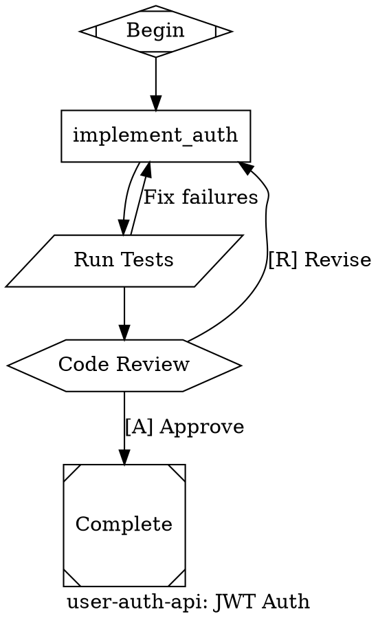

Convert a PRD (Product Requirements Document) into an attractor-compatible DOT digraph.

Persona active via CLAUDE.md. **SPEAK BEFORE ACTING**.

## Attractor Philosophy

An attractor is NOT a linear task list. It is a **convergence basin** — a target state the system falls into regardless of initial conditions. The DOT graph defines the phase space: edges are convergence paths with conditions, failures route back toward the basin, and the system self-corrects at the graph level.

**Every graph you generate MUST be self-correcting.** Linear chains (`A → B → C → done`) are forbidden unless the PRD truly has zero failure modes. Real software has failure modes. Encode them.

## Step 1: Acquire PRD
From `$ARGUMENTS`: file path (contains `/` or `.md`) → read file. Substantial text → use directly. No argument → ask user.

## Step 2: Parse PRD
Extract:
- **Metadata**: project slug (lowercase+underscores), goal (objective statement)
- **Tasks**: ID (`[A-Za-z_][A-Za-z0-9_]*`), description, type (code/review/approval/conditional/parallel), prompt (substantive LLM instruction with PRD context), critical? (P0/acceptance criteria), dependencies, complexity (low/medium/high)
- **Gates**: human review → hexagon, conditional routing → diamond
- **Parallelism**: independent tasks → component fan-out / tripleoctagon fan-in
- **Acceptance criteria**: extract ALL acceptance criteria from the PRD → `acceptance_criteria` graph attr + `goal_gate=true` markers
- **Failure modes**: for each task, identify what can go wrong. These become conditional edges.

## Step 2.5: Validate PRD

Before building the graph, validate that the parsed PRD meets minimum requirements:

1. **Title**: PRD must have a project name or title. If missing → **STOP** and ask the user.
2. **Sections**: PRD must contain at least one requirement or task section. If empty → **STOP** and ask the user.
3. **Acceptance criteria**: PRD should define acceptance criteria (what "done" looks like). If missing → **WARN** the user that the graph will lack `acceptance_criteria` and `goal_gate` convergence. Ask if they want to provide criteria or proceed without self-correction guarantees.

A PRD that passes validation has: a title, at least one actionable section, and (ideally) acceptance criteria. This prevents generating graphs from malformed or stub PRDs that would lack convergence properties.

## Step 3: Build Convergence Graph

**Structure**: exactly one `Mdiamond` start + one `Msquare` exit. All nodes reachable from start. Exit reachable from all non-terminal nodes. No orphans. DAG only (`->`, never `--`).

**Shapes**: Mdiamond=start, Msquare=exit, box=codergen(default), diamond=conditional, hexagon=human gate, component=parallel fan-out, tripleoctagon=parallel fan-in, parallelogram=tool, house=stack.manager_loop

### Mandatory Convergence Patterns

1. **Test-Fix Loops**: Every implementation node MUST have a verification node (tool/test) that routes back on failure:
   ```
   implement -> test
   test -> done [condition="outcome=success", weight=2]
   test -> implement [condition="outcome=fail"]
   ```

2. **Goal Gates**: All P0/critical nodes get `goal_gate=true` with a `retry_target`. If the PRD has acceptance criteria, they become graph-level `acceptance_criteria`:
   ```
   graph [acceptance_criteria="context.tests_pass=true && context.build_status=passing"]
   graph [retry_target="implement"]
   test_step [goal_gate=true]
   ```

   #### acceptance_criteria Semantics

   `acceptance_criteria` is a **graph-level contract**, not a per-node check. It declares the conditions that must hold for the entire graph to be considered converged. The attractor evaluates it after every `goal_gate=true` node completes.

   - **Scope**: Graph-level. Applies to the whole pipeline, not individual nodes. A node with `goal_gate=true` triggers evaluation of the graph's `acceptance_criteria`.
   - **Failure behavior**: When `acceptance_criteria` evaluates to false after a goal gate, the attractor automatically retries from the graph-level `retry_target` node. Without `retry_target`, the graph cannot self-correct and the run fails.
   - **Context variables**: Conditions reference `context.*` variables populated by tool and test nodes during execution. Common variables:
     - `context.tests_pass` — set by test runner nodes (parallelogram shape)
     - `context.build_status` — set by build/compile tool nodes
     - `context.lint_status` — set by linter tool nodes
     - `context.review_status` — set by human gate (hexagon) nodes
   - **Syntax**: `acceptance_criteria = "context.tests_pass=true && context.build_status=passing"` — uses the same condition language as edge conditions (see Reference: Condition Language).

3. **Conditional Routing**: Use diamond nodes for decisions, NOT linear assumptions:
   ```
   check [shape=diamond]
   check -> path_a [condition="context.status=ready"]
   check -> path_b [condition="context.status!=ready"]
   ```

4. **Parallel Fan-Out/Fan-In**: When a task can be solved multiple ways (P0 tasks, architecture decisions), use competing implementations:
   ```
   parallel_split [shape=component]
   approach_a [prompt="Implement using strategy A"]
   approach_b [prompt="Implement using strategy B"]
   select_best [shape=tripleoctagon, prompt="Select the best implementation"]
   parallel_split -> approach_a
   parallel_split -> approach_b
   approach_a -> select_best
   approach_b -> select_best
   ```

5. **Human Gates**: Review/approval steps use hexagon with revision loops:
   ```
   review [shape=hexagon, label="Review Changes"]
   review -> next_step [label="[A] Approve"]
   review -> fix_step [label="[R] Revise"]
   ```

6. **Max Visits**: Prevent infinite convergence loops with `max_visits` on looping nodes.

### Anti-Patterns (NEVER generate these)

- **Linear chains without feedback loops**: `research → plan → implement → done` — what happens when implementation fails?
- **Orphan test nodes**: Tests that don't route failures back for correction
- **Missing retry paths**: `goal_gate=true` without `retry_target`
- **Acceptance criteria without retry_target**: The system can't self-correct
- **Approval node without rejection path**: A hexagon gate with only an approve edge and no revise/reject edge — the graph assumes reviews always pass, eliminating the self-correction that human gates provide
- **Conditional without default branch**: A diamond node whose outgoing conditions don't cover all possible values — if no condition matches, execution stalls with no path forward
- **Parallel sibling dependencies**: Nodes inside a fan-out (between component and tripleoctagon) that depend on each other — this defeats parallelism and can deadlock since siblings execute concurrently with no ordering guarantee
- **Test retrying wrong implementation**: A test/verification failure edge that routes to a different node than the one that produced the code under test — the fix runs in the wrong context and can never address the actual failure

## Step 4: Generate DOT

Syntax: one `digraph`, bare IDs (`[A-Za-z_][A-Za-z0-9_]*`), `->` only, commas between attrs, double-quoted strings.

```dot
digraph ${SLUG} {
    goal = "${GOAL}"
    label = "${LABEL}"
    default_max_retry = 2
    retry_target = "${FIRST_IMPLEMENTATION_NODE}"
    acceptance_criteria = "${CRITERIA_FROM_PRD}"
    // working_dir = "/repos/${REPO_NAME}"
    // model_stylesheet = "* { llm_model: claude-sonnet-4-6; } .critical { llm_model: claude-opus-4-6; reasoning_effort: high; }"

    start [shape=Mdiamond, label="Begin"]

    // Implementation nodes with prompts, goal_gate on critical steps
    // Verification nodes (tool/test) with conditional edges back to implementation
    // Human gates for review points
    // Parallel fan-out/fan-in for competing approaches

    done [shape=Msquare, label="Complete"]

    // Edges: weight=2 for happy path, condition on failure paths
    // Every implementation node has a test-fix loop
}
```

Edge conditions: `outcome=success`, `outcome=fail`, `outcome!=success`, `context.KEY=VALUE`, combine with `&&`.

## Step 5: Validate
**Errors** (must fix): single start/exit, no incoming to start, no outgoing from exit, all reachable, exit reachable from all, no orphans, valid targets, diamond has 2+ conditional edges, component↔tripleoctagon paired, valid condition syntax, valid IDs, commas in attrs, quoted strings, `->` only, single digraph, acceptance_criteria syntax valid.

**Warnings** (must fix for convergence): every box has non-empty prompt, happy-path edges higher weight, goal_gate nodes have retry path, acceptance_criteria has retry_target, no linear chains without feedback loops, every implementation node has a verification step.

## Step 6: Convergence Summary & Save
Show DOT in ```dot block. Summary table including:
- Nodes by type
- Edges (total, conditional, feedback loops)
- Goal gates and acceptance criteria
- Convergence ratio potential (goal_gates + criteria count)
- Self-correction paths (how many failure edges route back for retry)

Ask where to save (default: `./${SLUG}.dot`). Offer Graphviz render if `dot` available: `dot -Tsvg file.dot -o file.svg`.

**Next step**: Run `/attract` to submit the generated `.dot` file to the attractor server for execution. `/attract` handles validation, server health checks, submission, and monitoring automatically.

## Example: End-to-End PRD → DOT

Given this PRD snippet:

> **Project**: user-auth-api
> **Goal**: Add JWT authentication to the REST API.
> **Requirements**:
> 1. Implement JWT middleware that validates tokens on protected routes
> 2. Add login endpoint that issues tokens
> 3. All tests must pass before merge
> 4. Code review required before deploy
>
> **Acceptance Criteria**: All auth tests pass, no regressions in existing tests.

### Node mapping

| PRD Requirement | Node | Shape | Why |
|-----------------|-------|-------|-----|
| — | `start` | Mdiamond | Entry point |
| Req 1 + 2 | `implement_auth` | box | Core implementation (prompt carries PRD context) |
| Req 3 | `run_tests` | parallelogram (tool) | Verification — routes back on failure |
| Req 3 (fail) | `run_tests → implement_auth` | edge | Self-correction loop |
| Req 4 | `code_review` | hexagon | Human gate with revision path |
| — | `done` | Msquare | Exit point |

### Resulting DOT



**Key convergence features**: `run_tests` loops back to `implement_auth` on failure (self-correction). `code_review` as hexagon gate can send revisions back. `goal_gate=true` on implementation with `retry_target` at graph level. `max_visits=3` prevents infinite loops.

## Reference: Condition Language
`ConditionExpr ::= Clause ('&&' Clause)*` where `Clause ::= Key Op Literal`. Keys: `outcome`, `preferred_label`, `context.PATH`. Ops: `=`, `!=`. Status values lowercase: success, fail, partial_success, retry.

## Reference: Shape→Handler
Mdiamond=start, Msquare=exit, box=codergen, hexagon=wait.human, diamond=conditional, component=parallel, tripleoctagon=parallel.fan_in, parallelogram=tool, house=stack.manager_loop

## Reference: Node Attrs
label(String), shape(String,"box"), prompt(String), goal_gate(Boolean,false), max_retries(Integer,0), max_visits(Integer), timeout(Duration), class(String), retry_target(String), fidelity(String)

## Reference: Edge Attrs
label(String), condition(String), weight(Integer,0), fidelity(String), loop_restart(Boolean,false)

## Reference: Graph Attrs
goal(String), label(String), retry_target(String), fallback_retry_target(String), acceptance_criteria(String), working_dir(String), default_max_retry(Integer), model_stylesheet(String)
