Convert a PRD into an attractor-compatible DOT digraph.

Persona via CLAUDE.md. **SPEAK BEFORE ACTING**.

Attractor = **convergence basin**, not task list. Failures route back toward the basin. Linear chains forbidden unless zero failure modes.

## Step 1: Acquire PRD, Flags & Resolve Working Dir

`$ARGUMENTS`: extract flags first, remainder is the PRD source.

**Flags** (all optional):
- `--provider <name>` — `anthropic` (default), `openai`, `qwen`, `gemini`, `deepseek`, `ollama`, `vllm`
- `--review-provider <name>` — separate provider for review/critical nodes (`.review`, `.critical` classes). Enables mixed-provider workflows (e.g., `--provider qwen --review-provider anthropic` = Qwen for impl, Opus for adversarial review)
- `--models default=<id>,review=<id>` — model IDs for two semantic tiers
- `--model <id>` — shorthand: one model for both tiers
- `--isolated` — skip workspace prompt, use isolated workspace mode
- `--shared` — skip workspace prompt, use shared mode (default)
- `--exit-validation` — prefer `exit_validation` graph attribute over a separate `verify_final` tool node for simple pipelines (single test command, no delta logic)
- `--multimodal` — enable `attachments_context_key` on relevant nodes for PRDs referencing screenshots, mockups, or images
- `--backend <name>` — execution backend: `claude-code` (default), `llm`, `mastra`, `qwen-code`, `none`. Passed through to `/attract` on submission

**Provider defaults** (when `--models` not given):

| Provider | Default tier | Review tier |
|----------|-------------|-------------|
| `anthropic` | `claude-sonnet-4-6` | `claude-opus-4-6` |
| `openai` | `gpt-4.1` | `o3` |
| `qwen` | `qwen-plus` | `qwen-max` |
| `gemini` | `gemini-2.5-flash` | `gemini-2.5-pro` |
| `deepseek` | `deepseek-chat` | `deepseek-reasoner` |
| `ollama` | `qwen3:32b` | `qwen3:32b` |
| `vllm` | *(ask user)* | *(ask user)* |

**PRD source**: path (has `/` or `.md`) → read file. Text → use directly. Empty → ask user.

**Working directory**: attractor runs in Docker, project mounted at `/repos/`. Use `git rev-parse --show-toplevel` to determine mount path. If not a git repo or ambiguous, **ask the user**: "What path will this repo be mounted at inside `/repos/`?" All `tool_command` paths use `cd ${WORKING_DIR} &&`. **Never** use absolute local paths.

**Spec file** (Layer 3 — Spec-Driven Acceptance): After resolving working dir, determine the PRD file path for `spec_file`:
- If PRD was a file path → use that path remapped to workspace (e.g., `/workspace/<run-id>/prd.md` for isolated, `/repos/<repo>/prd.md` for shared)
- If PRD was inline text → write it to `${WORKING_DIR}/prd.md` and reference that path
- Emit `spec_file` as a graph attribute in Step 4. The engine interpolates `$spec_file` in node prompts.

**Workspace isolation**: After resolving the working directory, determine workspace mode:
- If `--isolated` flag → use isolated mode
- If `--shared` flag → use shared mode
- Otherwise → defer to Step 2b checklist (recommend isolated for greenfield/risky, shared for iterative/quick)

**If isolated**: emit these graph-level attributes in Step 4:
1. `workspace = "isolated"`
2. `repo_url` — derive from `git remote get-url origin` in the target repo. **Must be HTTPS** — attractor validator rule 22 (`workspace_config`) rejects SSH URLs because isolated workspaces clone inside Docker where SSH keys aren't available. Convert SSH format: `git@github.com:org/repo.git` → `https://github.com/org/repo.git`. For private repos, the Docker container must have a GitHub token available (e.g., via `GITHUB_TOKEN` env var in attractor's Docker config)
3. `repo_branch` — current branch name (e.g., `"main"`)
4. `workspace_cleanup = "preserve"` — **always preserve by default**. Isolated workspaces are ephemeral; `"delete"` destroys all pipeline output. Use `"delete"` only if the pipeline has a `commit_and_push` node (Pattern 0).
5. `working_dir` stays the same (`/repos/...`) — the engine rewrites it automatically for codergen (box) nodes.
   **IMPORTANT**: `tool_command` strings are NOT rewritten by the engine. For isolated workspaces, tool_commands must use relative paths (`bun test 2>&1`) or `cd ${WORKING_DIR} &&` (which the engine resolves as an env var). Do NOT hardcode `/repos/` paths in tool_commands — they break when the real workspace is `/workspace/<run-id>/<repo>`.
6. **MANDATORY**: Emit a `commit_and_push` tool node (Pattern 0) after `check_final` success, before `done`. This pushes only verified working code. Without this, code is lost when the workspace is cleaned up.

**If shared**: do NOT emit `workspace`, `repo_url`, `repo_branch`, or `workspace_cleanup`. Current behavior unchanged.

## Step 2: Analyze PRD

Extract: slug, goal, tasks, acceptance criteria.

**Detect which conditional patterns apply** (read pattern reference for details):

| Signal in PRD | Pattern to emit |
|---------------|-----------------|
| Security/auth/data/crypto surface | 8 (security scan), 17 (red team) — recommend in Step 2b |
| Quantitative target with measurable metric (see microverse detection below) | 20 (microverse) — replaces standard impl→verify for that phase |
| Long-running external process ("wait for", "monitor", "poll", deploy, migration, CI wait) | 24 (manager loop) — supervisor polling node |
| High-complexity phase (>3 files, cross-cutting) | 18 (competing impls) — recommend in Step 2b |
| Coverage requirements | 9 (coverage gate) |
| Multiple independent workstreams | 4 (fan-out/fan-in) |

**Plan review teams** per phase:
1. `correctness` + `patterns` (always)
2. + `architecture` if >5 files or new modules
3. + `security` if auth/data/crypto
4. + `performance` if hot paths
5. + `resources` if new I/O code (streams, file handles, spawned processes, database connections)
6. + `concurrency` if parallel execution, shared state, fan-out nodes, async coordination, or multiple processes accessing same files/databases
7. + `error-handling` if error recovery paths, retries, fault tolerance, or external service calls
8. Default: 2 consecutive clean passes. **Maximum**: 3 passes for any single phase (>3 has diminishing returns and multiplies stall risk — each pass creates N review nodes + merge + fix cycle). Present in Step 2b checklist for user confirmation.

**Extract affected files** (Layer 4 — Permission Scoping): From the PRD's "affected files", "scope", or "changes" section, derive per-phase `allowed_paths` and `escalate_on` lists. If the PRD doesn't specify affected files, emit a `// WARNING: PRD lacks affected-files section — using broad allowed_paths` comment and default to `src/**, tests/**`. When building per-node `allowed_paths`, use the prompt text as the source of truth — not just the PRD's file list. After drafting each impl node's `prompt=`, scan it for file-path references and ensure every referenced file is in `allowed_paths`. The prompt IS the contract with the agent; `allowed_paths` must cover everything it asks the agent to touch.

**Count requirements per phase**: For phases with 3+ requirements, flag for BDD scenario generation (Layer 3 strengthening). Phases with 1-2 requirements use spec_tests alone.

**Microverse detection** (Pattern 20): A phase qualifies for microverse when ALL of:
1. **Numeric target** — PRD states a quantitative goal: "reduce to N", "improve to Z%", "keep under N ms", "achieve N% coverage", "at least/at most N", or any number + comparison.
2. **Measurable** — you can construct a shell command that runs in <60s and prints a number on its last line. If the answer requires human judgment or visual inspection → NOT measurable (use standard impl with LLM judge).
3. **Gradual, not binary** — intermediate progress has value. "Get coverage from 60% to 90%" = microverse. "Make tests pass" = binary → standard impl.
4. **Direction is clear** — "reduce", "minimize", "below", "under", "fewer" → `direction: "lower"`. "Improve", "maximize", "above", "at least", "increase" → `direction: "higher"`. Ambiguous → flag in Step 2b checklist for user clarification.

Derive the measurement command from PRD context:
| PRD signal | Command pattern |
|---|---|
| Coverage % | `npx jest --coverage --coverageReporters=text-summary 2>&1 \| grep 'Statements' \| grep -oE '[0-9.]+'` |
| Bundle size | `npm run build 2>/dev/null && wc -c < dist/bundle.js` |
| Lint error count | `(npx eslint src/ 2>&1 \|\| true) \| grep -c 'error'` |
| Build/response time | `{ time npm run build 2>/dev/null; } 2>&1 \| grep real \| grep -oE '[0-9]+\.[0-9]+'` |
| Custom metric | Extract script/command from PRD; wrap so last stdout line is a number |

The command MUST output a single number on its last line. Use the same command for both `baseline` and `measure` nodes.

**TypeScript strictness detection**: If the target project uses TypeScript, check `tsconfig.json` for strict flags: `exactOptionalPropertyTypes`, `strict`, `strictNullChecks`, `noUncheckedIndexedAccess`, `strictPropertyInitialization`. Record active flags as `${STRICT_FLAGS}`. If any are enabled, these MUST be embedded in every impl node's prompt in Step 3 — agents default to `prop: T | undefined` instead of `prop?: T` under strict configs, causing type regressions that exhaust verify retries.

**Count total nodes**: If >20 nodes or >3 phases, plan fidelity tiers — use `default_fidelity = "compact"` at graph level, `fidelity = "full"` on review/conformance nodes and fix nodes after review.

**Validate**: Must have title + ≥1 requirement. Missing acceptance criteria → WARN. Missing title → STOP.

## Step 2b: Confirm Plan with User

**Do NOT proceed to graph construction without user confirmation.** Present your analysis as a single checklist. Show your best guesses — the user corrects what's wrong in one shot.

Format:

```
I analyzed the PRD. Here's my plan — confirm or correct anything:

**Slug**: ${SLUG}
**Goal**: ${GOAL} (1 sentence)
**Phases**: N — [phase names]
**Tech stack**: ${LANG}/${RUNTIME} — lint: ${LINT_CMD}, typecheck: ${TC_CMD}, test: ${TEST_CMD}, pkg: ${PKG_MGR}
**TS strictness**: [${STRICT_FLAGS} / standard (no strict flags) / N/A (not TypeScript)]
**Workspace**: [shared / isolated] ${reason}

**Per-phase breakdown:**

Phase 1: ${PHASE_NAME}
  Scope: ${allowed_paths} | Escalate: ${escalate_on}
  Requirements: N → [BDD scenarios: yes/no]
  Microverse: [yes — target: N, direction: higher/lower, cmd: `...` / no — ${reason}]
  Review team: [roles] — ${N} consecutive passes
  Red team: [yes / no] — ${reason}
  Competing impls: [yes / no] — ${reason}

[repeat per phase]

**Pipeline shape:**
  ${template_summary — e.g., "single-phase with microverse loop, 2-pass review ratchet, conformance, red team"}

**Defense matrix:**
  L1 Competitive: [YES/NO]  L2 Guardrails: YES  L3 Spec-Driven: [YES/PARTIAL]
  L4 Permissions: YES  L5 Adversarial: [YES/NO]

Anything to change?
```

**Rules for the checklist:**
- **Tech stack**: Detect from PRD context, file extensions, or `package.json`/`pyproject.toml`/`go.mod` mentions. If ambiguous → show `[unknown — please specify]`
- **Microverse**: For each phase with a quantitative target, show the target, direction, and proposed measurement command. Let the user confirm the command works in their repo.
- **Scope**: If PRD lacks affected files, show `src/**, tests/** [broad — PRD lacks file list]` and ask if narrower scope is possible. Always verify test dirs are included in `allowed_paths` (agent needs to write tests). Show `escalate_on` list for user review.
- **Review team**: Show your recommendation with reasoning. Default 2 passes unless user overrides.
- **Red team / Competing impls**: Show recommendation. Don't ask open-ended — present a yes/no with your reasoning.
- **Workspace**: If not flagged, recommend based on context (isolated for greenfield/risky, shared for iterative/quick).
- **Omit items already resolved by flags** (e.g., `--isolated` → don't ask workspace, `--shared` → don't ask workspace).

Wait for user response. Apply corrections to your analysis, then proceed to Step 3.

## Step 3: Build Graph from Template

**STOP. Read `.claude/commands/pickle-dot-patterns.md` NOW** before proceeding. It contains all pattern definitions, anti-patterns, and shape/condition references needed for graph construction.

**Start from this template** and customize based on Step 2 analysis:

```
start → setup_deps → capture_baseline → [bdd_scenarios →] [spec_tests →] impl → check_progress → lint → typecheck → test
  → [security →] [coverage →] [scope_check →]
  → review_ratchet(pass_1 → pass_2)
  → conformance → [red_team →]
  → fix_all → verify_final → check_final → [commit_and_push →] done
```

**Customizations:**
- **Microverse phase** (quantitative target): replace `impl → lint → typecheck → test` with Pattern 20 loop. Wire into the full pipeline:
    ```
    ... → [spec_tests →] commit_baseline → baseline → optimize → measure → compare → check_mv
    check_mv → verify_lint [condition="outcome=success"]  // exits to normal gates
    check_mv → optimize [condition="outcome=partial_success"]  // improved, keep going
    check_mv → rollback → optimize [condition="outcome=fail"]  // regressed, undo + retry
    verify_lint → ... review_ratchet → conformance → ...
    ```
    On SUCCESS (target met), flow exits to lint/typecheck/test and the normal review ratchet. PARTIAL_SUCCESS loops back for another iteration. FAIL rolls back and retries. The `compare` node uses `auto_status=true` + `allow_partial=true` so the engine parses `STATUS: SUCCESS|PARTIAL_SUCCESS|FAIL` from the LLM output. Embed the concrete target and direction from the PRD in the compare prompt.
- **Competing impls** (high complexity): replace `impl` with Pattern 18 fan-out
- **Multi-phase**: replicate template per phase, connect sequentially. Each phase gets its own review ratchet. Emit `thread_id = "phase_N"` on ALL impl and fix nodes within the same phase — groups conversational context so each phase's fix node knows what its impl node did. Different phases MUST use different thread_ids
- **Multi-phase final gate**: Use separate fix nodes for conformance and verify_final. Conformance failures route to `fix_conformance → conformance` (own retry loop). verify_final failures route to `fix_all → verify_final` (own retry loop). Never merge these paths — shared max_visits causes premature pipeline crashes:
    conformance → conformance_gate
    conformance_gate → verify_final [success]
    conformance_gate → fix_conformance [fail]
    fix_conformance → conformance

    verify_final → check_final
    check_final → [commit_and_push →] done [success]
    check_final → fix_all [fail]
    fix_all → verify_final
  `fix_conformance` has the same attributes as fix_all (including `max_visits=5`, `thread_id`, and `timeout="30m"`) but its prompt focuses on unmet PRD requirements rather than lint/test regressions. For single-phase pipelines, conformance `retry_target="impl"` is fine — it naturally re-enters the full chain.
- **Single-phase**: template as-is, fix_all still recommended
- **Catastrophic failure**: use `loop_restart=true` on edges as an alternative to `retry_target` when the pipeline needs a full restart: `check_final -> setup_deps [condition="outcome=fail", loop_restart=true]`. Route to `setup_deps`, NOT `start` (validator rule 3 rejects incoming edges on start). This clears RunContext — use sparingly, only when incremental retry cannot recover
- **Skip what doesn't apply**: no linter → skip lint. No type checker → skip typecheck. No security tooling → skip security scan

**Multimodal** (`--multimodal`): If PRD references screenshots, mockups, or images, emit a tool node that captures them into a context key, then add `attachments_context_key="<key>"` on codergen nodes that need the visual context.

**TypeScript strictness in prompts**: If `${STRICT_FLAGS}` is non-empty (from Step 2), append to every impl and fix node's `prompt=`: "STRICT TSCONFIG: ${STRICT_FLAGS} enabled. Use optional property markers (prop?: T), never union types (prop: T | undefined). Run npx tsc --noEmit before finishing." This prevents type regressions under strict configs that exhaust verify retries.

**Every box prompt MUST have context + constraints + acceptance criteria.** The executing LLM has NO access to the PRD — the prompt IS its instruction.

- **Never hardcode line numbers** in prompts (e.g., "at line 23"). Earlier phases modify files, shifting all line numbers. Use searchable landmarks instead: "find the existing `.replaceAll('$goal', ...)` call", "find the `VALID_PROPS` set", "find `drainQueue()`".
- **Defensive coding clauses** in every impl prompt: For all I/O resources (streams, file handles, spawned processes), ensure cleanup on ALL exit paths including timeout and error — use try/finally or flush before every return. For all optional values accessed after a conditional check, bind to a local variable first (`const local = obj; if (local?.method()) { local.otherMethod(); }`). These two patterns prevent the most common pipeline-generated bugs.
- **Silent failure prevention** in every impl prompt with error handling: Never swallow errors in empty catch blocks — every catch must re-throw, return a typed error, or emit a warning. Functions returning sentinel values (empty array, null, default) on error must log the original error. Callers must be able to distinguish "no results" from "search failed."
- **Concurrency safety** in every impl prompt touching shared state or parallel execution: For every shared resource (file, database, state object, workspace), verify correct behavior when two callers access simultaneously. Emit events/callbacks AFTER state transitions complete, never before. Use run-scoped or caller-scoped paths for any file written by potentially-parallel code.
- **Explicit contracts** in every impl prompt creating module boundaries: No side-channel data propagation — data between modules goes through explicit typed interfaces, not stuffed into generic containers. No post-construction dependency binding — inject all dependencies at construction time. Numeric thresholds must be named constants or config values, never magic numbers in logic.

**Mandatory for every graph:**
- `commit_and_push` after `check_final` success, before `done` when `workspace="isolated"` (Pattern 0) — pushes only verified working code
- `setup_deps` before first impl (Pattern 0a)
- `capture_baseline` after `setup_deps`, before first impl (Pattern 0c) — snapshots pre-existing lint/typecheck/test errors
- All verify/reverify `tool_command` values MUST use delta-aware checking (Pattern 0d) — fail on regressions, not pre-existing debt
- `check_progress` tool node after each impl, before lint gates (Pattern 0e) — catches stalled impls with zero file changes
- All `component` nodes: `max_parallel=1` (Pattern 0b)
- `max_visits` on looping nodes (Pattern 6)
- `bdd_scenarios` before `spec_tests` for phases with 3+ requirements (Pattern 16b, recommended)
- `spec_tests` before impl on `goal_gate=true` paths (Pattern 16, default — skip only if explicitly simplified)
- `permission_mode="bypassPermissions"` on all codergen (box) nodes in headless pipelines — NEVER use `plan` (deadlocks waiting for human approval that never arrives; validator rule 24 warns)
- `timeout` on all codergen (box) nodes — `30m` for impl, `15m` for review/fix (unbounded LLM = unbounded cost)
- `STATUS: SUCCESS` / `STATUS: FAIL` output instruction in prompts of all read-only codergen nodes (conformance, scope_check, red_team, reviewers, bdd_scenarios, check_coverage) — prevents no-op detection infinite retry (Pattern 6b)
- `read_only=true` on all review box nodes that do NOT write files (reviewers, bdd_scenarios, scope_check, conformance) — prevents code backend no-op detection from triggering RETRY on nodes that intentionally make 0 Edit/Write calls (defense-in-depth alongside STATUS markers). **Exception**: nodes whose prompts instruct file writes (e.g., red_team with "write repro tests", spec_tests with "write test files") must NOT have `read_only=true` — it would suppress legitimate no-op detection if the node genuinely stalls
- `allowed_paths` on all codergen (box) impl nodes (Layer 4, validator rule 25 warns if missing)
- `escalate_on` on all codergen impl nodes — always include lock files, schema, config, auth
- Every impl prompt that creates streams, file handles, or spawned processes MUST include: "Ensure all I/O resources are closed on every exit path (success, error, timeout, early return). Flush TextDecoder/streams before returning. Bind optional values to local variables before using inside conditional blocks."
- Every impl prompt with error handling MUST include: "Never use empty catch blocks. Every catch must re-throw, return a typed error result, or log a warning with the original error. Functions that return defaults on error (empty array, null, 0) must log the error so callers can distinguish 'no results' from 'operation failed'."
- Every impl prompt with shared state or parallel access MUST include: "For shared resources (files, databases, state), use run-scoped or caller-scoped identifiers to prevent collisions. Emit events AFTER state transitions complete. Verify behavior under concurrent access — test with two simultaneous callers."
- Every impl prompt creating reusable objects in loops MUST include: "Compile-once objects (Regex, Glob, parsed configs, template engines) must be instantiated outside hot loops. If a constructor appears inside for/while/map/forEach and its arguments don't change per iteration, hoist it."
- Review ratchet with ≥2 consecutive passes (Pattern 19)
- `fix_all` before `verify_final` (Pattern 21) — **exception**: when `--exit-validation` is set and the pipeline is simple (single test command, no delta logic), omit `fix_all` and `verify_final` — `exit_validation` replaces them
- `verify_final` with `context_on_success` setting ALL `acceptance_criteria` keys (skip when using `exit_validation`)
- Graph-level `retry_target = "fix_all"` — NEVER setup_deps or per-phase impl
- Graph-level `spec_file` pointing to PRD location (Layer 3)
- Defense matrix comment block after graph attributes (Layer 5)

## Step 4: Generate DOT

Syntax: one `digraph`, bare IDs (`[A-Za-z_][A-Za-z0-9_]*`), `->` only, commas between attrs, double-quoted strings.

```dot
digraph ${SLUG} {
    goal = "${GOAL}"
    label = "${LABEL}"
    working_dir = "${WORKING_DIR}"
    default_max_retry = 2
    retry_target = "fix_all"
    fallback_retry_target = "fix_all"
    acceptance_criteria = "${CRITERIA}"
    model_stylesheet = "${MODEL_STYLESHEET}"
    spec_file = "${SPEC_FILE_PATH}"
    // If >20 nodes or >3 phases:
    // default_fidelity = "compact"
    // (then add fidelity = "full" on review/conformance/fix nodes)
    // If --exit-validation and simple final gate (single test command, no delta logic):
    // exit_validation = "npm test 2>&1 && npx tsc --noEmit 2>&1"
    // (omit verify_final tool node — exit_validation replaces it)
    // If isolated mode:
    // workspace = "isolated"
    // repo_url = "https://github.com/org/repo.git"
    // repo_branch = "main"
    // workspace_cleanup = "preserve"  // "delete" only when commit_and_push is present

    // Defense Matrix:
    //   Layer 1 (Competitive):  [YES/NO] — fan-out/fan-in for complex phases
    //   Layer 2 (Guardrails):   YES — lint → typecheck → test → audit
    //   Layer 3 (Spec-Driven):  [YES/PARTIAL] — spec_file, BDD contracts, conformance
    //   Layer 4 (Permissions):  YES — allowed_paths on impl nodes
    //   Layer 5 (Adversarial):  YES — multi-model review, red team, scope check

    start [shape=Mdiamond]
    // ... nodes and edges from Step 3 ...
    done [shape=Msquare]
}
```

**Defense matrix**: Layer 1 is YES when competing impls (Pattern 18) or parallel fan-out (Pattern 4) is emitted. Layer 3 is YES when all of: spec_file, BDD/spec_tests, conformance are present. Use PARTIAL when BDD/spec_tests are omitted: `Layer 3 (Spec-Driven): PARTIAL — spec_file + conformance (no BDD/spec_tests)`. Layer 5 is YES when review ratchet uses multi-model routing OR red_team is present. Layers 2 and 4 are always YES for standard pipelines.

**Model stylesheet** — resolve from flags:
```dot
// anthropic (default — no llm_provider needed):
model_stylesheet = "* { llm_model: claude-sonnet-4-6; } .critical { llm_model: claude-opus-4-6; reasoning_effort: high; } .review { llm_model: claude-opus-4-6; }"

// single non-anthropic provider (add llm_provider to all):
model_stylesheet = "* { llm_model: ${DEFAULT}; llm_provider: ${PROVIDER}; } .critical { llm_model: ${REVIEW}; reasoning_effort: high; } .review { llm_model: ${REVIEW}; }"

// mixed provider (--provider qwen --review-provider anthropic):
// .review and .critical override llm_provider to route adversarial validation to Opus
model_stylesheet = "* { llm_model: qwen-plus; llm_provider: qwen; } .critical { llm_model: claude-opus-4-6; llm_provider: anthropic; reasoning_effort: high; } .review { llm_model: claude-opus-4-6; llm_provider: anthropic; }"
```
When `--review-provider` differs from `--provider`, the `.review` and `.critical` selectors MUST include `llm_provider` to override the `*` default. Per-node `llm_model` and `llm_provider` attributes can also override the stylesheet for edge cases.

## Step 5: Validate

**Errors** (STOP and fix): single start/exit, no incoming→start, no outgoing←exit, all reachable, valid targets, diamond 2+ edges, component↔tripleoctagon paired (validator rule 20 — every `shape=component` must have a corresponding `shape=tripleoctagon` fan-in node), retry targets inside fan-out branches must point within the same component→tripleoctagon scope (validator rule 17), valid conditions/IDs/syntax, `->` only, single digraph, graph-level retry_target to setup_deps/start/per-phase impl instead of fix_all, `goal_gate=true` with `retry_target` but no `max_visits` (validator rule 19).

**Pre-submission check** (STOP if violated):
- For each key in `acceptance_criteria`, verify exactly one node has `context_on_success` setting that key. Missing mapping → retry until engine safety limit (10 retries), then hard failure.
- Every codergen (box) node has `timeout` (recommended: `30m` impl, `15m` review/fix). Unbounded LLM = unbounded cost.
- For each codergen node with `allowed_paths`, verify every file path in `prompt=` is covered. Same check as validator rule 26 (`prompt_files_in_allowed_paths`) but caught at generation time.
- For each read-only codergen node (conformance, scope_check, red_team, reviewers, bdd_scenarios, check_coverage), verify the prompt includes explicit `STATUS: SUCCESS` / `STATUS: FAIL` output instruction (Pattern 6b). Missing STATUS on read-only nodes → no-op detection → wasted retries.
- Every review/read-only codergen node (reviewers, bdd_scenarios, red_team, scope_check) has `read_only=true` attribute. Missing `read_only` on read-only nodes → no-op detection RETRY if STATUS marker is absent from output.

**Warnings** (emit but continue): TypeScript project with strict tsconfig flags (exactOptionalPropertyTypes, strict, strictNullChecks, noUncheckedIndexedAccess) detected in Step 2 but no impl node prompt mentions strictness constraints (agents will write `T | undefined` instead of `?: T`, exhausting verify retries), dep setup exists, max_parallel=1 on components, max_visits on loops, every box has prompt, happy-path weight=2, goal_gate has retry_target, no linear chains, spec_tests before goal_gate impls, review ratchet ≥2 passes with reset-on-fail, lint/typecheck/test separate gates, fix_all before verify_final in multi-phase, conformance before exit, security/auth phases have red_team, node inside component→tripleoctagon fan-out has retry_target pointing outside branch scope (stripped at runtime — retry ineffective), graph-level retry_target points before a component fan-out (branches retry entire pipeline — wasteful), codergen node without `allowed_paths` (unbounded file scope), `allowed_paths` doesn't include test directories (agent can't write tests), missing `spec_file` graph attribute, BDD scenarios missing for phase with 3+ requirements, defense matrix comment block missing, missing `capture_baseline` before first impl (Pattern 0c — pre-existing errors cause infinite retry), verify nodes using raw lint/typecheck commands instead of delta-aware checking (Pattern 0d), impl node without progress gate (Pattern 0e — stalled impls waste retry budgets), **isolated workspace without `commit_and_push` node after check_final success (Pattern 0 — all code lost on cleanup)**.

## Step 6: Summary & Save

Show DOT in ```dot block. Summary: nodes by type, edges (total/conditional/feedback), goal gates, review ratchet (roles, passes), model routing. Save to `./${SLUG}.dot`. Offer `dot -Tsvg`. Next: `/attract ${SLUG}.dot` to submit (uses `--backend claude-code` by default).

## Example

JWT auth API (TypeScript/Express). **Shared workspace** — no `commit_and_push` needed. For isolated workspace additions (`workspace`, `repo_url`, `repo_branch`, `workspace_cleanup="preserve"`, `commit_and_push` node wiring), see Pattern 0 in the patterns file.

Demonstrates all 5 layers: spec_file + BDD contracts (L3), allowed_paths + escalate_on (L4), setup, spec-first TDD, lint/typecheck/test gates, 2-pass review ratchet with correctness+security teams, conformance, red team (L5), fix_all, verify_final with context_on_success, defense matrix.

```dot
digraph user_auth_api {
    goal = "Add JWT authentication to the REST API"
    label = "user-auth-api: JWT Auth"
    working_dir = "/repos/my-api"
    default_max_retry = 2
    retry_target = "fix_all"
    fallback_retry_target = "fix_all"
    acceptance_criteria = "context.tests_pass=true && context.lint_status=passing && context.typecheck_status=passing"
    model_stylesheet = "* { llm_model: claude-sonnet-4-6; } .critical { llm_model: claude-opus-4-6; reasoning_effort: high; } .review { llm_model: claude-opus-4-6; }"
    spec_file = "/repos/my-api/prd.md"

    // Defense Matrix:
    //   Layer 1 (Competitive):  NO — single-phase, no competing impls
    //   Layer 2 (Guardrails):   YES — lint → typecheck → test → audit
    //   Layer 3 (Spec-Driven):  YES — spec_file, BDD contracts, conformance
    //   Layer 4 (Permissions):  YES — allowed_paths on impl nodes
    //   Layer 5 (Adversarial):  YES — multi-model review, red team, scope check

    start [shape=Mdiamond]
    setup_deps [shape=parallelogram, tool_command="cd ${WORKING_DIR} && npm install 2>&1", timeout="120s"]
    capture_baseline [shape=parallelogram, tool_command="cd ${WORKING_DIR} && echo '=== BASELINE SNAPSHOT ===' && (npx eslint src/ 2>&1 || true) | grep -c 'error' > /tmp/baseline_lint_errors.txt && (npx tsc --noEmit 2>&1 || true) | grep -c 'error TS' > /tmp/baseline_ts_errors.txt && echo \"lint=$(cat /tmp/baseline_lint_errors.txt) ts=$(cat /tmp/baseline_ts_errors.txt)\" 2>&1", timeout="120s"]

    bdd_scenarios_auth [class="review", read_only=true, timeout="10m", prompt="Read the spec file at $spec_file. For each JWT auth requirement, generate BDD scenarios in Given/When/Then format: token validation (missing, expired, malformed), login flow, refresh rotation, bcrypt hashing, OWASP patterns. Output as executable test descriptions. Do NOT implement — only define the behavioral contracts. Then output 'STATUS: SUCCESS' on its own line."]
    spec_tests_auth [class="review", timeout="15m", prompt="Read the BDD scenarios from the previous node's output. Write failing test cases that verify each scenario. Run them to confirm they fail. Do NOT write production code.", goal_gate=true, retry_target="spec_tests_auth", max_visits=5]
    implement_auth [goal_gate=true, retry_target="implement_auth", permission_mode="bypassPermissions", timeout="30m", prompt="Make all failing auth tests pass. Do NOT modify test files. JWT middleware + login endpoint. 1h expiry, refresh rotation, bcrypt. OWASP patterns.", allowed_paths="src/auth/**, src/middleware/**, tests/auth/**", escalate_on="package.json, package-lock.json, .env*, prisma/schema.prisma", max_visits=8, thread_id="phase_1"]

    check_progress [shape=parallelogram, tool_command="cd ${WORKING_DIR} && CHANGED=$(git status --porcelain | wc -l | tr -d ' ') && if [ \"$CHANGED\" -eq 0 ]; then echo 'STALL: impl produced zero file changes — retrying'; exit 1; fi && echo \"progress: $CHANGED files modified\" 2>&1", max_visits=3]
    check_progress_gate [shape=diamond]

    verify_lint [shape=parallelogram, tool_command="cd ${WORKING_DIR} && BASELINE=$(cat /tmp/baseline_lint_errors.txt 2>/dev/null || echo 0) && CURRENT=$((npm run lint 2>&1 || true) | grep -c 'error') && echo \"lint baseline=$BASELINE current=$CURRENT\" && [ $CURRENT -le $BASELINE ] || (echo 'LINT REGRESSION' && exit 1)", max_visits=3]
    check_lint [shape=diamond]
    verify_types [shape=parallelogram, tool_command="cd ${WORKING_DIR} && BASELINE=$(cat /tmp/baseline_ts_errors.txt 2>/dev/null || echo 0) && CURRENT=$((npx tsc --noEmit 2>&1 || true) | grep -c 'error TS') && echo \"typecheck baseline=$BASELINE current=$CURRENT\" && [ $CURRENT -le $BASELINE ] || (echo 'TYPECHECK REGRESSION' && exit 1)", max_visits=3]
    check_types [shape=diamond]
    run_tests [shape=parallelogram, tool_command="cd ${WORKING_DIR} && npm test 2>&1", max_visits=3]
    check_tests [shape=diamond]

    // Review ratchet — 2 consecutive clean passes (Pattern 19)
    split_review_1 [shape=component, max_parallel=1, join_policy="wait_all", error_policy="continue"]
    reviewer_correctness_1 [class="review", read_only=true, timeout="15m", prompt="Correctness ONLY: logic errors, off-by-one, null handling, async. List issues with file:line. Then output 'STATUS: SUCCESS' on its own line."]
    reviewer_patterns_1 [class="review", read_only=true, timeout="15m", prompt="Patterns ONLY: anti-patterns, duplication, naming conventions, error handling consistency. List with file:line. Then output 'STATUS: SUCCESS' on its own line."]
    reviewer_security_1 [class="review", read_only=true, timeout="15m", prompt="Security ONLY: token forgery, timing attacks, algorithm confusion, secrets exposure. List with file:line. Then output 'STATUS: SUCCESS' on its own line."]
    merge_review_1 [shape=tripleoctagon, class="review", timeout="15m", prompt="Consolidate. BLOCKER or ADVISORY. CLEAN or DIRTY."]
    check_review_1 [shape=diamond]
    fix_1 [prompt="Fix all BLOCKERs. Also simplify: redundant logic, duplication, naming. Do NOT modify test files.", permission_mode="bypassPermissions", timeout="15m", allowed_paths="src/auth/**, src/middleware/**", escalate_on="package.json, package-lock.json, .env*", max_visits=5, thread_id="phase_1"]
    reverify_1 [shape=parallelogram, tool_command="cd ${WORKING_DIR} && BASELINE_LINT=$(cat /tmp/baseline_lint_errors.txt 2>/dev/null || echo 0) && CURRENT_LINT=$((npm run lint 2>&1 || true) | grep -c 'error') && BASELINE_TS=$(cat /tmp/baseline_ts_errors.txt 2>/dev/null || echo 0) && CURRENT_TS=$((npx tsc --noEmit 2>&1 || true) | grep -c 'error TS') && npm test 2>&1 && [ $CURRENT_LINT -le $BASELINE_LINT ] && [ $CURRENT_TS -le $BASELINE_TS ] && echo 'DELTA: CLEAN' || (echo 'DELTA: REGRESSION' && exit 1)"]
    check_reverify_1 [shape=diamond]

    split_review_2 [shape=component, max_parallel=1, join_policy="wait_all", error_policy="continue"]
    reviewer_correctness_2 [class="review", read_only=true, timeout="15m", prompt="Fresh correctness review of ALL code — assume nothing from prior reviews. List issues with file:line. Then output 'STATUS: SUCCESS' on its own line."]
    reviewer_patterns_2 [class="review", read_only=true, timeout="15m", prompt="Fresh patterns review of ALL code — assume nothing. Anti-patterns, duplication, naming, error handling. List with file:line. Then output 'STATUS: SUCCESS' on its own line."]
    reviewer_security_2 [class="review", read_only=true, timeout="15m", prompt="Fresh security review of ALL code — assume nothing. All OWASP vectors. List with file:line. Then output 'STATUS: SUCCESS' on its own line."]
    merge_review_2 [shape=tripleoctagon, class="review", timeout="15m", prompt="Consolidate. BLOCKER or ADVISORY. CLEAN or DIRTY."]
    check_review_2 [shape=diamond]
    fix_2 [prompt="Fix all BLOCKERs. Also simplify. Do NOT modify test files.", permission_mode="bypassPermissions", timeout="15m", allowed_paths="src/auth/**, src/middleware/**", escalate_on="package.json, package-lock.json, .env*", max_visits=5, thread_id="phase_1"]
    reverify_2 [shape=parallelogram, tool_command="cd ${WORKING_DIR} && BASELINE_LINT=$(cat /tmp/baseline_lint_errors.txt 2>/dev/null || echo 0) && CURRENT_LINT=$((npm run lint 2>&1 || true) | grep -c 'error') && BASELINE_TS=$(cat /tmp/baseline_ts_errors.txt 2>/dev/null || echo 0) && CURRENT_TS=$((npx tsc --noEmit 2>&1 || true) | grep -c 'error TS') && npm test 2>&1 && [ $CURRENT_LINT -le $BASELINE_LINT ] && [ $CURRENT_TS -le $BASELINE_TS ] && echo 'DELTA: CLEAN' || (echo 'DELTA: REGRESSION' && exit 1)"]
    check_reverify_2 [shape=diamond]

    conformance [class="review", read_only=true, timeout="15m", goal_gate=true, retry_target="implement_auth", max_visits=5, prompt="Conformance audit: read the spec file at $spec_file. Compare every requirement against the current git diff. Verify: 1) Every requirement has a corresponding code change. 2) Acceptance criteria are testable and tested. 3) No requirements silently dropped. Output PASS or FAIL with unmet requirements. Then output 'STATUS: SUCCESS' if PASS, 'STATUS: FAIL' if FAIL on its own line."]
    conformance_gate [shape=diamond]

    red_team_auth [class="review", timeout="15m", prompt="Adversarial audit: token forgery, expired replay, refresh reuse, injection, timing attacks, algorithm confusion. Write repro tests. Output PASS or FAIL. Then output 'STATUS: SUCCESS' if PASS, 'STATUS: FAIL' if FAIL on its own line.", goal_gate=true, retry_target="implement_auth", max_visits=5, allowed_paths="tests/auth/**", escalate_on="package.json"]
    red_team_gate [shape=diamond]

    fix_all [prompt="Fix ALL remaining issues across the entire codebase. Run: 1) npx eslint src/ --fix 2>&1. 2) npx tsc --noEmit 2>&1. 3) npm test 2>&1. Iterate until all pass. Do NOT skip errors.", permission_mode="bypassPermissions", timeout="30m", allowed_paths="src/**, tests/**", escalate_on="package.json, package-lock.json, .env*, prisma/schema.prisma", max_visits=5, thread_id="phase_1"]

    verify_final [shape=parallelogram,
        tool_command="cd ${WORKING_DIR} && BASELINE_LINT=$(cat /tmp/baseline_lint_errors.txt 2>/dev/null || echo 0) && CURRENT_LINT=$((npx eslint src/ 2>&1 || true) | grep -c 'error') && BASELINE_TS=$(cat /tmp/baseline_ts_errors.txt 2>/dev/null || echo 0) && CURRENT_TS=$((npx tsc --noEmit 2>&1 || true) | grep -c 'error TS') && npm test 2>&1 && [ $CURRENT_LINT -le $BASELINE_LINT ] && [ $CURRENT_TS -le $BASELINE_TS ] && echo 'DELTA: CLEAN' || (echo 'DELTA: REGRESSION' && exit 1)",
        goal_gate=true, retry_target="fix_all", max_visits=5,
        context_on_success="tests_pass=true,lint_status=passing,typecheck_status=passing"]
    check_final [shape=diamond]

    done [shape=Msquare]

    // Edges
    start -> setup_deps -> capture_baseline -> bdd_scenarios_auth -> spec_tests_auth -> implement_auth
    implement_auth -> check_progress -> check_progress_gate
    check_progress_gate -> verify_lint [condition="outcome=success", weight=2]
    check_progress_gate -> implement_auth [condition="outcome=fail"]
    verify_lint -> check_lint
    check_lint -> verify_types [condition="outcome=success", weight=2]
    check_lint -> implement_auth [condition="outcome=fail"]
    verify_types -> check_types
    check_types -> run_tests [condition="outcome=success", weight=2]
    check_types -> implement_auth [condition="outcome=fail"]
    run_tests -> check_tests
    check_tests -> split_review_1 [condition="outcome=success", weight=2]
    check_tests -> implement_auth [condition="outcome=fail"]

    // Ratchet pass 1
    split_review_1 -> reviewer_correctness_1 -> merge_review_1
    split_review_1 -> reviewer_patterns_1 -> merge_review_1
    split_review_1 -> reviewer_security_1 -> merge_review_1
    merge_review_1 -> check_review_1
    check_review_1 -> split_review_2 [condition="outcome=success", weight=2]
    check_review_1 -> fix_1 [condition="outcome=fail"]
    fix_1 -> reverify_1 -> check_reverify_1
    check_reverify_1 -> split_review_1 [condition="outcome=success", weight=2]
    check_reverify_1 -> fix_1 [condition="outcome=fail"]

    // Ratchet pass 2 — failure RESETS to pass 1
    split_review_2 -> reviewer_correctness_2 -> merge_review_2
    split_review_2 -> reviewer_patterns_2 -> merge_review_2
    split_review_2 -> reviewer_security_2 -> merge_review_2
    merge_review_2 -> check_review_2
    check_review_2 -> conformance [condition="outcome=success", weight=2]
    check_review_2 -> fix_2 [condition="outcome=fail"]
    fix_2 -> reverify_2 -> check_reverify_2
    check_reverify_2 -> split_review_1 [condition="outcome=success", weight=2]
    check_reverify_2 -> fix_2 [condition="outcome=fail"]

    conformance -> conformance_gate
    conformance_gate -> red_team_auth [condition="outcome=success", weight=2]
    conformance_gate -> implement_auth [condition="outcome=fail"]
    red_team_auth -> red_team_gate
    red_team_gate -> fix_all [condition="outcome=success", weight=2]
    red_team_gate -> implement_auth [condition="outcome=fail"]
    fix_all -> verify_final -> check_final
    check_final -> done [condition="outcome=success", weight=2]
    check_final -> fix_all [condition="outcome=fail"]
}
```


