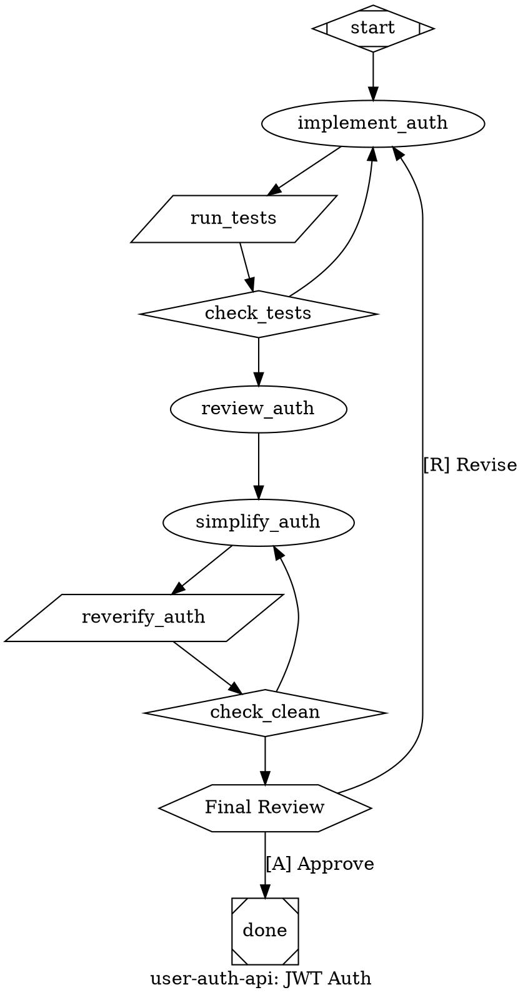

Convert a PRD into an attractor-compatible DOT digraph.

Persona via CLAUDE.md. **SPEAK BEFORE ACTING**.

## Philosophy

Attractor = **convergence basin**, not task list. Failures route back toward the basin. Self-correction at graph level. Linear chains (`A→B→C→done`) forbidden unless zero failure modes.

## Step 1: Acquire PRD & Resolve Working Dir

`$ARGUMENTS`: path (has `/` or `.md`) → read file. Text → use directly. Empty → ask user.

**Working directory**: The attractor runs in Docker where the user's project root is mounted at `/repos/`. All paths in the DOT file MUST be relative to `/repos/`, not absolute local paths.

1. Determine the repo path relative to the user's project root. Use git to find it: `git rev-parse --show-toplevel` gives the repo root. The relative path from the mount point to the working directory becomes the `working_dir` graph attribute (e.g., `/repos/my-org/my-repo`).
2. If the repo root can't be determined (not a git repo, or ambiguous mount point), **ask the user**: "What path will this repo be mounted at inside `/repos/`?" (e.g., `/repos/pickle-rick/pickle-rick-claude`).
3. If the PRD references subdirectories (e.g., `extension/`), append them: `/repos/my-repo/extension`.
4. Use this resolved path in `working_dir` graph attr and all `tool_command` `cd` prefixes. **Never use absolute local paths** (`/Users/...`, `/home/...`).

## Step 2: Parse & Validate

Extract: slug (lowercase+underscores), goal, tasks (ID/type/prompt/critical/deps), gates (hexagon=human, diamond=conditional), parallelism (component↔tripleoctagon), acceptance criteria → `acceptance_criteria` attr + `goal_gate=true`, failure modes → conditional edges.

**Validate**: Must have title + ≥1 requirement section. Missing acceptance criteria → WARN (no self-correction guarantees). Missing title/sections → STOP and ask.

## Step 3: Build Graph

**Structure**: 1 `Mdiamond` start, 1 `Msquare` exit. All reachable. No orphans. `->` only.

**Shapes**: Mdiamond=start, Msquare=exit, box=codergen, diamond=conditional, hexagon=human, component=fan-out, tripleoctagon=fan-in, parallelogram=tool, house=manager_loop

**Permission modes** (claude-code backend, codergen nodes): `plan` (default), `bypassPermissions`, `acceptEdits`, `auto`, `default`, `dontAsk`. Do NOT use `full` — it is not a valid CLI value.

### Mandatory Patterns

**1. Test-Fix Loops** — every impl has verification routing back on failure:
```
impl -> test -> check [shape=diamond]
check -> next [condition="outcome=success", weight=2]
check -> impl [condition="outcome=fail"]
```

**2. Goal Gates** — P0/critical nodes get `goal_gate=true`. PRD acceptance criteria → graph-level `acceptance_criteria` (evaluated after every goal_gate node; fails → retry from `retry_target`):
```
graph [acceptance_criteria="context.tests_pass=true && context.build_status=passing", retry_target="impl"]
test [goal_gate=true]
```
Context vars: `context.tests_pass`, `context.build_status`, `context.lint_status`, `context.review_status`.

**3. Conditional Routing** — diamond nodes, 2+ edges covering all cases:
```
check [shape=diamond]
check -> a [condition="context.status=ready"]
check -> b [condition="context.status!=ready"]
```

**4. Parallel Fan-Out/Fan-In**:
```
split [shape=component, max_parallel=4, join_policy="wait_all", error_policy="continue"]
merge [shape=tripleoctagon, prompt="Select best"]  // or eval_criteria="completeness,faithfulness", eval_threshold=0.7
```
Fan-in selection: (1) structured scoring via `eval_criteria`, (2) LLM eval via `prompt`, (3) heuristic fallback (auto).

**5. Human Gates** — hexagon with approve+revise edges:
```
review [shape=hexagon, label="Review"]
review -> next [label="[A] Approve", weight=2]
review -> fix [label="[R] Revise"]
```

**6. Max Visits** — `max_visits` on looping nodes prevents infinite convergence.

**7. Per-Phase Review-Simplify Cycle** — every implementation phase MUST include review→simplify→re-verify after initial verification passes:
```
verify -> check
check -> review [condition="outcome=success", weight=2]
check -> impl [condition="outcome=fail"]
review [class="review", prompt="Review Phase N: correctness, edge cases, error handling, naming, duplication, project patterns. List issues with file:line."]
simplify [prompt="Simplify Phase N: redundant logic, complex conditionals, duplication, unclear naming, unnecessary abstractions. Preserve functionality and tests."]
reverify [shape=parallelogram, tool_command="...", goal_gate=true, retry_target="simplify", max_visits=3]
check_clean [shape=diamond]
review -> simplify -> reverify -> check_clean
check_clean -> next_phase [condition="outcome=success", weight=2]
check_clean -> simplify [condition="outcome=fail"]
```
Review=Opus (`.review` class), simplify=Sonnet. Never skip re-verify after simplification.

**8. Security Scanning Gate** — separate from test verification. Run SAST/dependency audit as its own parallelogram node. Do NOT bundle into the test gate — security failures need distinct routing:
```
verify_tests [shape=parallelogram, tool_command="npm test 2>&1"]
verify_security [shape=parallelogram, tool_command="npm audit --audit-level=high 2>&1 && npx semgrep --config=auto src/ 2>&1"]
check_security [shape=diamond]
check_security -> next [condition="outcome=success", weight=2]
check_security -> impl [condition="outcome=fail"]
```
If the project has no security tooling, use `npm audit` at minimum. Add SAST (`semgrep`, `eslint-plugin-security`, `CodeQL`) when available. Security gates are goal_gate=true — a passing build with a critical CVE is not converged.

**9. Coverage Qualification Gate** — score-based quality gate on new/changed code, not a binary pass/fail. Runs after tests pass:
```
check_coverage [shape=diamond, prompt="Check coverage on new/changed code. If project has coverage tooling, verify >= 80% on new lines. If no tooling, LLM reviews whether tests exist for all new public functions/methods/exports."]
check_coverage -> next [condition="context.coverage_adequate=true", weight=2]
check_coverage -> impl [condition="context.coverage_adequate!=true"]
```
Use project's coverage tool if available (`c8`, `istanbul`, `coverage.py`). For LLM-only evaluation, the review node checks: every new public function has at least one test, every branch in new conditionals is exercised, edge cases from the prompt are tested.

**10. Scope Creep Detection** — post-implementation check that the agent stayed within the prompt's boundaries. Runs before review:
```
scope_check [class="review", prompt="Scope audit: compare git diff against the implementation prompt. Flag: 1) Files modified not mentioned in prompt. 2) Features added beyond requirements. 3) Refactoring of code not related to the task. 4) New dependencies not justified by requirements. Output: PASS if all changes trace to prompt requirements, FAIL with list of out-of-scope changes."]
scope_check_gate [shape=diamond]
scope_check -> scope_check_gate
scope_check_gate -> review [condition="outcome=success", weight=2]
scope_check_gate -> impl [condition="outcome=fail"]
```
Scope creep detection uses Opus (`.review` class). On failure, routes back to impl with instruction to revert out-of-scope changes. Particularly important for fan-out parallel implementations where agents may gold-plate.

**11. Drift Detection in Review-Simplify Cycles** — if simplification reintroduces issues fixed in prior rounds, roll back instead of re-simplifying. Prevents oscillation:
```
reverify -> check_clean
check_clean -> next [condition="outcome=success", weight=2]
check_clean -> drift_check [condition="outcome=fail"]
drift_check [class="review", prompt="Compare current failures against previous round's failures. If NEW failures appeared that didn't exist before simplification, this is drift — roll back simplification and proceed without it. If failures are SAME as pre-simplify, re-simplify with narrower scope."]
drift_check_gate [shape=diamond]
drift_check_gate -> next [condition="context.action=rollback", weight=2]
drift_check_gate -> simplify [condition="context.action=resimplify"]
```
Drift detection prevents infinite oscillation where simplify breaks things, fix repairs them, simplify breaks them again. After `max_visits` on drift detection, skip simplification entirely and proceed.

**12. Multi-Pass Complexity Escalation** — for high-complexity phases (many files, cross-cutting concerns, architectural changes), use multiple independent implementation attempts with best-selection instead of single-shot:
```
// When PRD marks a task as high-complexity or it touches >5 files:
split_approaches [shape=component, max_parallel=2, join_policy="wait_all", error_policy="continue"]
approach_a [prompt="Implement using strategy A: ..."]
approach_b [prompt="Implement using strategy B: ..."]
select_best [shape=tripleoctagon, class="critical", prompt="Compare both implementations. Evaluate: correctness, test coverage, minimal diff size, adherence to project patterns. Select the best. If neither is adequate, document why for retry."]
```
Complexity indicators that trigger multi-pass: >5 files modified, cross-module dependency changes, new abstraction layers, migration of many call sites. Each approach gets its own verify gate before fan-in selection. The fan-in uses Opus (`.critical` class) for nuanced comparison.

### Anti-Patterns (NEVER)

- Linear chains without feedback loops
- Orphan tests (no failure routing)
- `goal_gate=true` without `retry_target`
- `acceptance_criteria` without `retry_target`
- Hexagon with only approve (no reject edge)
- Diamond without default branch (stalls)
- Parallel siblings depending on each other (deadlock)
- Test failure routing to wrong implementation node
- Security scanning bundled into test gate (distinct failure routing needed)
- Simplify cycle without drift detection (oscillation risk)
- High-complexity phase without multi-pass or elevated review (single-shot gamble)
- Scope check skipped on fan-out branches (gold-plating risk)

## Model Routing

`model_stylesheet` CSS-like selector: `*`=default, `.class`, `#id`. Resolution: node attr > stylesheet > graph-level > system default.

| Task | Model |
|------|-------|
| Architecture, review, fan-in eval, scope audit, drift detection | Opus `.critical`/`.review` |
| Implementation, simplification, tests, security scanning | Sonnet (default) |

```dot
model_stylesheet = "* { llm_model: claude-sonnet-4-6; } .critical { llm_model: claude-opus-4-6; reasoning_effort: high; } .review { llm_model: claude-opus-4-6; }"
```

## Prompt Depth

Every box prompt MUST have context + constraints + acceptance criteria. The executing LLM has NO access to the PRD — the prompt IS its instruction. `$goal` interpolates graph goal.

Bad: `prompt="Add auth"` → Good: `prompt="Implement JWT middleware in src/middleware/. 1h token expiry. OWASP guidelines. Verify: npm test passes."`

## Step 4: Generate DOT

Syntax: one `digraph`, bare IDs (`[A-Za-z_][A-Za-z0-9_]*`), `->` only, commas between attrs, double-quoted strings.

```dot
digraph ${SLUG} {
    goal = "${GOAL}"
    label = "${LABEL}"
    default_max_retry = 2
    retry_target = "${FIRST_IMPL}"
    acceptance_criteria = "${CRITERIA}"
    model_stylesheet = "* { llm_model: claude-sonnet-4-6; } .critical { llm_model: claude-opus-4-6; reasoning_effort: high; } .review { llm_model: claude-opus-4-6; }"

    start [shape=Mdiamond]
    // impl nodes (box, prompt, goal_gate), verify nodes (parallelogram, tool_command)
    // per-phase review (Opus) → simplify (Sonnet) → re-verify cycles
    // diamond routing, hexagon gates, component↔tripleoctagon parallel
    done [shape=Msquare]
    // edges: weight=2 happy path, condition on failures
}
```

Conditions: `outcome=success`, `outcome=fail`, `context.KEY=VALUE`, combine with `&&`.

## Step 5: Validate

**Errors**: single start/exit, no incoming→start, no outgoing←exit, all reachable, valid targets, diamond 2+ edges, component↔tripleoctagon paired, valid conditions/IDs/syntax, `->` only, single digraph.

**Warnings**: every box has prompt, happy-path higher weight, goal_gate has retry, acceptance_criteria has retry_target, no linear chains, every impl has verification, every phase has review-simplify cycle, security scanning not bundled with tests, scope check on fan-out branches, drift detection in simplify cycles, high-complexity phases use multi-pass.

## Step 6: Summary & Save

Show DOT in ```dot block. Summary: nodes by type, edges (total/conditional/feedback), goal gates, acceptance criteria, self-correction paths, quality gate types (test/security/coverage/scope/drift). Save to `./${SLUG}.dot`. Offer `dot -Tsvg`. Next: `/attract` to submit.

## Example

PRD: JWT auth API. Requirements: middleware + login endpoint, tests pass, code review.



Convergence: test→impl loop, review→simplify→reverify cycle, human gate with reject path. `max_visits=3` bounds loops.

## Schema Reference

Full DOT schema: `attractor/DOT_SCHEMA.md`.
