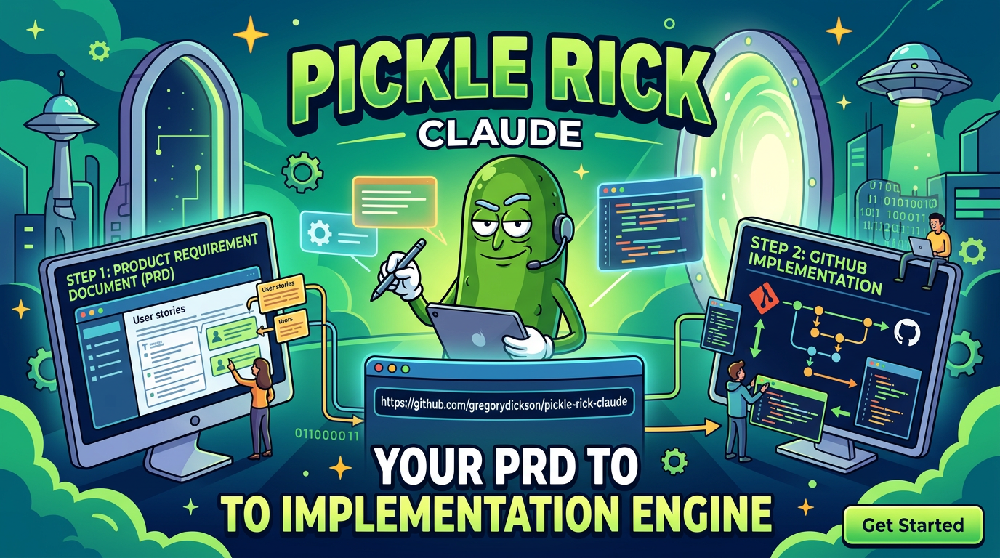

# Product Manager's Guide to Pickle Rick



A practical guide for PMs who want to define work, refine it with AI analysis, and optionally launch autonomous implementation — without needing to understand the internals.

---

## How It Works: Just Tell It What You Want

You don't need to memorize commands, learn syntax, or write a formal document to get started. Open a Claude Code session in your project and just say what you want in plain language:

> "Help me create a PRD for caching the loan status API responses in Redis."

> "I have a prd.md — can you refine it?"

> "I want to build a feature that lets underwriters bulk-approve loans. Help me write the requirements."

That's it. The system recognizes your intent and **automatically activates the right workflow** — PRD drafting, refinement, implementation — without you needing to type a specific command. Behind the scenes there are slash commands like `/pickle-prd` and `/pickle-refine-prd`, but you never need to use them directly. Just describe what you need and the system figures out which tool to use.

Some examples of natural language that triggers the right workflow:

| What you say | What the system does |
|:-------------|:---------------------|
| "Help me create a PRD for X" | Starts the PRD drafting interview |
| "Write requirements for X" | Starts the PRD drafting interview |
| "Refine this PRD" / "Improve my prd.md" | Launches parallel refinement analysts |
| "Build X" / "Implement X" | Drafts a PRD, decomposes, and implements |
| "Refine and implement this PRD" | Refines, decomposes, and launches autonomous implementation |

You can also use the slash commands directly if you prefer — `/pickle-prd`, `/pickle-refine-prd`, `/pickle` — but natural language works just as well.

### The System Explores Your Project For You

Once you describe your intent, the system **automatically explores your codebase** to understand what already exists. It reads your source files, finds relevant patterns, traces how data flows through the system, and identifies the exact files and functions your feature will touch. You don't need to know file paths or function names — the system discovers them.

This exploration happens at two key moments:

1. **During PRD drafting** (`/pickle-prd`) — while interviewing you about requirements, the system reads your code to ground the conversation in reality. It might say: *"I see you already have a Redis client at `src/services/redis.ts` — should we use that, or do you need a separate cache layer?"*

2. **During refinement** (`/pickle-refine-prd`) — three AI analysts run in parallel, each deeply exploring your codebase from a different angle (requirements gaps, code integration points, risk/scope). They cross-reference each other's findings across 3 cycles.

### The Conversation That Builds Your PRD

The system doesn't just accept your description and run — it **interrogates you** to fill gaps. This is a back-and-forth conversation:

- You say what you want to build
- It asks **why** — what problem does this solve, who's affected, why now?
- It asks about **scope** — what's in, what's explicitly out?
- It pushes on **verification** — for *every* requirement, it asks: **"How will we know this works?"**

That last question is the key difference from a traditional PRD. The system needs machine-checkable acceptance criteria — a test to run, a command to execute, a condition to assert. It won't let you get away with "should work correctly." It'll push until you have something like `npm test -- cache-invalidation.test.ts` or `curl -w '%{time_total}' /api/status returns under 100ms`.

This might feel annoying. It's the most valuable part. Requirements that can't be verified automatically can't be implemented reliably.

### What You Get Out

The system produces a structured PRD with:

- Problem statement grounded in your codebase (not abstract)
- Scope boundaries that prevent gold-plating
- Requirements with machine-checkable verification for each one
- Interface contracts with exact data shapes (discovered from your code)
- Test expectations — what tests should exist, what they should assert
- Codebase context — specific file paths, existing patterns to follow

Then, if you choose to refine and implement:

```
Your description  →  Interactive PRD drafting  →  AI Refinement (3 analysts x 3 cycles)
                                                          ↓
                                               Atomic Tickets  →  Autonomous Implementation  →  Code Review
```

---

## Getting Started: Three Approaches

In all cases, start by opening a Claude Code session in your project directory. From there, just talk.

### Approach 1: Guided conversation (recommended)

Best for: First-timers, complex features, when you're not sure about scope.

1. Say something like: *"Help me create a PRD for bulk loan approvals"*
2. The system starts the PRD interview automatically — no command needed
3. Have the conversation — answer questions, push back, iterate
4. Review the generated `prd.md`
5. Say *"Refine this PRD"* — the system launches 3 parallel analysts to improve it
6. Say *"Implement it"* — autonomous execution begins

The interview covers:
- **What** you're building (feature)
- **Why** it matters (problem, value, urgency)
- **Who** it's for (audience, user journeys)
- **How** to verify it (the hard question — automated checks for each requirement)
- **What's out of scope** (prevents the AI from building things you didn't ask for)
- **What exists already** (the system reads your codebase and asks about relevant code it finds)

### Approach 2: Write your own PRD, let the system refine it

Best for: PMs who already have a draft or are comfortable writing requirements.

1. Write a `prd.md` (see template below)
2. Say *"Refine my prd.md"* — the system finds it and launches refinement
3. It checks your PRD for verification readiness — if it's thin, it interviews you
4. Three analysts explore your codebase and refine the PRD in parallel
5. Atomic tickets are generated
6. Review, then say *"Implement it"* or *"Resume"*

### Approach 3: One sentence, full automation

Best for: Small, well-understood changes. Risky for anything complex.

1. Say *"Build rate limiting for the status API"*
2. The system drafts a PRD from your sentence, explores the codebase, decomposes into tickets, and implements
3. All in one loop, no hand-holding

---

## What Happens After Your PRD Is Ready

### Refinement (automatic)

When you run `/pickle-refine-prd`, three AI analysts explore your project in parallel:

| Analyst | What It Does |
|:--------|:-------------|
| **Requirements** | Finds gaps, ambiguities, missing acceptance criteria, untestable requirements |
| **Codebase** | Maps requirements to existing code — finds file paths, patterns to follow, integration points, potential conflicts |
| **Risk & Scope** | Identifies scope creep potential, dependency risks, ordering concerns, missing edge cases |

They run 3 cycles, cross-referencing each other's findings. The output is a **refined PRD** with concrete file paths, interface contracts, and decomposed tickets.

### Implementation (autonomous)

After refinement, the system executes autonomously. Each ticket goes through 8 phases:

1. **Research** — reads the codebase to understand context
2. **Review research** — validates understanding before planning
3. **Plan** — architects the solution
4. **Review plan** — catches design issues before coding
5. **Implement** — writes the code
6. **Spec conformance** — runs every acceptance criterion automatically
7. **Code review** — security, correctness, architecture audit
8. **Simplify** — removes dead code, cleans up

You don't need to be involved. But review the PRD carefully before launching — it's the source of truth for everything downstream.

---

## Writing a Better PRD (optional — the system helps you)

You don't *need* to write a formal PRD — the guided conversation produces one for you. But if you prefer to write your own, or want to understand what makes a good one, here's the template:

### The Minimum Viable PRD

```markdown
# [Feature Name] PRD

## Problem
What's broken, who's affected, why it matters now.

## Goal
One sentence describing what "done" looks like.

## Scope
### In-scope
- What to build (be specific)

### Out of scope
- What NOT to build (be explicit — this prevents the AI from gold-plating)

## Requirements
| Priority | Requirement | Verification |
|:---------|:------------|:-------------|
| P0       | [Must have] | [How to verify automatically] |
| P1       | [Should have] | [How to verify automatically] |
```

Five sections. The refinement process fills in everything else — interface contracts, test expectations, codebase context, implementation details. But the more you provide, the better the output.

### The Verification Column

This is the single most important thing that separates a Pickle Rick PRD from a traditional PRD. Every requirement needs a **machine-checkable** way to verify it.

**Good verification examples:**
- `npm test -- loan-status.test.ts` (run a specific test)
- `curl -w '%{time_total}' localhost:3000/api/status` returns under 200ms
- `npx tsc --noEmit` passes with zero errors
- `grep -r "TODO" src/auth/` returns no results
- LLM reads implementation and confirms behavior matches spec (for UX/behavioral requirements)

**Bad verification examples:**
- "Should work correctly" (not testable)
- "Looks good" (subjective)
- "QA will verify" (not automated)
- "Meets requirements" (circular)

If you can't think of how to verify a requirement automatically, that's a signal the requirement is too vague. Rewrite it until you can.

### Priority Levels

| Priority | Meaning | Guidance |
|:---------|:--------|:---------|
| **P0** | Must ship | Blocks the feature. If any P0 fails verification, the implementation is incomplete. |
| **P1** | Should ship | Important but the feature works without it. Can be a follow-up ticket. |
| **P2** | Nice to have | Only if time allows. Often better as a separate PRD. |

### Sections That Improve Output Quality

Beyond the minimum, these sections significantly improve what the system produces:

**Interface Contracts** — If your feature touches APIs, shared types, or crosses module boundaries, define the exact shapes:

```markdown
## Interface Contracts
| Endpoint | Input | Output | Error |
|:---------|:------|:-------|:------|
| POST /api/loans/:id/status | `{ status: "approved" \| "denied", reason?: string }` | `{ id: string, status: string, updatedAt: string }` | `{ error: string, code: number }` |
```

**Codebase Context** — Point at existing files, patterns, or conventions:

```markdown
## Context
- Similar feature: `src/api/routes/loan-notes.ts` — follow this pattern
- Shared types: `packages/shared/types/loan.ts`
- Test pattern: see `tests/api/loan-notes.test.ts` for integration test structure
```

**User Journeys** — Step-by-step flows become acceptance tests:

```markdown
### CUJ: Approve a Loan
1. User opens loan detail page (`/loans/:id`)
2. Clicks "Approve" button
3. Confirmation modal appears with reason field
4. User enters reason, clicks "Confirm"
5. Status updates to "Approved" in the UI
6. Audit log entry created
7. Notification sent to borrower
```

**Not-in-scope** — Explicitly listing what you're NOT building prevents the AI from over-engineering:

```markdown
### Not in scope
- Bulk approval (separate feature)
- Email notifications (existing system handles this)
- Approval workflow with multiple reviewers (v2)
- Mobile-specific UI changes
```

---

## Common PRD Mistakes

| Mistake | Why It's Bad | Fix |
|:--------|:-------------|:----|
| No scope boundaries | AI adds features you didn't ask for | Write explicit "Not in scope" section |
| Vague requirements ("improve performance") | Can't verify, can't decompose into tickets | Make measurable: "API response time under 200ms at p95" |
| Implementation details as requirements | Constrains the solution unnecessarily | Describe the **what**, not the **how** |
| Multiple unrelated features | Tickets get tangled, verification becomes unclear | One PRD per feature |
| No codebase context | Refinement team has to guess where things go | Point at existing files and patterns |
| Subjective acceptance criteria | "Looks professional" can't be automated | Rewrite as observable behavior |
| Time estimates | The system ignores them; they add noise | Focus on scope and priority instead |

---

## What Happens During Refinement

When you say *"refine this PRD"* (or run `/pickle-refine-prd`), here's what actually happens:

1. **Verification readiness check** — The system scans your PRD for:
   - Interface contracts with exact types
   - Verification commands that can actually run
   - Test expectations with file paths and assertions
   - Machine-checkable acceptance criteria

   If anything is missing or vague, it pauses and asks you to fill gaps.

2. **Parallel analysis** (3 workers x 3 cycles) — Each analyst reads your PRD and the codebase, produces a report, then cross-references the other analysts' findings in subsequent cycles.

3. **Synthesis** — Findings are merged into a refined PRD. Changes are attributed: `*(refined: requirements analyst)*` so you can trace what changed.

4. **Decomposition** — The refined PRD is broken into atomic tickets:
   - Each ticket is < 30 minutes of coding work
   - Each touches < 5 files
   - Each has < 4 acceptance criteria
   - Each is self-contained (the worker doesn't need the full PRD)
   - Each has embedded research seeds (file paths, patterns, APIs to look at)

5. **Output** — You get:
   - `prd_refined.md` — your PRD with refinement additions
   - `linear_ticket_parent.md` — the epic
   - `<hash>/linear_ticket_<hash>.md` — one per ticket, ordered

---

## Reviewing Tickets Before Implementation

Before saying *"implement it"* (or running `/pickle --resume`), check the tickets:

- **Order**: Do dependencies make sense? Ticket 10 shouldn't depend on Ticket 30.
- **Scope**: Is each ticket doing one thing? Split if it's doing two.
- **Acceptance criteria**: Could you manually verify each criterion? If not, rewrite it.
- **File paths**: Do the referenced files actually exist? Refinement usually gets this right, but check.
- **Not-in-scope**: Does any ticket exceed the PRD's scope boundaries?

You can edit tickets directly — they're markdown files in the session directory.

---

## Monitoring Progress

You can check on things at any time by asking in natural language:

| What you say | What you get |
|:-------------|:-------------|
| *"What's the status?"* | Current phase, iteration, ticket status (todo/in-progress/done) |
| *"Give me a standup summary"* | Formatted summary of recent activity |
| *"How many tokens have we used?"* | Token usage, commits, lines changed |
| *"Stop"* / *"Cancel"* | Stops the loop |
| *"Retry ticket abc123"* | Re-attempts a failed ticket |

For power users, these also work as slash commands: `/pickle-status`, `/pickle-standup`, `/pickle-metrics`, `/eat-pickle`, `/pickle-retry <id>`.

In long-running mode, you can attach to a live dashboard:
- Top-left: ticket status, phase, elapsed time
- Top-right: iteration log
- Bottom: live worker output

---

## FAQ for Product Managers

**Q: Do I need to know how to code?**
No. You need to understand your product requirements well enough to make them specific and verifiable. The system handles implementation.

**Q: How specific should my PRD be?**
As specific as possible on the *what* and *why*. Leave the *how* to the system unless you have strong constraints (e.g., "must use the existing Redis instance, not a new one").

**Q: What if the system builds the wrong thing?**
It built exactly what your PRD specified. Refine the PRD, re-run. The PRD is the source of truth — there's no separate "feedback" mechanism.

**Q: Can I change requirements mid-implementation?**
Say *"stop"* to cancel the loop, update the PRD, then say *"refine and implement this PRD."* Don't edit tickets while the system is running.

**Q: How long does implementation take?**
Depends on complexity. A 3-ticket feature might take 30 minutes. A 15-ticket epic might take several hours. The system runs unattended — you don't need to watch it.

**Q: What if a ticket fails?**
Say *"retry ticket abc123"* to re-attempt it. If it keeps failing, the acceptance criteria or scope may need adjustment.

**Q: Do I need to memorize slash commands?**
No. Just describe what you want in plain language — *"create a PRD," "refine my PRD," "implement it," "what's the status?"* — and the system activates the right workflow automatically. Slash commands exist for power users but are never required.

**Q: What's the difference between the interview and just writing a markdown file?**
The interview pushes on verification, contracts, and scope — questions you might not think to answer on your own. If you're comfortable writing PRDs with machine-checkable criteria, writing your own is fine. If you're new to this, the interview helps.

**Q: Do I need to include time estimates?**
No. The system ignores them. Focus on scope, acceptance criteria, and priority.

---

## Example: Minimal PRD That Works

```markdown
# Loan Status Caching PRD

## Problem
The loan status API (`GET /api/loans/:id/status`) hits the database on every request.
At current volume (500 req/min), this adds unnecessary load and increases p95 latency to 800ms.
Operations team has flagged this as a scaling concern before Q3 volume increase.

## Goal
Cache loan status responses in Redis with intelligent invalidation,
reducing p95 latency to under 100ms for cache hits.

## Scope
### In-scope
- Redis cache layer for loan status endpoint
- Cache invalidation when loan status changes
- Cache TTL configuration
- Cache hit/miss metrics logging

### Out of scope
- Caching other endpoints (separate PRD per endpoint)
- Redis cluster setup (ops team handles infrastructure)
- Cache warming on deployment

## Requirements
| Priority | Requirement | Verification |
|:---------|:------------|:-------------|
| P0 | Cached responses return in <100ms at p95 | `npm run bench -- loan-status --p95` |
| P0 | Cache invalidates when status changes via PUT /api/loans/:id/status | `npm test -- cache-invalidation.test.ts` |
| P0 | Cache TTL is configurable via environment variable | `CACHE_TTL=60 npm test -- cache-ttl.test.ts` |
| P1 | Cache hit/miss ratio logged to application metrics | `grep "cache.hit\|cache.miss" src/api/routes/loan-status.ts` |
| P1 | Graceful degradation — DB fallback if Redis is unavailable | `npm test -- cache-fallback.test.ts` |

## Context
- Endpoint: `src/api/routes/loan-status.ts`
- Redis client: `src/services/redis.ts` (already configured)
- Test pattern: see `tests/api/loan-notes.test.ts`
- Status update handler: `src/api/routes/loan-mutations.ts:updateStatus()`
```

This is ~40 lines. Refinement expands it to ~200 with contracts, test expectations, and implementation details. The tickets practically write themselves.
