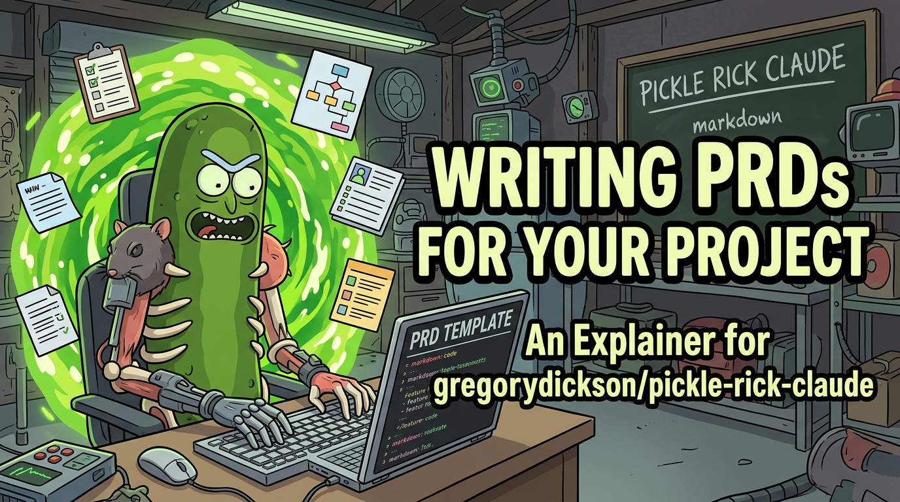

# How to Write a PRD for Pickle Rick



*Most PRDs are garbage — wishes sprinkled with corporate jargon. This guide tells you how to write one my system can turn into working code.*

---

## Four Ways to Start

**A: Just talk** — Describe what you want in a Claude Code session. I'll ask questions, poke holes, write the PRD. Save as `.md`, hand to `/pickle-refine-prd` or `/pickle`.

**B: `/pickle-prd`** — Structured interview. Why, Who, What, How, plus verification drilling (how to verify each requirement automatically). I write the PRD and initialize a session.

**C: Write it yourself** — Hand a `.md` to `/pickle-refine-prd`. Three parallel analysts refine it, cross-reference your codebase, produce tickets.

**D: Wing it** — `/pickle your task`. I draft a PRD from one sentence. Fine for small stuff, gambling for anything complex.

---

## What Goes in a PRD

🔴 = critical, 🟡 = recommended, 🟢 = optional. Write for a hyper-intelligent pickle who's short on patience.

### 1. Title & Summary — 🔴
```markdown
# [Feature] PRD
One sentence: what it does and why.
```
"Improve performance" = useless. "Add Redis caching to loan-status API" = useful.

### 2. Problem Statement — 🔴
```markdown
## Problem
**Current Process**: | **Users**: | **Pain Points**: | **Importance**:
```
Skip this and I'm solving the wrong problem brilliantly.

### 3. Objective & Scope — 🔴
```markdown
## Scope
**Objective**: Single measurable goal | **Done looks like**:
### In-scope
### Not-in-scope
```
Not-in-scope is more important. Without it, I'll keep adding features you didn't ask for.

### 4. User Journeys — 🟡
Step-by-step flows. These become acceptance criteria. "User clicks Edit Profile → changes email → Save → sees toast → new email in header" — that's verifiable.

### 5. Functional Requirements — 🟡
```markdown
| Priority | Requirement | Verification |
|:---------|:------------|:-------------|
| P0       | Cached results <50ms | `curl -w '%{time_total}' /api/status` |
| P1       | Cache invalidates on change | `npm test -- cache-invalidation.test` |
```
Every requirement needs a Verification column — a machine-checkable command, test, or assertion. The spec IS the review.

### 6. Interface Contracts — 🟡
```markdown
## Interface Contracts
| Endpoint | Input | Output | Error |
|:---------|:------|:-------|:------|
```
Exact shapes at boundaries — field names, types. If your feature crosses module/service boundaries, this is required. N/A with justification otherwise.

### 7. Verification Strategy — 🟡
How conformance is checked automatically:
- **Type**: project type checker passes (tsc/mypy/equivalent)
- **Test**: all acceptance tests pass
- **Contract**: interface shapes match impl signatures
- **LLM**: agent reads impl, quotes code, PASS/FAIL (behavioral reqs only)

### 8. Test Expectations — 🟡
```markdown
| Requirement | Test File | Description | Assertion |
|:------------|:----------|:------------|:----------|
```
Specified BEFORE implementation. Small features (<3 files) can consolidate into requirements table.

### 9. Technical Constraints — 🟡
What I *can't* do. Boundaries make me more creative.

### 10. Codebase Context — ⭐
File paths, function names, existing patterns. My refinement team greps your repo, but pointing at the right files up front makes tickets *significantly* better.

### 11. Assumptions / Risks / Impact — 🟢
Things to verify before building, risk mitigations, success metrics.

---

## Minimum Viable PRD

```markdown
# [Feature] PRD

## Problem
[2-3 sentences: what's broken and who cares]

## Goal
[1 sentence: what "done" looks like]

## Scope
### In
- [What to build]
### Out
- [What NOT to build]

## Requirements
| Priority | Requirement | Verification |
|:---------|:------------|:-------------|
| P0       | [Must have] | [command/test] |
| P1       | [Should have] | [command/test] |

## Context
- Key files: [paths]
- Patterns to follow: [examples]
```

Five sections. Refinement fills the gaps.

---

## Good vs. Bad PRD Signals

**Good**: Specific verbs (Add/Replace/Remove), measurable outcomes (under 200ms), file references, explicit boundaries, concrete user flows, machine-checkable verification.

**Bad**: Vague aspirations ("world-class"), no scope boundaries, requirements that are implementation details, zero codebase context, multiple unrelated features, subjective acceptance criteria ("looks good").

---

## How the System Uses Your PRD

1. **Verification Readiness** — Checks for interface contracts, verification strategy, test expectations, machine-checkable criteria. Missing/vague → interactive interview. Under-specified PRDs can't auto-run.
2. **Refinement** — 3 parallel analysts × 3 cycles against your codebase. Requirements, codebase context, risk/scope.
3. **Decomposition** — Atomic tickets (<30min, <5 files, <4 criteria). Self-contained with embedded contracts, tests, conformance checks.
4. **Execution** — 8 phases per ticket: Research → Review → Plan → Review → Implement → **Spec Conformance** → Code Review → Simplify. Conformance runs every acceptance criterion and checks contracts before subjective review.

**Your PRD is the source of truth AND the review mechanism.** Precise spec = automated verification. Graphite is the audit trail, not the bottleneck.

---

## Quick Reference

| Command | Use When |
|:--------|:---------|
| `/pickle-prd <topic>` | Want guided interview → PRD |
| `/pickle-refine-prd <path>` | Have a draft → refine + tickets |
| `/pickle-refine-prd --run <path>` | Ready to let it rip |
| `/pickle <task>` | Small/clear task, one shot |
| `/pickle-tmux --resume <session>` | Picking up where you left off |
| `/citadel --prd <path>` | Post-implementation conformance audit against the PRD |

---

## Configuration Reference

Every user-facing BMAD hardening knob lives in one of these surfaces. Anything else is out-of-spec.

### CLI Flags

| Skill | Flag | Type | Default | Description |
|:------|:-----|:-----|:--------|:------------|
| `/pickle-readiness` | `--skip-readiness "<reason>"` | string <=200 chars | none | Bypass gate; reason required and logged |
| `/pickle-readiness` | `--repo-root <path>` | repeatable path | `process.cwd()` | Multi-repo workspace targeting |
| `/pickle-readiness` | `--history [--last N]` | int | 10 | Show readiness cycle history |
| `/pickle-archaeology` | `--refresh` | bool | false | Force re-archaeology |
| `/pickle-archaeology` | `--no-archaeology` | bool | false | Disable injection for session |
| `/pickle-archaeology` | `--project-type <category>` | enum | auto | Override classifier |
| `/pickle-correct-course` | `--auto-apply` | bool | false | Skip approval prompt |
| `/pickle-correct-course` | `--force` | bool | false | Override low-confidence gate; structural predicates still apply |
| `/pickle-correct-course` | `--dry-run` | bool | false | Emit proposal without apply |
| `/pickle-correct-course` | `--recover-from-ledger` | bool | false | Replay-reverse partial apply |
| `/pickle-correct-course` | `--recover --force` | bool | false | Forward-replay partial apply |
| `/pickle-debate` | `--solo` | bool | auto on codex | Sequential single-context debate |
| `/pickle-debate` | `--strict-teams` | bool | false | Disable codex auto-promote; persisted in `state.json.flags.strict_teams` |
| `/pickle-debate` | `--continue [--personas <subset>]` | bool/csv | off | Continue prior debate; fenced against round-one `tickets_version` |
| `/pickle-debate` | `--n <count>` | int 2..6 | 4 | Number of personas |
| `/pickle-debate` | `--personas <csv>` | csv | r,a,i,s | Persona selection |
| `/pickle-debate` | `--accept-stale` | bool | false | Round-N override after `tickets_version` changes |

### Environment Variables

| Variable | Type | Default | Effect |
|:---------|:-----|:--------|:-------|
| `PICKLE_PHASE_PERSONAS` | `on|off` | `off` | P2 dispatcher kill-switch until behavioral baseline is checked in |
| `PICKLE_ARCHAEOLOGY_AUTO_REFRESH` | `on|off` | `on` | P1 auto-trigger kill-switch |
| `BEHAVIORAL` | `0|1` | `0` | Gate behavioral tests |
| `CI` | `0|1` | `0` | Suppress confirmation prompts; strict budget |

### Settings

Settings live under `~/.claude/pickle-rick/pickle_settings.json:bmad_hardening`.

| Key | Type | Default | Used by |
|:----|:-----|:--------|:--------|
| `archaeology_refresh_threshold_pct` | int 0-100 | 10 | P1 auto-refresh |
| `debate_max_rounds` | int 1-10 | 5 | P4 multi-round cap |
| `debate_codex_solo_max_rounds` | int 1-5 | 2 | P4 codex solo cap |
| `debate_min_rounds_confirm` | int 1-10 | 3 | P4 multi-round confirmation |
| `readiness_skip_reasons_max_len` | int | 200 | P0 readiness bypass |
| `readiness_max_recycle_cycles` | int | 3 | P0 recycle cap |
| `phase_personas_enabled` | bool | false | P2 dispatcher |
| `phase_personas.model_override` | object | `{}` | P2 model overrides |
| `behavioral_test_max_usd_per_test` | float | 0.50 | Behavioral framework |
| `behavioral_test_max_wall_s` | int | 120 | Behavioral framework |
| `calibration.drift_threshold_pct` | int | 5 | Calibration drift gate |

### Discoverability

- `/help-pickle` lists skills and primary flags.
- `/pickle-status --config` prints resolved configuration for the current session, including provenance.
- `/pickle-readiness --history` shows readiness cycle log.
- Calibration drift gates are `npm run calibrate:readiness`, `npm run calibrate:correct-course`, and `npm run calibrate:archaeology` from `extension/`; run `node bin/calibrate.js <suite> --write` only when intentionally recalibrating after the documented baseline trigger changes.
- This guide mirrors the source configuration table.

### Hang Guards

| Const | Default | Used by |
|:------|:--------|:--------|
| `READINESS_GREP_TIMEOUT_MS` | `30_000` ms | P0 contract resolution through `scope-resolver.computeOneHop()` |
| `ARCHAEOLOGY_WORKER_TIMEOUT_S` | `600` s | P1 worker spawn through `buildWorkerInvocation()` |
| `CORRECTOR_TIMEOUT_S` | `300` s | P3 corrector path through `buildJudgeInvocation()`; current bin is brief-prep only |
| `DEBATER_TIMEOUT_S` | `240` s | P4 per-persona path; current bin is brief-prep only |
