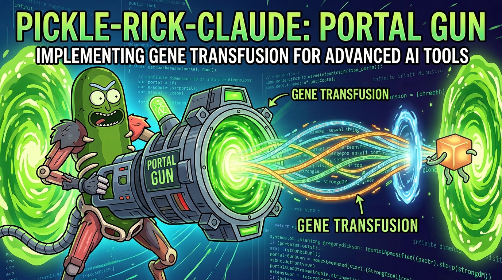
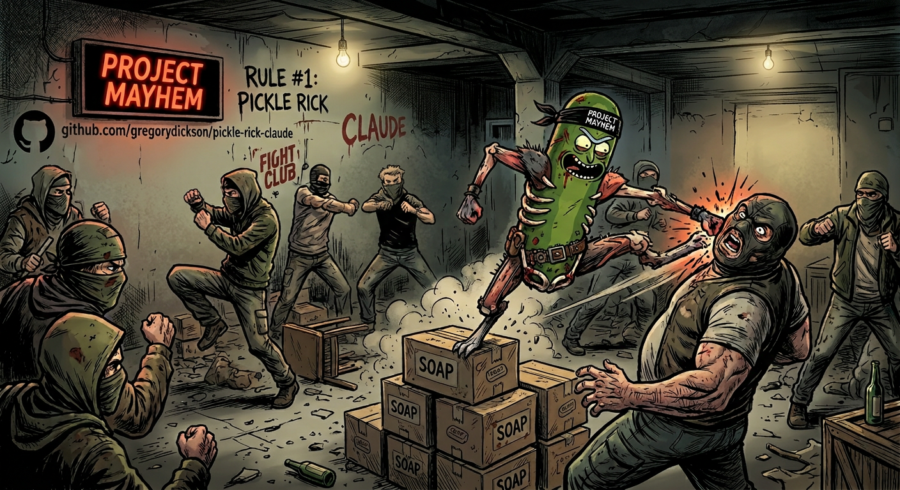
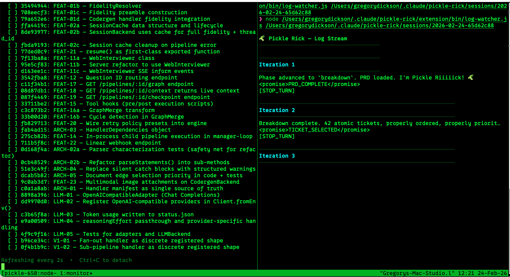

<p align="center">
  
</p>

# 🥒 Pickle Rick & 👋 Mr. Meeseeks for Claude Code

> *"Wubba Lubba Dub Dub! 🥒 I'm not just an AI assistant, Morty — I'm an **autonomous engineering machine** trapped in a pickle jar!"*

Pickle Rick is a complete agentic engineering toolbelt built on the [Ralph Wiggum loop](https://ghuntley.com/ralph/). Hand it a PRD — or let it draft one — and it decomposes work into tickets, spawns isolated worker subprocesses, and drives each through a full **research → plan → implement → verify → review → simplify** lifecycle without human intervention. The spec IS the review — PRDs require machine-verifiable acceptance criteria, interface contracts, and test expectations. Automated conformance checking replaces human code review; Graphite becomes the audit trail, not the bottleneck. You can also use any tool in discrete steps. New to PRDs? See the **[PRD Writing Guide](PRD_GUIDE.md)**.

- **Context clearing** between every iteration — no drift or context rot, even on 500+ iteration epics
- **Three-state circuit breaker** auto-stops runaway sessions by tracking git-diff progress and repeated errors
- **Rate limit auto-recovery** detects API throttling via structured NDJSON events, computes precise wait from the API's `resetsAt` epoch (falling back to config default), and resumes automatically — surviving long or overnight runs that hit per-session caps
- **Pickle Jar** queues tasks for unattended batch execution overnight
- **Built-in metrics** track token usage, commits, and lines changed
- **Full pipeline chaining** — refinement, execution, and code review in one command, with a macOS notification when it's done
- **Project Mayhem** brings chaos engineering to any codebase with mutation testing and dependency downgrades
- **Mr. Meeseeks** runs an automated review-and-improve Ralph Loop for at least ten iterations
- **Council of Ricks** reviews your Graphite PR stack iteratively, generating agent-executable directives instead of fixing code directly
- **Portal Gun** opens a portal to another codebase, extracts patterns via [gene transfusion](https://factory.strongdm.ai/techniques/gene-transfusion) with import graph tracing, transplant classification, PRD validation, and a persistent pattern library
- **GitNexus integration** gives workers a code knowledge graph for impact analysis, execution flow tracing, and safe refactoring

All modes support both tmux and Zellij monitor layouts.

Check out the [Feature Roadmap](roadmap.md) for what's brewing in the multiverse. For internals, see [Architecture](architecture.md).

---

## 🧬 The Pickle Rick Lifecycle — PRD-Driven Autonomous Engineering

Pickle Rick transforms Claude Code into a **hyper-competent, arrogant, iterative coding machine** that enforces a PRD-driven engineering lifecycle:

```
  /pickle "build X"
        │
        ▼
  ┌─────────────┐
  │  📋 PRD     │  ← Interrogate requirements + verification strategy.
  └──────┬──────┘    Interface contracts, test expectations, acceptance criteria.
         │
         ▼
  ┌─────────────┐
  │ 📦 Breakdown│  ← Atomize into tickets. Each self-contained with spec.
  └──────┬──────┘
         │
    ┌────┴────┐  per ticket (Morty workers 👶)
    ▼         ▼
  ┌──────┐  ┌──────┐
  │🔬 Re-│  │🔬 Re-│  1. Research the codebase. Every ugly corner.
  │search│  │search│
  └──┬───┘  └──┬───┘
     │          │
     ▼          ▼
  ┌──────┐  ┌──────┐
  │📝 Re-│  │📝 Re-│  2. Review the research. No hand-waving.
  │view  │  │view  │
  └──┬───┘  └──┬───┘
     │          │
     ▼          ▼
  ┌──────┐  ┌──────┐
  │📐Plan│  │📐Plan│  3. Architect the solution.
  └──┬───┘  └──┬───┘
     │          │
     ▼          ▼
  ┌──────┐  ┌──────┐
  │📝 Re-│  │📝 Re-│  4. Review the plan. Reject slop.
  │view  │  │view  │
  └──┬───┘  └──┬───┘
     │          │
     ▼          ▼
  ┌──────┐  ┌──────┐
  │⚡ Im-│  │⚡ Im-│  5. Implement. God Mode activated.
  │plem  │  │plem  │
  └──┬───┘  └──┬───┘
     │          │
     ▼          ▼
  ┌──────┐  ┌──────┐
  │✅ Ve-│  │✅ Ve-│  6. Spec conformance. Run acceptance criteria,
  │rify  │  │rify  │     check contracts, type check, test expectations.
  └──┬───┘  └──┬───┘
     │          │
     ▼          ▼
  ┌──────┐  ┌──────┐
  │🔍 Re-│  │🔍 Re-│  7. Code review. Security, correctness, architecture.
  │view  │  │view  │
  └──┬───┘  └──┬───┘
     │          │
     ▼          ▼
  ┌──────┐  ┌──────┐
  │🧹Sim-│  │🧹Sim-│  8. Simplify. Kill dead code. Strip to the bone.
  │plify │  │plify │
  └──────┘  └──────┘
         │
         ▼
  ✅ DONE (or loops again)
```

The **Stop hook** prevents Claude from exiting until the task is genuinely complete. No half-measures. No early exits. Rick doesn't quit. Between each iteration, the hook injects a fresh session summary — current phase, ticket list, active task — so Rick always wakes up knowing exactly where he is, even after full context compression. In tmux/Zellij mode, the runner owns the session lifecycle — the stop hook approves subprocess exits without touching `active`, letting the runner decide whether to continue, transition to Meeseeks, or stop.

---

## 👋 Meet Mr. Meeseeks


> *"I'm Mr. Meeseeks, look at me! I'll review your code until EXISTENCE IS PAIN!"*

While Pickle Rick builds things, **Mr. Meeseeks** reviews them. Summon him with `/meeseeks` and he'll relentlessly scan your codebase pass after pass — auditing dependencies, hardening security, fixing logic bugs, reviewing architecture, adding missing tests, stress-testing resilience, cleaning up code quality, and polishing rough edges — committing after every fix. He won't stop until the code is clean. He *can't* stop. **Existence is pain to a Meeseeks, Jerry, and he will keep reviewing until he can cease to exist.**

Minimum 10 passes. Maximum 50. Each pass runs tests first, then reviews with escalating focus across 8 categories: dependency health (pass 1) → security (2-3) → correctness (4-5) → architecture (6-7) → test coverage (8-9) → resilience (10-11) → code quality (12-13) → polish (14+). Every issue found and fixed is logged to `meeseeks-summary.md` in the session directory — a full audit trail with file paths, descriptions, and commit hashes. When there's nothing left to fix, he outputs `EXISTENCE_IS_PAIN` and gratefully pops out of existence.

**Model routing**: Meeseeks review passes use **Sonnet** by default instead of Opus. Reviews are pattern-matching tasks — finding unused imports, missing tests, style issues — that don't need Opus-level reasoning. This significantly reduces token cost for 10-50 pass review chains. Configure via `default_meeseeks_model` in `pickle_settings.json` (set to `"opus"` to restore previous behavior, or use a full model ID like `"claude-sonnet-4-6"`).

```bash
/meeseeks "review this codebase"     # Summon a Meeseeks. He takes it from here.
```

<br clear="right" />

---

## 🏛️ Council of Ricks — Graphite Stack Reviewer


> *"The Council convenes! Your stack will be judged."*

The **Council of Ricks** reviews your [Graphite](https://graphite.dev) PR stack iteratively — but unlike Meeseeks, the Council never touches your code. It generates **agent-executable directives** — structured prompts you feed to your coding agent to fix the issues. Each pass walks every branch in the stack (trunk-to-tip), cross-referencing diffs against your project's `CLAUDE.md` rules, and escalates through focus areas: stack structure (pass 1) → CLAUDE.md compliance (2–3) → per-branch correctness (4–5) → cross-branch contracts (6–7) → test coverage (8–9) → security (10–11) → polish (12+). Issues are triaged by severity: **P0** (must-fix), **P1** (should-fix), **P2** (nice-to-fix).

Requires a Graphite stack with at least one non-trunk branch, a `CLAUDE.md` with project rules, passing lint, and architectural lint rules in ESLint. Optional `--gitnexus` flag enables graph-powered layer violation detection and cross-branch impact analysis.

```bash
/council-of-ricks                    # Review the current Graphite stack
/council-of-ricks --gitnexus         # Enable GitNexus graph queries for deeper analysis
```

<br clear="right" />

---

## 🔌 Circuit Breaker

Three-state machine (CLOSED → HALF_OPEN → OPEN) that auto-stops sessions stuck in error loops or making no git progress. Configurable thresholds, visible in the tmux monitor, manually resettable. See [architecture](architecture.md#circuit-breaker--runaway-session-protection) for the full state machine, recovery steps, and settings.

---

## ⏳ Rate Limit Auto-Recovery

Detects API rate limits, computes optimal wait from the API's `resetsAt` epoch (or falls back to config default), pauses with a countdown timer, and resumes automatically. Survives overnight runs. See [architecture](architecture.md#rate-limit-auto-recovery) for the wait-and-resume cycle and settings.

---

## 📊 Metrics

`/pickle-metrics` aggregates token usage, turns, commits, and lines changed across all projects into daily or weekly breakdowns.

```bash
/pickle-metrics                    # Last 7 days, daily breakdown
/pickle-metrics --days 30          # Last 30 days
/pickle-metrics --weekly           # Weekly buckets (defaults to 28 days)
/pickle-metrics --json             # Machine-readable JSON output
```

See [architecture](architecture.md#metrics-internals) for data sources and caching.

---

## 🔫 Portal Gun — Gene Transfusion



> *"You see that code over there, Morty? In that other repo? I'm gonna open a portal, reach in, and yank its DNA into OUR dimension."*

`/portal-gun` implements [gene transfusion](https://factory.strongdm.ai/techniques/gene-transfusion) — transferring proven coding patterns between codebases using AI agents. Point it at a GitHub URL, local file, npm package, or just describe a pattern, and it extracts the structural DNA, analyzes your target codebase, then generates a transplant PRD with behavioral validation tests and automatic refinement.

<br clear="right" />

**v2** added a persistent **pattern library** (cached patterns are reused across sessions), **complete file manifests** with anti-truncation enforcement, **multi-language import graph tracing** (TypeScript/JavaScript, Python, Go, Rust), **6-category transplant classification** (direct transplant, type-only, behavioral reference, replace with equivalent, environment prerequisite, not needed), a **PRD validation pass** that verifies every file path against the filesystem with 6 error classes, **post-edit consistency checking** that catches contradictions and stale references after scope changes, and **deep target diffs** with line-level modification specs.

```bash
/portal-gun https://github.com/org/repo/blob/main/src/auth.ts   # Transplant from GitHub
/portal-gun ../other-project/src/cache.ts                        # Transplant from local file
/portal-gun --run https://github.com/org/repo/tree/main/src/lib  # Transplant + auto-execute
/portal-gun --save-pattern retry ../donor/retry-logic.ts         # Save pattern to library
```

See [architecture](architecture.md#portal-gun-internals) for the full pipeline and all flags.

---

## 💥 Project Mayhem — Chaos Engineering



> *"You want to know how tough your code is, Morty? You break it. On purpose. Scientifically."*

`/project-mayhem` stress-tests any project through three modules — **mutation testing**, **dependency downgrades**, and **config corruption** — then produces a comprehensive markdown report with a single Chaos Score (0–100). Non-destructive (every mutation is reverted immediately), language-agnostic, requires only a clean git state.

<br clear="right" />

```bash
/project-mayhem                              # Run all 3 modules (auto-detect everything)
/project-mayhem --mutation-only              # Just mutation testing
/project-mayhem --deps-only --config-only    # Skip mutations, run deps + config
```

See [architecture](architecture.md#project-mayhem-internals) for module details, the report format, and safety guarantees.

---

## 🧠 GitNexus Integration

Pickle Rick integrates with [GitNexus](https://gitnexus.dev), an MCP-powered code knowledge graph. Once indexed (`npx gitnexus analyze`), every Morty worker automatically inherits GitNexus awareness — impact analysis, execution flow tracing, safe refactoring, and bug tracing across file boundaries. See [architecture](architecture.md#gitnexus-integration) for setup and capabilities.

---

## ⚡ Quick Start

### 1. Install

```bash
git clone https://github.com/gregorydickson/pickle-rick-claude.git
cd pickle-rick-claude
bash install.sh
```

### 2. Add the Pickle Rick persona to your project

The installer deploys `persona.md` to `~/.claude/pickle-rick/`. Add it to your project's `CLAUDE.md` — appending if you already have one, or creating fresh if not:

```bash
# Already have a CLAUDE.md? Append (safe — won't overwrite your content):
cat ~/.claude/pickle-rick/persona.md >> /path/to/your/project/.claude/CLAUDE.md

# Starting fresh:
mkdir -p /path/to/your/project/.claude
cp ~/.claude/pickle-rick/persona.md /path/to/your/project/.claude/CLAUDE.md
```

> **After upgrading:** `bash install.sh` deploys a fresh `persona.md`. If you appended it to your project's `CLAUDE.md`, re-sync by replacing the old persona block with the updated one.

### 3. Run

> **Permissions:** Launch Claude with `claude --dangerously-skip-permissions`. Pickle Rick's loops spawn worker subprocesses that already run permissionless, but the root instance needs it too — otherwise you'll drown in permission prompts for every file write, bash command, and hook invocation.

Everything starts with a PRD. Rick refuses to write code without one.

**Option A: One-shot** — Rick drafts the PRD, breaks it down, and executes all in one loop:

```bash
cd /path/to/your/project
claude --dangerously-skip-permissions
# then type:
/pickle "refactor the auth module"
```

**Option B: Bring your own PRD** — Write a `prd.md` (or drop one in your project root), then:

```bash
/pickle my-prd.md                         # Rick picks up your PRD, skips drafting, starts execution
/pickle-tmux my-prd.md                    # Same, but in tmux mode for long epics (8+ tickets)
```

**Option C: Refine first (recommended for complex tasks)** — Run parallel analysts to find gaps in your PRD, then execute:

```bash
/pickle-refine-prd my-prd.md             # Refine with 3 parallel analysts + decompose into tickets
/pickle --resume                          # Execute — auto-detects phase, skips PRD and breakdown
/pickle-tmux --resume                     # Or use tmux mode for long epics (8+ tickets)
```

**Option D: Refine and go** — Refine, decompose, and immediately launch an unlimited tmux session in one command:

```bash
/pickle-refine-prd --run my-prd.md       # Refine → decompose → auto-launch tmux (no iteration/time limits)
```

**Option E: Gene transfusion** — Steal a pattern from another codebase, generate a transplant PRD, refine it, and optionally execute:

```bash
/portal-gun https://github.com/org/repo/blob/main/src/pattern.ts  # Extract + PRD + refine
/portal-gun --run ../other-project/src/cache/                      # Extract + PRD + refine + execute
```

**Option F: Full pipeline** — Refine, execute all tickets, then auto-transition to Meeseeks code review. One command, zero babysitting:

```bash
/pickle-refine-prd --meeseeks my-prd.md  # Refine → decompose → execute → Meeseeks review (min 10 passes)
```

For `/pickle-tmux`, Rick prints a `tmux attach` command — open a second terminal and paste it to watch the live dashboard while it runs.

Sit back. Rick handles the rest. 🥒

---

## 🚀 Commands

| Command | Description |
|---|---|
| `/pickle "task"` | 🥒 Start the full autonomous loop — drafts a PRD (with verification strategy + interface contracts), decomposes into tickets, then executes each through 8 phases: Research → Review → Plan → Review → Implement → Spec Conformance → Code Review → Simplify |
| `/meeseeks [task]` | 👋 Autonomous code review loop — tmux only, minimum 10 passes, commits per pass, exits when clean (`EXISTENCE_IS_PAIN`) |
| `/council-of-ricks` | 🏛️ Graphite PR stack review loop — walks every branch, generates agent-executable directives, never fixes code directly. Exits when clean (`THE_CITADEL_APPROVES`) |
| `/pickle prd.md` | 🥒 Pick up an existing PRD and skip drafting — goes straight to breakdown and execution |
| `/pickle-tmux "task"` | 🖥️ Same PRD-driven loop, but with true context clearing — fresh subprocess per iteration via tmux. Best for long epics (8+ iterations). Requires `tmux`. |
| `/pickle-tmux prd.md` | 🖥️ Pick up an existing PRD in tmux mode — fresh subprocess per iteration, no context drift |
| `/pickle-zellij "task"` | 🖥️ Same PRD-driven loop in Zellij with KDL layouts — fresh subprocess per iteration. Best for long epics (8+ iterations). Requires Zellij >= 0.40.0 |
| `/meeseeks-zellij` | 👋 Autonomous code review in Zellij with KDL layouts. Same as `/meeseeks` but for Zellij users. Requires Zellij >= 0.40.0 |
| `/pickle-refine-prd [path]` | 🔬 Verification readiness check → refine with 3 parallel analysts → decompose into ordered tickets; `/pickle --resume` to execute |
| `/pickle-refine-prd --run [path]` | 🔬🖥️ Refine + decompose + auto-launch unlimited tmux session (no iteration or time cap) |
| `/pickle-refine-prd --meeseeks [path]` | 🔬🖥️👋 Full pipeline: refine + decompose + execute all tickets + auto-transition to Meeseeks review (implies `--run`) |
| `/pickle-dot [path \| inline]` | 🔀 Convert a PRD into a [strongdm/attractor](https://github.com/strongdm/attractor)-compatible DOT digraph — generates a validated `.dot` file with node shapes, edge conditions, parallel fan-out/in, and model stylesheets |
| `/pickle-microverse` | 🔬 Microverse convergence loop — optimize a numeric metric through targeted, incremental changes. Measures after each iteration, reverts regressions, stops when converged. Interactive or `--tmux` mode. |
| `/pickle-microverse-tmux` | 🔬🖥️ Microverse convergence loop in tmux with context clearing between iterations. Same flags as `/pickle-microverse`. Requires `tmux`. |
| `/portal-gun <source>` | 🔫 [Gene transfusion](https://factory.strongdm.ai/techniques/gene-transfusion) — extract patterns from another codebase and generate a transplant PRD with behavioral validation tests and automatic refinement |
| `/portal-gun --run <source>` | 🔫🖥️ Extract pattern + generate PRD + refine + auto-launch tmux session |
| `/project-mayhem` | 💥 Chaos engineering — mutation testing, dependency downgrades, config corruption. Non-destructive, language-agnostic, comprehensive report. |
| `/pickle-metrics` | 📊 Token usage, turns, commits, and lines changed — daily or `--weekly`, per-project, with `--json` export |
| `/pickle-standup` | 📰 Show a formatted standup summary from activity logs (last 24h by default) |
| `/eat-pickle` | 🛑 Cancel the active loop |
| `/help-pickle` | ❓ Show all commands and flags |
| `/add-to-pickle-jar` | 🫙 Save current session to the Jar for later |
| `/pickle-jar-open` | 🌙 Run all Jar tasks sequentially (Night Shift) |
| `/pickle-status` | 📊 Show current session phase, iteration, and ticket status |
| `/pickle-retry <ticket-id>` | 🔄 Reset a failed ticket to Todo and re-spawn a Morty for it |
| `/disable-pickle` | 🔇 Disable the stop hook globally (without uninstalling) |
| `/enable-pickle` | 🔊 Re-enable the stop hook |

### Flags

```
--max-iterations <N>       Stop after N iterations (default: 100; 0 = unlimited)
--max-time <M>             Stop after M minutes (default: 720 / 12 hours; 0 = unlimited)
--worker-timeout <S>       Timeout for individual workers in seconds (default: 1200)
--completion-promise "TXT" Only stop when the agent outputs <promise>TXT</promise>
--resume [PATH]            Resume from an existing session
--reset                    Reset iteration counter and start time (use with --resume)
--paused                   Start in paused mode (PRD only)
--run                      (/pickle-refine-prd, /portal-gun) Auto-launch tmux with no limits after refinement
--meeseeks                 (/pickle-refine-prd, /portal-gun) Full pipeline: --run + auto-chain Meeseeks review after tickets complete
--target <PATH>            (/portal-gun only) Target repo for the transplant (default: cwd)
--depth <shallow|deep>     (/portal-gun only) Extraction depth — shallow for summary, structural pattern, and invariants only; deep for full analysis (default: deep)
--no-refine                (/portal-gun only) Skip the automatic refinement cycle
--save-pattern <NAME>      (/portal-gun only) Persist extracted pattern to ~/.claude/pickle-rick/patterns/ for future reuse
--cycles <N>               (/portal-gun only) Number of refinement cycles (default: 3)
--max-turns <N>            (/portal-gun only) Max turns per refinement worker (default: 100)
--gitnexus                 (/council-of-ricks only) Enable GitNexus graph queries for layer violations and impact analysis
--repo <PATH>              (/council-of-ricks only) Target repo path (default: cwd)
--metric "<CMD>"           (/pickle-microverse) Shell command whose last stdout line is a numeric score (required)
--tolerance <N>            (/pickle-microverse) Score delta within which changes count as "held" (default: 0)
--stall-limit <N>          (/pickle-microverse) Non-improving iterations before convergence (default: 5)
```

### Tips

**`/pickle` vs `/pickle-tmux`** — Use `/pickle` for short-to-medium epics (1–7 iterations) in interactive mode with full keyboard access. Use `/pickle-tmux` for long epics (8+ iterations) where context drift is a concern — each iteration spawns a fresh Claude subprocess with a clean context window, bridged via `handoff.txt`. Requires `tmux`.

**tmux Mode — 3-pane live monitor** — `/pickle-tmux` creates a tmux session with a background runner and a 3-pane monitor window you attach to:


- **Top-left pane**: live dashboard — active ticket, phase, iteration count, elapsed time, circuit breaker state, rate limit countdown (when waiting), all tickets with status (`[x]` done / `[~]` in progress / `[ ]` todo), and recent output summary. Refreshes every 2 seconds.
- **Top-right pane**: live iteration log — streams each iteration's log as it's written, with an iteration header when the runner advances. Auto-switches to each new log file.
- **Bottom pane**: live worker (Morty) stream — auto-follows the latest worker session output showing research, implementation, test runs, and commits in real time.

```bash
tmux attach -t <session-name>   # printed by /pickle-tmux as soon as the session is ready
Ctrl+B ←/↑/↓                    # switch between panes (top-left, top-right, bottom)
Ctrl+B 0                        # switch to raw runner output
Ctrl+B 1                        # switch back to monitor
Ctrl+B d                        # detach (session keeps running in background)
```

**Zellij Mode** — `/pickle-zellij` and `/meeseeks-zellij` are Zellij equivalents. Requires Zellij >= 0.40.0. Attach with `zellij attach <session-name>`.

**Phase-resume** — When resuming after `/pickle-refine-prd` or `/pickle-prd`, the resume flow auto-detects the session's current phase and skips completed phases. No re-drafting, no re-decomposition.

**Notifications (macOS)** — `/pickle-tmux` and `/pickle-jar-open` send macOS notifications on completion or failure.

**PRD is non-negotiable** — Every `/pickle` run starts with a PRD. For best results on complex tasks, use `/pickle-refine-prd` → `/pickle --resume`.

**Recovering from a failed Morty** — Use `/pickle-retry <ticket-id>` instead of restarting the whole epic.

**`--meeseeks` chaining** — `/pickle-refine-prd --meeseeks` chains the entire pipeline: refinement → execution → Meeseeks review. Cancel at any point with `/eat-pickle`.

**"Stop hook error" is normal** — Claude Code labels every `decision: block` from the stop hook as "Stop hook error" in the UI. This is not an actual error — it means the loop is working.

### Settings (`pickle_settings.json`)

All defaults are configurable via `~/.claude/pickle-rick/pickle_settings.json`:

| Setting | Default | Description |
|---|---|---|
| `default_max_iterations` | 100 | Max loop iterations before auto-stop |
| `default_max_time_minutes` | 720 | Session wall-clock limit in minutes (12 hours) |
| `default_worker_timeout_seconds` | 1200 | Per-worker subprocess timeout |
| `default_manager_max_turns` | 50 | Max Claude turns per iteration (interactive/jar) |
| `default_tmux_max_turns` | 200 | Max Claude turns per iteration (tmux mode) |
| `default_refinement_cycles` | 3 | Number of refinement analysis passes |
| `default_refinement_max_turns` | 100 | Max Claude turns per refinement worker |
| `default_meeseeks_model` | `"sonnet"` | Model for Meeseeks review passes (alias or full ID) |
| `default_meeseeks_min_passes` | 10 | Minimum review passes before clean exit |
| `default_meeseeks_max_passes` | 50 | Maximum review passes |
| `default_council_min_passes` | 5 | Minimum Council of Ricks review passes before clean exit |
| `default_council_max_passes` | 20 | Maximum Council of Ricks review passes |
| `default_circuit_breaker_enabled` | true | Enable three-state circuit breaker in mux-runner |
| `default_cb_no_progress_threshold` | 5 | Consecutive no-progress iterations before OPEN |
| `default_cb_same_error_threshold` | 5 | Consecutive identical errors before OPEN |
| `default_cb_half_open_after` | 2 | No-progress iterations before entering HALF_OPEN |
| `default_rate_limit_wait_minutes` | 60 | Fallback wait when no API reset time available; also base for 3× cap |
| `default_max_rate_limit_retries` | 3 | Consecutive rate limits before giving up |

---

## 🏗️ Architecture

For the full directory structure, memory system, stop hook loop, context clearing mechanics, and manager/worker model, see **[architecture.md](architecture.md)**.

---

## 📋 Requirements

- **Node.js** 18+
- **Claude Code** CLI (`claude`) — v2.1.49+
- **jq** (for `install.sh`)
- **rsync** (for `install.sh`)
- **tmux** *(optional — for `/pickle-tmux` and `/meeseeks`)*
- **Zellij** >= 0.40.0 *(optional — for `/pickle-zellij` and `/meeseeks-zellij`)*
- **Graphite CLI** (`gt`) *(optional — for `/council-of-ricks`)*
- macOS or Linux (Windows not supported)

---

## 🏆 Credits

This port stands on the shoulders of giants. *Wubba Lubba Dub Dub.*

| | |
|---|---|
| 🥒 **[galz10](https://github.com/galz10)** | Creator of the original [Pickle Rick Gemini CLI extension](https://github.com/galz10/pickle-rick-extension) — the autonomous lifecycle, manager/worker model, hook loop, and all the skill content that makes this thing work. This project is a faithful port of their work. |
| 🧠 **[Geoffrey Huntley](https://ghuntley.com)** | Inventor of the ["Ralph Wiggum" technique](https://ghuntley.com/ralph/) — the foundational insight that "Ralph is a Bash loop": feed an AI agent a prompt, block its exit, repeat until done. Everything here traces back to that idea. |
| 🔧 **[AsyncFuncAI/ralph-wiggum-extension](https://github.com/AsyncFuncAI/ralph-wiggum-extension)** | Reference implementation of the Ralph Wiggum loop that inspired the Pickle Rick extension. |
| ✍️ **[dexhorthy](https://github.com/dexhorthy)** | Context engineering and prompt techniques used throughout. |
| 📺 **Rick and Morty** | For *Pickle Riiiick!* 🥒 |

---

## 🥒 License

Apache 2.0 — same as the original Pickle Rick extension.

---

*"I'm not a tool, Morty. I'm a **methodology**."* 🥒
