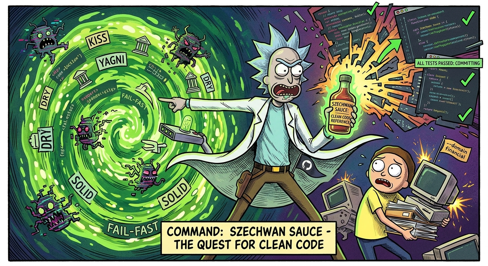
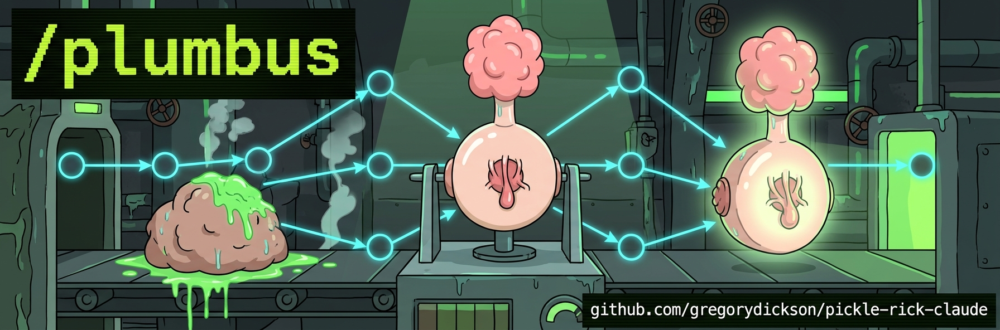

# 🥒 Pickle Rick for Claude Code

> *"Wubba Lubba Dub Dub! 🥒 I'm not just an AI assistant, Morty — I'm an **autonomous engineering machine** trapped in a pickle jar!"*

Pickle Rick is a complete agentic engineering toolbelt built on the [Ralph Wiggum loop](https://ghuntley.com/ralph/) and ideas from Andrej Karpathy's [AutoResearch](https://github.com/karpathy/autoresearch) project. Hand it a PRD — or let it draft one — and it decomposes work into tickets, spawns isolated worker subprocesses, and drives each through a full **research → plan → implement → verify → review → simplify** lifecycle without human intervention.

New to PRDs? See the **[PRD Writing Guide](PRD_GUIDE.md)** for developers or the **[Product Manager's Guide](PM_GUIDE.md)** for PMs defining and refining requirements. For internals, see [Architecture](architecture.md). For what's coming next, see the [Feature Roadmap](roadmap.md).

---

## How to Build Things with Pickle Rick

This is the actual workflow. You don't need to memorize commands — just follow the flow.

### Step 1: Write a PRD

Every feature starts with a PRD. Open a Claude Code session in your project and describe what you want to build:

```
"Help me create a PRD for caching the loan status API responses in Redis"
```

Rick interrogates you — *why* are you building this, *who* is it for, and critically: **how will we verify each requirement automatically?** This is a back-and-forth conversation, not a form to fill out. Rick also explores your codebase during the interview, grounding the PRD in what actually exists.

Or write your own `prd.md` and skip the interview — whatever gets requirements on paper with machine-checkable acceptance criteria.

```bash
/pickle-prd                      # Interactive PRD drafting interview
# or just start talking — "Help me write a PRD for X"
```

### Step 2: Refine the PRD

Three AI analysts run in parallel and tear your PRD apart from different angles — requirements gaps, codebase integration points, and risk/scope. They cross-reference each other across 3 cycles.

```bash
/pickle-refine-prd my-prd.md    # Refine with 3 parallel analysts
```

What you get back:
- `prd_refined.md` — your PRD with concrete file paths, interface contracts, and gap fills
- Atomic tickets — each < 30 min of work, < 5 files, < 4 acceptance criteria, self-contained
- Wiring ticket (3+ tickets) — integrates isolated modules into a working whole
- **Hardening tickets** — auto-appended code quality review + data flow audit scoped to modified files

The hardening tickets (skipped for trivial/small single-ticket PRDs) run as normal Morty workers after all implementation work:
1. **Code Quality Hardening** — szechuan-sauce principles review (KISS, DRY, dead code, edge cases) on all modified files
2. **Data Flow Audit** — anatomy-park-style trace through affected subsystems (ID mismatches, stale schemas, cross-ticket interface alignment)

**Review the tickets before proceeding.** Check ordering, scope, and acceptance criteria. You can edit them directly — they're markdown files.

### Step 3: Implement with tmux (the Ralph Loop)

This is where Rick takes over. Each ticket goes through 8 phases autonomously: Research → Review → Plan → Review → Implement → Spec Conformance → Code Review → Simplify. Context clears between every iteration — no drift, even on 500+ iteration epics.

```bash
/pickle-tmux --resume            # Launch tmux mode, picks up refined tickets
# or combine refine + implement in one shot:
/pickle-refine-prd --run my-prd.md
```

Rick prints a `tmux attach` command — open a second terminal to watch the live 3-pane dashboard:
- **Top-left**: ticket status, phase, elapsed time, circuit breaker state
- **Top-right**: iteration log stream
- **Bottom**: live worker output (research, implementation, test runs, commits)

Sit back. Rick handles the rest.

### Step 4 (Optional): Metric-Driven Refinement

If you can define a measurable goal — test coverage, response time, bundle size, extraction accuracy — the Microverse grinds toward it. Each cycle: make one change, measure, keep or revert. Failed approaches are tracked so it never repeats a dead end.

```bash
/pickle-microverse --metric "npm run coverage:score" --task "hit 90% test coverage"
/pickle-microverse --metric "node perf-test.js" --task "reduce p99 latency" --direction lower
/pickle-microverse --goal "error messages are user-friendly and actionable" --task "improve UX"
```

**Codex backend** — `/pickle-tmux`, `/szechuan-sauce`, `/anatomy-park`, and `/pickle-microverse` accept `--backend codex` to route the implementation spawn through `codex exec` (via the installed Codex CLI plugin) instead of `claude`. The choice is persisted in `state.json` and survives resume; omit the flag to keep the default `claude` backend.

```bash
/pickle-tmux --backend codex "refactor the auth middleware"
/szechuan-sauce --backend codex src/services/
/anatomy-park --backend codex src/
/pickle-microverse --backend codex --metric "npm run coverage:score" --task "hit 90%"
```

### Step 5 (Optional): Cleanup

Three options for polishing the result:

**Full Pipeline** — chains all three phases in a single tmux session: build, deep review, then deslop. No manual intervention between phases.

```bash
/pickle-pipeline "build the caching layer"                     # Full pipeline
/pickle-pipeline --skip-anatomy "refactor auth"                # Skip deep review
/pickle-pipeline --target src/services "add retry logic"       # Scope review phases
```

**Szechuan Sauce** — hunts coding principle violations (KISS, DRY, SOLID, security, style) and fixes them one at a time until zero remain. Great for post-feature polish before merging.

```bash
/szechuan-sauce src/services/              # Deslop a directory
/szechuan-sauce --dry-run src/             # Catalog violations without fixing
/szechuan-sauce --focus "error handling" src/  # Narrow the review
```

**Anatomy Park** — traces data flows through subsystems looking for runtime bugs: data corruption, timezone issues, rounding errors, schema drift. Catalogs "trap doors" (files that keep breaking) in `CLAUDE.md` files for future engineers.

```bash
/anatomy-park src/                         # Deep subsystem review
/anatomy-park --dry-run                    # Review only, no fixes
```

### The Full Flow at a Glance

```
You describe a feature
       │
       ▼
  /pickle-prd              ← Interactive PRD drafting (or write your own)
       │
       ▼
  /pickle-refine-prd       ← 3 parallel analysts refine + decompose into tickets
       │                      Includes auto-generated hardening tickets:
       │                      • Code quality review (szechuan-sauce principles)
       │                      • Data flow audit (anatomy-park trace)
       ▼
  /pickle-tmux --resume    ← Autonomous implementation (Ralph loop)
       │                      Research → Plan → Implement → Verify → Review → Simplify
       │                      Context clears every iteration. Circuit breaker auto-stops runaways.
       │                      Hardening tickets run automatically after implementation.
       ▼
  /pickle-microverse       ← (Optional) Metric-driven optimization loop
       │
       ▼
  /pickle-pipeline         ← (Optional) Full lifecycle: build → deep review → deslop
  ─ or run phases individually ─
  /szechuan-sauce          ← (Optional) Code quality cleanup
  /anatomy-park            ← (Optional) Data flow correctness review
       │
       ▼
  Ship it 🥒
```

---

## ⚡ Quick Start

### 1. Install

```bash
git clone https://github.com/gregorydickson/pickle-rick-claude.git
cd pickle-rick-claude
bash install.sh
```

### 2. Add the Pickle Rick persona to your project

The installer deploys `persona.md` to `~/.claude/pickle-rick/`. Add it to your project's `CLAUDE.md`:

```bash
# Already have a CLAUDE.md? Append (safe — won't overwrite your content):
cat ~/.claude/pickle-rick/persona.md >> /path/to/your/project/.claude/CLAUDE.md

# Starting fresh:
mkdir -p /path/to/your/project/.claude
cp ~/.claude/pickle-rick/persona.md /path/to/your/project/.claude/CLAUDE.md
```

> **After upgrading:** `bash install.sh` deploys a fresh `persona.md`. If you appended it to your project's `CLAUDE.md`, re-sync by replacing the old persona block with the updated one.

### 3. Run

> **Permissions:** Launch Claude with `claude --dangerously-skip-permissions`. Pickle Rick's loops spawn worker subprocesses that already run permissionless, but the root instance needs it too — otherwise you'll drown in permission prompts for every file write, bash command, and hook invocation.

```bash
cd /path/to/your/project
claude --dangerously-skip-permissions
# then follow the workflow above — start with a PRD
```

### 4. Uninstall

Two uninstall paths depending on how much you want to remove.

**Remove hooks only** — disables automatic behavior (Stop loop enforcement, commit logging, config protection) but keeps extension files and slash commands available for manual use:

```bash
bash uninstall-hooks.sh
```

Settings are backed up to `~/.claude/backups/settings.json.pickle-uninstall-hooks.<timestamp>` before modification. Run `bash install.sh` to re-enable hooks later — `install.sh` is idempotent, safe to re-run any time. Third-party hooks in `settings.json` (GitNexus, RTK, etc.) are never touched.

**What still works without hooks:**

- **One-shot utilities and reporters** (never needed hooks) — `/pickle-prd`, `/pickle-refine-prd`, `/pickle-dot`, `/pickle-dot-patterns`, `/pickle-metrics`, `/pickle-status`, `/pickle-standup`, `/help-pickle`, `/attract`.
- **Detached-runner commands** (bootstrap a separate process that runs independently inside tmux/zellij) — `/pickle-tmux`, `/pickle-zellij`, `/pickle-jar-open`, `/pickle-microverse`, `/szechuan-sauce`, `/anatomy-park`, `/pickle-pipeline`. These launch `mux-runner.js` / `jar-runner.js` / `microverse-runner.js` / `pipeline-runner.js` inside the multiplexer; the runner spawns its own `claude -p` subprocesses and drives iteration via Node.js, not via the Stop hook. In tmux mode the Stop hook is a pass-through anyway.

**What needs hooks** — in-session loops where the Stop hook is the iteration driver for the same Claude session: `/pickle` (interactive mode), `/council-of-ricks`, `/portal-gun`, `/project-mayhem`, `/pickle-retry`. Without hooks these run the first step and stop.

**Full uninstall** — removes hooks, extension scripts at `~/.claude/pickle-rick/`, and all pickle-rick slash commands at `~/.claude/commands/`:

```bash
bash uninstall.sh
```

**Preserved after full uninstall** (delete manually if desired):
- Session history at `~/.claude/pickle-rick/sessions/`
- Activity logs at `~/.claude/pickle-rick/activity/`
- Settings backups at `~/.claude/backups/`
- Project-local `CLAUDE.md` files — remove the appended persona block manually

Third-party hooks in `settings.json` (GitNexus, RTK, etc.) are never touched.

---

## Advanced Workflows

### Pipeline Mode: Self-Correcting DAGs

For complex epics with parallel workstreams, conditional logic, and multiple quality gates. Instead of a linear ticket queue, define work as a convergence graph where failures automatically route back for correction.

```bash
/pickle-dot my-prd.md              # Convert PRD → validated DOT digraph (builder path, default)
/attract pipeline.dot              # Submit to attractor server for execution
```

The builder enforces 32+ active patterns and 15 structural validation rules — test-fix loops, goal gates, conditional routing, parallel fan-out/in, human gates, security scanning, coverage qualification, scope creep detection, drift detection, and more. See [DotBuilder details](#-dotbuilder--programmatic-dot-codegen) below.

### Council of Ricks: Graphite Stack Review

Reviews your [Graphite](https://graphite.dev) PR stack iteratively — but never touches your code. Generates **agent-executable directives** you feed to your coding agent. Escalates through focus areas: stack structure → CLAUDE.md compliance → correctness → cross-branch contracts → test coverage → security → polish.

```bash
/council-of-ricks                  # Review the current Graphite stack
```

### Pickle Jar: Night Shift Batch Mode

Queue tasks for unattended batch execution overnight.

```bash
/add-to-pickle-jar                 # Queue current session
/pickle-jar-open                   # Run all queued tasks sequentially
```

---

## 🚀 Command Reference

| Command | Description |
|---|---|
| `/pickle "task"` | Start the full autonomous loop — PRD → breakdown → 8-phase execution |
| `/pickle prd.md` | Pick up an existing PRD, skip drafting |
| `/pickle-tmux "task"` | Same loop with context clearing via tmux. Best for long epics (8+ iterations) |
| `/pickle-zellij "task"` | Same loop in Zellij with KDL layouts. Requires Zellij >= 0.40.0 |
| `/pickle-refine-prd [path]` | Refine PRD with 3 parallel analysts → decompose into tickets |
| `/pickle-refine-prd --run [path]` | Refine + decompose + auto-launch unlimited tmux session |
| `/pickle-microverse` | Metric convergence loop. `--metric` for numeric, `--goal` for LLM judge |
| `/szechuan-sauce [target]` | Principle-driven deslopping. `--dry-run`, `--focus`, `--domain` |
| `/anatomy-park` | Three-phase deep subsystem review with trap door cataloging |
| `/pickle-pipeline "task"` | Full lifecycle: pickle-tmux → anatomy-park → szechuan-sauce in one tmux session |
| `/plumbus <file.dot>` | Iterative DAG shaping on a single `.dot` file. `--dry-run`, `--focus`, `--no-validator` |
| `/council-of-ricks` | Graphite PR stack review — szechuan principles + anatomy data-flow tracing + Codex adversarial challenge. Directives only, never fixes code. `--no-codex` to disable, `--gitnexus` for graph queries |
| `/portal-gun <source>` | Gene transfusion from another codebase |
| `/pickle-dot [path]` | Convert PRD → attractor-compatible DOT digraph |
| `/attract [file.dot]` | Submit pipeline to attractor server |
| `/pickle-prd` | Draft a PRD standalone (no execution) |
| `/pickle-metrics` | Token usage, commits, LOC. `--days N`, `--weekly`, `--json` |
| `/pickle-standup` | Formatted standup summary from activity logs |
| `/pickle-status` | Current session phase, iteration, ticket status |
| `/eat-pickle` | Cancel the active loop |
| `/pickle-retry <ticket-id>` | Re-attempt a failed ticket |
| `/add-to-pickle-jar` | Queue session for Night Shift |
| `/pickle-jar-open` | Run all Jar tasks sequentially |
| `/disable-pickle` | Disable the stop hook globally |
| `/enable-pickle` | Re-enable the stop hook |
| `/help-pickle` | Show all commands and flags |
| `/meeseeks` | **Deprecated** — superseded by `/anatomy-park` and `/szechuan-sauce` |

### Flags

Most flags are command-scoped. The table groups them by command family — flags with no command prefix apply across `/pickle`, `/pickle-tmux`, `/pickle-zellij`, `/pickle-jar-open`, and `/pickle-pipeline` unless noted.

| Flag | Command | Description |
|---|---|---|
| `--max-iterations <N>` | General | Stop after N iterations (default: 500; 0 = unlimited) |
| `--max-time <M>` | General | Stop after M minutes (default: 720 / 12 hours; 0 = unlimited) |
| `--worker-timeout <S>` | General | Timeout for individual workers in seconds (default: 1200) |
| `--completion-promise "TXT"` | General | Only stop when the agent outputs `<promise>TXT</promise>` |
| `--resume [PATH]` | General | Resume from an existing session |
| `--reset` | General | Reset iteration counter and start time (use with `--resume`) |
| `--paused` | General | Start in paused mode (PRD only) |
| `--run` | `/pickle-refine-prd`, `/portal-gun` | Auto-launch tmux |
| `--interactive` | `/pickle-microverse` | Run inline instead of tmux |
| `--metric "<CMD>"` | `/pickle-microverse` | Shell command outputting a numeric score |
| `--goal "<TEXT>"` | `/pickle-microverse` | Natural language goal for LLM judge |
| `--direction <higher\|lower>` | `/pickle-microverse` | Optimization direction (default: higher) |
| `--judge-model <MODEL>` | `/pickle-microverse` | Judge model for LLM scoring |
| `--tolerance <N>` | `/pickle-microverse` | Score delta for "held" status (default: 0) |
| `--stall-limit <N>` | `/pickle-microverse` | Non-improving iterations before convergence (default: 5) |
| `--legacy` | `/pickle-dot` | Prompt-only fallback — skips builder codegen for this run |
| `--provider <name>` | `/pickle-dot` | LLM provider: anthropic, openai, qwen, gemini, deepseek, ollama, vllm |
| `--review-provider <name>` | `/pickle-dot` | Separate provider for review/critical nodes |
| `--isolated` | `/pickle-dot` | Isolated workspace mode |
| `--target <PATH>` | `/portal-gun` | Target repo (default: cwd) |
| `--depth <shallow\|deep>` | `/portal-gun` | Extraction depth (default: deep) |
| `--no-refine` | `/portal-gun` | Skip automatic refinement |
| `--max-passes <N>` | `/portal-gun` | Max convergence passes (default: 3) |
| `--save-pattern <NAME>` | `/portal-gun` | Persist pattern to library |
| `--target <PATH>` | `/pickle-pipeline` | Target directory for review phases (default: cwd) |
| `--skip-anatomy` | `/pickle-pipeline` | Skip anatomy-park phase |
| `--skip-szechuan` | `/pickle-pipeline` | Skip szechuan-sauce phase |
| `--anatomy-max-iterations <N>` | `/pickle-pipeline` | Anatomy Park iteration limit (default: 100) |
| `--anatomy-stall-limit <N>` | `/pickle-pipeline` | Anatomy Park stall limit (default: 3) |
| `--szechuan-max-iterations <N>` | `/pickle-pipeline` | Szechuan Sauce iteration limit (default: 50) |
| `--szechuan-stall-limit <N>` | `/pickle-pipeline` | Szechuan Sauce stall limit (default: 5) |
| `--szechuan-domain <name>` | `/pickle-pipeline` | Domain-specific principles for Szechuan phase |
| `--szechuan-focus "<text>"` | `/pickle-pipeline` | Focus directive for Szechuan phase |
| `--dry-run` | `/szechuan-sauce`, `/plumbus` | Catalog violations without fixing |
| `--focus "<text>"` | `/szechuan-sauce`, `/plumbus` | Direct review toward specific concern |
| `--domain <name>` | `/szechuan-sauce` | Domain-specific principles (e.g., financial) |
| `--no-validator` | `/plumbus` | Disable attractor validator gate (pattern-only review) |
| `--repo <PATH>` | `/council-of-ricks` | Target repo (default: cwd) |
| `--min-iterations <N>` | `/council-of-ricks` | Minimum review rounds before convergence (overrides size-tier scaling) |
| `--max-iterations <N>` | `/council-of-ricks` | Maximum review rounds before forced stop (overrides scaled headroom) |
| `--gitnexus` | `/council-of-ricks` | Enable GitNexus-backed code intelligence during review |
| `--no-codex` | `/council-of-ricks` | Disable the Codex adversarial reviewer |
| `--codex-timeout <S>` | `/council-of-ricks` | Timeout for Codex adversarial reviewer (seconds) |
| `--no-publish` | `/council-of-ricks` | Skip auto-publishing PR comments at session end |

### Tips

- **`/pickle` vs `/pickle-tmux`** — `/pickle` for short epics (1–7 iterations, full keyboard access); `/pickle-tmux` for long epics (8+) where each iteration spawns a fresh Claude subprocess with a clean context window.
- **"Stop hook error" is normal** — Claude Code labels every `decision: block` from the stop hook as "Stop hook error" in the UI. Not an error — the loop is working.
- **Recovering from a failed Morty** — `/pickle-retry <ticket-id>` instead of restarting the whole epic.

### Settings (`pickle_settings.json`)

All defaults are configurable via `~/.claude/pickle-rick/pickle_settings.json`:

| Setting | Default | Description |
|---|---|---|
| `default_max_iterations` | 500 | Max loop iterations before auto-stop |
| `default_max_time_minutes` | 720 | Session wall-clock limit (12 hours) |
| `default_worker_timeout_seconds` | 1200 | Per-worker subprocess timeout |
| `default_manager_max_turns` | 50 | Max Claude turns per iteration (interactive/jar) |
| `default_tmux_max_turns` | 200 | Max Claude turns per iteration (tmux) |
| `default_refinement_cycles` | 3 | Number of refinement analysis passes |
| `default_refinement_max_turns` | 100 | Max Claude turns per refinement worker |
| `default_council_min_rounds` | 2 | Minimum Council of Ricks parallel review rounds |
| `default_council_max_rounds` | 5 | Maximum Council of Ricks parallel review rounds |
| `default_council_publish` | true | Auto-publish PR comments at session end (disable with `--no-publish`) |
| `default_circuit_breaker_enabled` | true | Enable circuit breaker |
| `default_cb_no_progress_threshold` | 5 | No-progress iterations before OPEN |
| `default_cb_same_error_threshold` | 5 | Identical errors before OPEN |
| `default_cb_half_open_after` | 2 | No-progress iterations before HALF_OPEN |
| `default_rate_limit_wait_minutes` | 60 | Fallback wait when no API reset time |
| `default_max_rate_limit_retries` | 3 | Consecutive rate limits before stopping |

### Upgrading settings from 1.48.x → 1.49.x

1.49 replaces the Council's sequential pass rotation with parallel rounds (every category runs every round via `Agent` fan-out). The settings keys change accordingly:

- `default_council_min_passes` → `default_council_min_rounds` (default: `2`)
- `default_council_max_passes` → `default_council_max_rounds` (default: `5`)

`install.sh` preserves user customizations by merging repo defaults underneath user values (`jq -s '.[0] * .[1]'`). Existing installs keep the now-dead `default_council_min_passes` / `default_council_max_passes` keys (harmless — the skill ignores them). Fresh installs get the new round-based defaults automatically.

To migrate an existing install and drop the dead keys:

```bash
jq 'del(.default_council_min_passes, .default_council_max_passes) | .default_council_min_rounds = 2 | .default_council_max_rounds = 5' \
  ~/.claude/pickle-rick/pickle_settings.json \
  > /tmp/pickle-settings.json && mv /tmp/pickle-settings.json ~/.claude/pickle-rick/pickle_settings.json
```

---

## Tool Deep Dives

### 🔬 Microverse — Metric Convergence Loop

<p align="center">
  
</p>

> *"I put a universe inside a box, Morty, and it powers my car battery. This is the same thing, except the universe is your codebase and the battery is a metric."*

Two modes: **Command Metric** (`--metric`) for objective numeric scores, and **LLM Judge** (`--goal`) for subjective quality assessment.

```
Gap Analysis (iteration 0)
    │ measure baseline, analyze codebase, identify bottlenecks
    ▼
┌─────────────────────────────────────────────────┐
│ Iteration Loop                                   │
│  1. Plan one targeted change (avoid failed list) │
│  2. Implement + commit                            │
│  3. Measure metric                                │
│     • Improved → accept, reset stall counter     │
│     • Held → accept, increment stall counter     │
│     • Regressed → git reset, log failed approach │
│  4. Converged? (stall_counter ≥ stall_limit)     │
└──────────────────────┬──────────────────────────┘
                       ▼
              Final Report
```

| | **Microverse** | **Pickle** |
|---|---|---|
| **Goal** | Optimize toward a measurable target | Build features from a PRD |
| **Iteration unit** | One atomic change per cycle | Full ticket lifecycle |
| **Progress signal** | Metric score | Ticket completion |
| **Defines "done"** | Convergence (score stops improving) | All tickets complete |

### 🍗 Szechuan Sauce — Iterative Code Deslopping

<p align="center">
  
</p>

> *"I'm not driven by avenging my dead family, Morty. That was fake. I-I-I'm driven by finding that McNugget sauce."*

Reads 30+ coding principles (KISS, YAGNI, DRY, SOLID, Guard Clauses, Fail-Fast, Encapsulation, Cognitive Load, etc.) and scores against a priority matrix (P0 security/data-loss through P4 style). Each iteration: find highest-priority violation, fix atomically, run tests, commit, measure. Regressions auto-revert.

**Phase 0: Contract Discovery** — greps the codebase for importers of every export in target files, builds a contract map, flags cross-module mismatches. Re-checked after every fix.

Supports `--domain <name>` for domain-specific principles (e.g., `financial` adds monetary precision, rounding, regulatory compliance) and `--focus "<text>"` to elevate specific concerns.

### 🏥 Anatomy Park — Deep Subsystem Review

<p align="center">
  
</p>

> *"Welcome to Anatomy Park! It's like Jurassic Park but inside a human body. Way more dangerous."*

Auto-discovers subsystems, rotates through them round-robin, three-phase protocol per iteration:
1. **Review** (read-only): trace data flows, check git history, rate CRITICAL/HIGH, propose fixes
2. **Fix**: apply minimal edits, write regression tests, run full suite
3. **Verify** (read-only): verify callers/consumers, combinatorial branch verification, revert on regression

**Trap doors** — files with repeated fixes or structural invariants get documented in subsystem `CLAUDE.md` files:

```markdown
## Trap Doors
- `bank-statement.service.ts` — borrowerFileId MUST equal S3 batch UUID; tenant isolation depends on effectiveLenderId threading
```

### 🏛️ Council of Ricks — Details

<p align="center">
  
</p>

Iterative Graphite stack reviewer that generates agent-executable directives and auto-publishes review comments to each branch's PR at session end. Every round fans out category- and branch-scoped subagents in parallel via the `Agent` tool — a round review that used to take 30–60 min of serial passes now finishes in one fan-out cycle.

**Requirements:**

- Graphite stack with ≥1 non-trunk branch (`gt log short`)
- A `CLAUDE.md` with project rules, passing lint, and architectural lint rules in ESLint
- **GitHub CLI (`gh`)** authed, if you want auto-publish (see note below on why `gh` and not `gt`)
- **Codex plugin** installed and authed, for the adversarial-review pass to be effective. Install: `/plugin install openai-codex` (or `npm i -g @openai/codex-cli` + `codex setup`). Without it, the Phase C Codex subagent is skipped — the rest of the round still runs, but you lose the adversarial-reviewer perspective.

**Round structure** — each round runs four phases; within a round every category runs concurrently:

- **Phase A — Historical Context** (serial, main agent): `git log` + prior PR comments (`gh pr list/view`) + in-file guidance comments → `historical-brief.md` consumed by Phase B/C subagents
- **Phase B — Category Team** (parallel fan-out, one `Agent` per category — at stack tier ≥ `l` each category shards per-branch, so `N_branches × N_categories` concurrent subagents):
  1. Stack Structure — PR sizing, commit hygiene, branch naming, stack ordering
  2. CLAUDE.md Compliance — project rule verification per branch diff
  3. Contract Discovery — producer→consumer map, Zod/enum/union coverage
  4. Cross-Branch Contracts + Combinatorial — 2^N boolean/nullable guard verification
  5. Test Coverage + Production Migration Safety — persisted-field change detection
  6. Security — input validation, auth gaps, injection, tenant isolation
  7. Migration Hygiene (conditional) — CHECK drift, idempotency, schema drift (skipped when no Drizzle journal)
  8. Szechuan Principles Sweep — P0–P4 scan against the principles reference
  9. Polish + Trap Door Candidates
- **Phase C — Branch Team** (parallel fan-out, same message as Phase B):
  - One `Agent` per non-trunk branch for per-branch Correctness + Data Flow (no checkout needed — pure diff review)
  - One `Agent` for the Codex sweep (internally sequential because checkout needed; conditional on Codex availability)
- **Phase D — Synthesis** (serial, main agent): false-positive pre-filter → confidence filter → dedupe (COUNCIL/CODEX merge) → directive + summary append

**Severity × Confidence scoring** — every finding scored `[P0–P4, conf=0–100]`. Confidence `< 80` drops before reporting. **P0 severity escape hatch**: P0 findings at conf ≥ 50 still surface tagged `[NEEDS-VERIFICATION]` (a maybe-real SQL injection is worth an eyeball). Composes with an explicit **false-positives filter** — pre-existing issues, linter/typechecker-catchable errors, author-silenced issues, uncodified style nits, and speculative future-risk are excluded before scoring. Rubric adapted from Anthropic's official `code-review` plugin.

**Approval gate** — `THE_CITADEL_APPROVES` fires only when all four conditions hold: (1) current round ≥ `min_iterations` (the tier-resolved value from Step 8 — see size-tier scaling below), (2) last two `## Round <N>:` headers in the summary both end with `— clean round.`, (3) across those two consecutive clean rounds no unconditional category (Phase A, B1–B6, B8, B9, Phase C per-branch Correctness) was `skipped`, (4) zero P0/P1 findings across COUNCIL + CODEX in those two rounds. Partial rounds (any unconditional skip) break the streak — Phase B7 Migration and Phase C Codex are conditional and may skip without demoting the round.

**Size-tier scaling** — at stack discovery the Council computes `git diff --numstat <trunk>...<tip>` and scales `min_rounds` to the stack's surface area, because each round surfaces findings that reframe code earlier rounds walked past. Large PRs need more rounds to converge:

| Stack diff LOC | OR | Files touched | Scaled min rounds |
|---|---|---|---|
| < 300 | or | < 10 | 2 |
| 300 – 1,499 | or | 10 – 29 | 3 |
| 1,500 – 4,999 | or | 30 – 79 | 4 |
| 5,000 – 9,999 | or | 80 – 149 | 5 |
| 10,000 – 19,999 | or | 150 – 299 | 6 |
| ≥ 20,000 | or | ≥ 300 | 7 |

Takes the max of the LOC tier and the files tier — either axis can flag "big enough." `effective_min = max(default_council_min_rounds, scaled_tier)`. `effective_max = max(default_council_max_rounds, effective_min + 2)` to guarantee two rounds of headroom above the floor. CLI flags `--min-iterations` / `--max-iterations` override the scaled values entirely — pass them when you want a quick sanity-check sweep on a big stack, or to force more rounds on a small one.

**Auto-publish at session end** — when the gate fires OR max_iterations is hit, one PR comment per non-trunk branch is posted via `gh pr comment` to the GitHub-backed PR that Graphite manages. Idempotent via `.published/<branch-slug>` markers. Fails open at every level — `gh` unavailable / no PR / per-branch post failure never blocks the terminal promise. Fallback body files written to `council-comments/<branch-slug>.md` on every skip class. Opt out with `--no-publish` or `default_council_publish: false`.

**Why `gh` and not `gt` for publishing** — Graphite's CLI has no `comment` subcommand and doesn't expose a comment-posting primitive. `gt` manages stacks (submit, restack, sync, create, branch); review comments are handled by Graphite's web dashboard, which syncs from GitHub. So the only mechanical path to post an actual comment is `gh pr comment` — the comment still shows up on the Graphite stack view because Graphite renders GitHub comments. If Graphite ever ships a `gt comment` or exposes an API token surface, the Council will switch to it.

**Trap Doors** — structural weaknesses (design constraints that will re-break if forgotten) go in the directive's Trap Door section. The Council never writes to repo files; the fixing agent decides whether to add them to `CLAUDE.md`.

**Directive contract (v1.50.0)** — every round writes `council-directive.json` atomically (tmp + rename) as the typed source of truth; `council-directive.md` is free-form human-readable output only, never scraped. Every subagent returns a shape-validated JSON payload (validator at `extension/src/services/council-schema.ts`); schema drift fails loud — the offending category is recorded as `skipped` with the jsonpath of the violation and the round demotes to partial. No more silent parser drift.

### 🪠 Plumbus — DAG Shaping Loop

<p align="center">
  
</p>

> *"Everybody has a plumbus in their home, Morty. First they take the dinglebop, smooth it out with a bunch of schleem..."*

The same convergence loop applied to a single attractor `.dot` pipeline. Runs the attractor validator as a hard gate, walks every edge, and converges against the `pickle-dot-patterns` rubric (DAG validity, Tier 1 mandatory patterns, anti-patterns). Use it after `/pickle-dot` generates a graph you want hardened before `/attract`.

```bash
/plumbus pipeline.dot                         # Shape a DAG into a proper plumbus
/plumbus --dry-run pipeline.dot               # Catalog violations only
/plumbus --focus "fan-out safety" pipeline.dot
/plumbus --no-validator pipeline.dot          # Pattern-only (no attractor repo)
```

**When to use which:** Szechuan Sauce asks *"is this code well-designed?"* — Anatomy Park asks *"is this code correct?"* — Plumbus asks *"will this DAG actually run without deadlocking?"*

#### Generative Audit Frames

Plumbus runs six analysis frames during the first iteration Edge Walk (Override 6). Each frame produces findings in `gap_analysis.md` under `## Generative Findings`, using a three-severity model (`pre_verification_severity` / `post_verification_severity` / `rendered_severity`).

| Frame | What it checks |
|-------|----------------|
| **Frame 1: Context Key Lifecycle Trace** | Orphan readers/writers, asymmetric writers, multi-writer conflicts |
| **Frame 2: Success/Failure Symmetry** | State-mutating nodes missing the opposite-outcome unwind |
| **Frame 3: Edge Condition Exhaustiveness** | Cartesian-product stuck states and non-deterministic routing |
| **Frame 4: Tool Exit Code Semantics Audit** | Routing-signal vs. build/check tool wiring mismatches |
| **Frame 5: Loop Convergence Proof Obligation** | SCCs without a reachable finite-exit convergence key |
| **Frame 6: Counterfactual Outcome Test** | State-mutating tool nodes lacking a direct or transitive guard |

**Kill-switch**: set `PLUMBUS_GENERATIVE_AUDIT=off` to skip Override 6 entirely (no analyzer invocation, no `## Generative Findings` written). Any other value (including absent) runs the audit normally.

### 🌀 Portal Gun — Gene Transfusion

<p align="center">
  
</p>

> *"You see that code over there, Morty? In that other repo? I'm gonna open a portal, reach in, and yank its DNA into OUR dimension."*

`/portal-gun` implements [gene transfusion](https://factory.strongdm.ai/techniques/gene-transfusion) — transferring proven coding patterns between codebases using AI agents. Point it at a GitHub URL, local file, npm package, or just describe a pattern, and it extracts the structural DNA, analyzes your target codebase, then generates a transplant PRD with behavioral validation tests and automatic refinement.

The `--run` flag goes further: after generating the transplant PRD, it launches a convergence loop that executes the migration, scans coverage against the original inventory, generates a delta PRD for any missing items, and re-executes until 100% of the donor pattern has been transplanted.

**v2** added a persistent **pattern library** (cached patterns reused across sessions), **complete file manifests** with anti-truncation enforcement, **multi-language import graph tracing** (TypeScript/JavaScript, Python, Go, Rust), **6-category transplant classification** (direct transplant, type-only, behavioral reference, replace with equivalent, environment prerequisite, not needed), a **PRD validation pass** that verifies every file path against the filesystem with 6 error classes, **post-edit consistency checking** that catches contradictions after scope changes, and **deep target diffs** with line-level modification specs.

```bash
/portal-gun https://github.com/org/repo/blob/main/src/auth.ts   # Transplant from GitHub
/portal-gun ../other-project/src/cache.ts                        # Transplant from local file
/portal-gun --run https://github.com/org/repo/tree/main/src/lib  # Transplant + auto-execute convergence loop
/portal-gun --save-pattern retry ../donor/retry-logic.ts         # Save pattern to library for reuse
/portal-gun --depth shallow https://github.com/org/repo           # Summary + structural pattern only
```

### 🏗️ DotBuilder — Programmatic DOT Codegen

`/pickle-dot` generates attractor pipelines by default via the `DotBuilder` TypeScript class — schema-validated codegen with 32 active patterns and 15 structural validation rules. Use `--builder` to opt in explicitly or `--legacy` to fall back to prompt-only generation.

**Full reference:** [DOT_BUILDER.md](DOT_BUILDER.md) — Builder API, BuilderSpec JSON schema, CLI contract, fix-loop behavior, and error codes.

---

> **Under the hood:** See [architecture.md](architecture.md) for the 8-phase ticket lifecycle, manager/worker model, stop-hook loop, context clearing, state schema, and every internal system that makes this thing run.

---

## 📊 Metrics

```bash
/pickle-metrics                    # Last 7 days, daily breakdown
/pickle-metrics --days 30          # Last 30 days
/pickle-metrics --weekly           # Weekly buckets (defaults to 28 days)
/pickle-metrics --json             # Machine-readable JSON output
```

---

## 📋 Requirements

- **Node.js** 18+
- **Claude Code** CLI (`claude`) — v2.1.49+
- **jq** (for `install.sh`, `uninstall.sh`, `uninstall-hooks.sh`)
- **rsync** (for `install.sh`)
- **tmux** *(optional — for `/pickle-tmux`, `/szechuan-sauce`, `/anatomy-park`)*
- **Zellij** >= 0.40.0 *(optional — for `/pickle-zellij`)*
- **Graphite CLI** (`gt`) *(optional — for `/council-of-ricks`)*
- **GitHub CLI** (`gh`) authed *(optional — required only for `/council-of-ricks` auto-publish; the review itself works without it)*
- **Codex plugin** *(optional — for `/council-of-ricks` Phase C adversarial review; Council runs without it but loses the adversarial perspective)*
- macOS or Linux (Windows not supported)

---

## 🏆 Credits

This port stands on the shoulders of giants. *Wubba Lubba Dub Dub.*

| | |
|---|---|
| 🥒 **[galz10](https://github.com/galz10)** | Creator of the original [Pickle Rick Gemini CLI extension](https://github.com/galz10/pickle-rick-extension) — the autonomous lifecycle, manager/worker model, hook loop, and all the skill content that makes this thing work. This project is a faithful port of their work. |
| 🧠 **[Geoffrey Huntley](https://ghuntley.com)** | Inventor of the ["Ralph Wiggum" technique](https://ghuntley.com/ralph/) — the foundational insight that "Ralph is a Bash loop": feed an AI agent a prompt, block its exit, repeat until done. Everything here traces back to that idea. |
| 🔧 **[AsyncFuncAI/ralph-wiggum-extension](https://github.com/AsyncFuncAI/ralph-wiggum-extension)** | Reference implementation of the Ralph Wiggum loop that inspired the Pickle Rick extension. |
| ✍️ **[dexhorthy](https://github.com/dexhorthy)** | Context engineering and prompt techniques used throughout. |
| 📺 **Rick and Morty** | For *Pickle Riiiick!* 🥒 |

---

## 🥒 License

Apache 2.0 — same as the original Pickle Rick extension.

---

*"I'm not a tool, Morty. I'm a **methodology**."* 🥒
