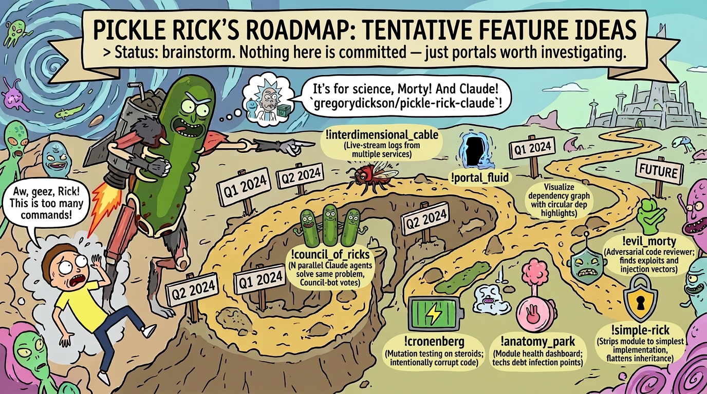

# Pickle Rick Roadmap

> Tentative feature ideas. Status: brainstorm. Nothing here is committed — just portals worth investigating.

## Proposed Features

### /interdimensional-cable
Live-stream logs from multiple running services side-by-side in a TUI. Each pane is a "channel" you can flip through.

### /portal-fluid
Dependency graph visualizer. Shows how packages flow between repos like portal fluid through the gun. Highlights circular deps in toxic green.

### /council-of-ricks
Spin up N parallel Claude agents that each solve the same problem differently, then a "Council" agent votes on the best solution.

### /szechuan-sauce
A "time machine" for config files. Tracks every change to `.env`, `tsconfig`, `package.json` etc. across branches and lets you restore any historical combo.

### /butter-robot
Single-purpose bot generator. Give it one task ("run lint on save" / "ping me when tests fail") and it creates a minimal daemon that does exactly that.

### /cronenberg
Mutation testing on steroids. Intentionally corrupts the codebase in horrifying ways and checks if the test suite catches it. If tests still pass, you've Cronenberg'd yourself.

### /tiny-rick
Minification and bundle analysis. Shrinks code down to its smallest, most energetic form.

### /plumbus
Auto-generates boilerplate that everyone needs but nobody wants to explain. Scaffolds services, endpoints, test files.

### /squanch
Universal search-and-replace across the entire monorepo with preview, rollback, and regex support.

### /death-crystal
Predictive impact analysis. Shows all possible futures (code paths) affected by a current change. Builds on GitNexus impact analysis with forward-looking path exploration.

### /get-schwifty
Performance benchmarking suite. Runs load tests, profiles memory, and judges code performance.

### /microverse-battery
Nested Docker environment generator. Containers within containers, each powering the one above it. Microservices with extra steps.

### /vindicators
CI/CD pipeline orchestrator where each stage is a "Vindicator." When a stage fails, it gets dramatically killed off in the logs.

### /simple-rick
Strips a complex module down to its simplest possible implementation. Removes every abstraction, flattens every inheritance chain.

### /gazorpazorp
Dependency spawner. One command creates a child package with all the right tsconfig inheritance, shared types, and build pipeline.

### /fleeb-juice
Secret rotation and environment variable manager. Detects hardcoded secrets, extracts them, and rotates them on a schedule.

### /mr-poopybutthole
Companion agent that watches your coding session and periodically summarizes what you've done. Always honest, even when it hurts.

### /unity
Monorepo sync tool. When you change a shared type or interface, Unity assimilates every consuming package to stay compatible. One mind, one type system.

### /evil-morty
Adversarial code reviewer. Deliberately tries to find exploits, injection vectors, and security holes in PRs. Thinks three steps ahead.

### /blips-and-chitz
Gamified test coverage. Assigns points for covering edge cases, achievement badges for hitting coverage thresholds. Roy: A Life Well Tested.

### /anatomy-park
Code health dashboard. Zooms into a module like a human body — shows infection points (tech debt), organ failure (deprecated deps), and vital signs (test health, build time).

### /meseeks-box
Spawns disposable agents for one-shot tasks: "generate fixtures," "write migration," "stub this API." They exist to serve a single purpose, then poof.

### /galactic-federation
Centralized audit log across all repos. Every deploy, PR merge, config change — tracked with federation-level bureaucracy.

### /story-train
Auto-generates changelogs and release notes from commit history by weaving commits into a coherent narrative. Each release is an "episode."

### /detoxifier
Tech debt remediation. Scans for code smells, complexity hotspots, and outdated patterns, then generates targeted refactoring tickets.

### /jerry-detector
Identifies code that's trying too hard and accomplishing too little. Over-abstracted factories, unnecessary wrapper classes, enterprise-grade hello worlds.

### /birdperson
Long-running integration test orchestrator. Patient, methodical, reliable. Runs the slow E2E suites that nobody wants to wait for.

### /phoenix-person
Auto-resurrection for failed deployments. Detects a bad deploy, rolls back, and redeploys the last known good version.

### /ricks-garage
Local dev environment bootstrapper. One command sets up the entire local stack — databases, services, env files, seed data.

### /time-crystal
Build caching and incremental compilation optimizer. Analyzes what actually changed and skips everything that doesn't need rebuilding.

### /citadel
Multi-environment management. Spin up, tear down, and switch between dev/staging/prod configs like walking between dimensions.

### /scary-terry
Nightmare scenario generator for APIs. Fuzzes endpoints with malformed payloads, missing auth, absurd edge cases.

### /two-brothers
Pair programming mode. Two Claude agents work the same file — one writes code, one writes tests. It's just two brothers. In a codebase.
