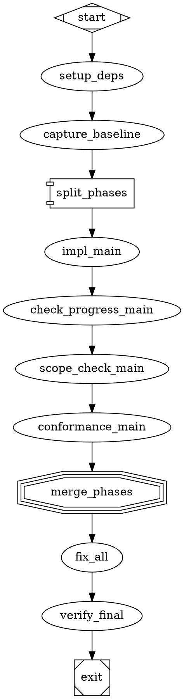

# BDD Scenarios for Pickle-Dot Codegen Builder

Generated from PRD sections: API Contracts, DOT String Escaping, DOT Serialization Algorithm

Pipeline Author Perspective — Given/When/Then Format

---

## Scenario 1: Empty Slug Rejection

**Given** a pipeline author who omits the slug field (or provides an empty string)

**When** the builder processes the spec via `DotBuilder.fromSpec({ slug: "", goal: "Build something", phases: [], acceptanceCriteria: {} })`

**Then** it rejects with a clear EMPTY_SLUG error explaining what was missing

**Expected Diagnostic**:
```
{
  rule: "constructor",
  severity: "error",
  message: "slug must be a non-empty string",
  fix: "Provide a valid slug identifier for the pipeline"
}
```

**Source**: PRD line 519 - EMPTY_SLUG code triggers on empty slug in constructor

---

## Scenario 2: Duplicate Phase ID Collision (Sanitized Name Collision)

**Given** a pipeline author who defines two phases with names that sanitize to the same ID (e.g., 'auth scan' and 'auth-scan')

**When** the builder processes the spec with phases that both sanitize to `auth_scan` (non-alphanumeric → underscore, collapse consecutive underscores, strip leading/trailing underscores)

**Then** it rejects with DUPLICATE_PHASE identifying the collision

**Expected Diagnostic**:
```
{
  rule: ".phase()",
  severity: "error",
  message: "Phase 'auth-scan' sanitizes to node ID 'auth_scan' which collides with existing phase 'auth scan'",
  nodeId: "auth_scan",
  fix: "Use phase names that produce unique sanitized IDs"
}
```

**Source**: PRD line 521 - DUPLICATE_PHASE triggers when two phases share the same sanitized node ID; lines 645-646 specify sanitization rules

**Sanitization Rules Applied**:
1. Replace all non-alphanumeric characters with `_` (`/[^a-zA-Z0-9]/g` → `'_'`)
2. Collapse consecutive `_` to single `_` (`/_{2,}/g` → `'_'`)
3. Strip leading/trailing `_`

Examples:
- `"auth scan"` → `"auth_scan"`
- `"auth-scan"` → `"auth_scan"`
- `"Auth_Scan"` → `"Auth_Scan"` (already valid, no change needed)

---

## Scenario 3: Single-Phase Pipeline DOT Output Structure

**Given** a pipeline author who defines a single-phase pipeline

**When** the builder generates the DOT output

**Then** the output contains a valid digraph with `Mdiamond` start and `Msquare` exit nodes

**Expected DOT Structure**:


**Source**: PRD lines 651-683 - DOT Serialization Algorithm specifies flat node emission order with start→exit structure

---

## Scenario 4: Already-Built Instance Rejection

**Given** a pipeline author who calls `.build()` on an already-built pipeline instance

**When** the second `.build()` invocation is invoked on the same `DotBuilder` instance

**Then** it rejects with ALREADY_BUILT to prevent accidental reuse

**Expected Error**:
```typescript
throw new BuildError(
  'ALREADY_BUILT',
  'Builder instance has already been used. Create a new instance from the corrected spec.',
  []
);
```

**Source**: PRD line 524 - ALREADY_BUILT code triggers when `.build()` is called twice; line 349 - "DotBuilder instances are single-use. After `.build()`, the instance is consumed."

**Fix Loop Requirement**: The fix loop must construct a new `DotBuilder` from the corrected spec for each iteration (not reuse the same instance).

---

## Scenario 5: Special Characters in Phase Names → Valid DOT Node IDs

**Given** a pipeline author who uses special characters in phase names (e.g., 'Build & Test', 'Auth@Pro', 'Unit Test v2!')

**When** the builder sanitizes them for DOT node IDs

**Then** the resulting DOT node IDs are valid identifiers matching `[a-zA-Z_][a-zA-Z0-9_]*`

**Expected Sanitization**:
| Input Phase Name | Sanitized Node ID |
|------------------|-------------------|
| `"Build & Test"` | `"Build__Test"` → `"Build_Test"` (collapse) |
| `"Auth@Pro"` | `"Auth_Pro"` |
| `"Unit Test v2!"` | `"Unit_Test_v2_"` → `"Unit_Test_v2"` (strip trailing) |
| `"Special!@#$Chars"` | `"Special____Chars"` → `"Special_Chars"` |
| `" leading space"` | `"_leading_space"` → `"leading_space"` (strip leading) |

**DOT Node Declaration Example**:
```dot
// Before sanitization: "Build & Test"
impl_Build_Test [class="codergen", timeout="30m"]
check_progress_Build_Test [class="codergen", read_only="true", max_visits="3", timeout="30m"]

// Before sanitization: "Auth@Pro"
impl_Auth_Pro [class="codergen", timeout="30m"]
check_progress_Auth_Pro [class="codergen", read_only="true", max_visits="3", timeout="30m"]
```

**Source**: PRD lines 645-646 - Node ID format and sanitization rules

---

## Scenario 6: Special Characters in Prompt Text → Proper DOT Escaping

**Given** a pipeline author whose prompt text contains quotes and newlines

**When** the builder emits DOT

**Then** all special characters are properly escaped in the output

**Escaping Rules Applied** (PRD lines 632-643):
1. Replace `\` with `\\`
2. Replace `"` with `\"`
3. Replace newlines (`\n`) with literal `\n` (backslash-n)
4. Replace carriage returns (`\r`) with `\r`
5. Wrap all attribute values in double quotes

**Test Case 1: Double Quotes in Prompt**
```typescript
// Input
const spec = {
  slug: "test_quotes",
  goal: "Test pipeline",
  phases: [{
    name: "main",
    prompt: `Generate code that says "Hello, World!"`,
    allowedPaths: ["src/"]
  }],
  acceptanceCriteria: {}
};

// Output DOT excerpt
impl_main [class="codergen", prompt="Generate code that says \"Hello, World!\"", timeout="30m"]
```

**Test Case 2: Newlines in Prompt**
```typescript
// Input
const spec = {
  slug: "test_newlines",
  goal: "Test pipeline",
  phases: [{
    name: "main",
    prompt: `Step 1: Do something\nStep 2: Do another thing\nStep 3: Finish`,
    allowedPaths: ["src/"]
  }],
  acceptanceCriteria: {}
};

// Output DOT excerpt
impl_main [class="codergen", prompt="Step 1: Do something\nStep 2: Do another thing\nStep 3: Finish", timeout="30m"]
```

**Test Case 3: Backslash in Prompt**
```typescript
// Input
const spec = {
  slug: "test_backslash",
  goal: "Test pipeline",
  phases: [{
    name: "main",
    prompt: `Use path: C:\\Users\\test`,
    allowedPaths: ["src/"]
  }],
  acceptanceCriteria: {}
};

// Output DOT excerpt
impl_main [class="codergen", prompt="Use path: C:\\\\Users\\\\test", timeout="30m"]
```

**Test Case 4: Combined Special Characters**
```typescript
// Input
const spec = {
  slug: "test_combined",
  goal: "Test pipeline",
  phases: [{
    name: "main",
    prompt: `Define interface:\ninterface Config {\n  path: string;  // "C:\\data"\n}`,
    allowedPaths: ["src/"]
  }],
  acceptanceCriteria: {}
};

// Output DOT excerpt
impl_main [class="codergen", prompt="Define interface:\ninterface Config {\n  path: string;  // \"C:\\\\data\"\n}", timeout="30m"]
```

**Source**: PRD lines 632-643 - DOT String Escaping rules; line 645 - Node ID sanitization

---

## Summary

| Scenario | Error Code | Trigger | Validation Rule |
|:---|:---|:---|:---|
| 1: Empty slug | `EMPTY_SLUG` | Empty `slug` field | Constructor validation |
| 2: Duplicate phase | `DUPLICATE_PHASE` | Sanitized phase IDs collide | `.phase()` duplicate detection |
| 3: Single-phase output | N/A (success) | Valid single-phase spec | DOT serialization algorithm |
| 4: Already built | `ALREADY_BUILT` | Second `.build()` call | Instance single-use constraint |
| 5: Special chars → valid IDs | N/A (success) | Phase names with special chars | Sanitization algorithm |
| 6: Prompt escaping | N/A (success) | Quotes/newlines in prompt | DOT string escaping rules |

---

**STATUS: SUCCESS**
